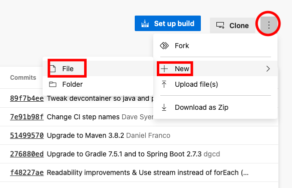

# Azure Devops
----------------
### Introduction
* We can build __CI-CD__ Pipelines using the Azure Devops.
* To run the jobs we has two options.
  * Azure-hosted
  * Self-Hosted
* To run job in the Azure-Hosted we need a paid subscription.
* But to run in Self-Hosted all we need is a virtual machine with OS `windows`, `linux`, `MacOs`.
### Azure Devops account creation.
----------------------------------
* [Refer Here](https://azure.microsoft.com/en-in/products/devops/) to create azure devops account.
* You can use an azure account or any github account to login.
* After creating account and login.
* You can create new project or open the existing project.


* Azure Devops has its own version control system like git and own Pipelines.
* We can configure the repository in 3 ways:
  * clone the repository to our computer and start building code.
  * We push the existing repository to the azure repository.
  * We can import the git or TFVC remote repository.

* For now we has the spring pet clinic code in the git hub repository.
* We has to fork the repository to make changes and also to run Pipelines.
* Get the forked repository url.
* [Refer Here](https://github.com/spring-projects/spring-petclinic) for the repository of the spring pet clinic.
* Now fork this repository.


* Copy the forked repository url.
* Now lets go back to the azure devops portal.
* Select import and paste the repository url and click on import.


* Now we are in the branch main.
* Change the branch if needed.
* We need a file named __Azure-pipelines.yml__ in our branch.

* Now create a pipeline file with name `Azure-pipelines.yml`.

* Now we need to build the steps for the pipeline.
* [Refer Here](https://learn.microsoft.com/en-in/azure/devops/pipelines/tasks/?view=azure-devops) for the build tasks.
* [Refer Here](https://learn.microsoft.com/en-us/azure/devops/pipelines/yaml-schema/pipeline?view=azure-pipelines#examples) for the example and syntax of the azure pipeline.
* Now we have the basic syntax of the pipeline and we need to configure this according to our requirement.
## Pipeline Steps 
-----------------
### Trigger
* We need to trigger the job when ever we commit something in the current branch.
* We has a property `trigger`.
* To know all the parameters for the trigger  [Refer Here](https://learn.microsoft.com/en-us/azure/devops/pipelines/yaml-schema/trigger?view=azure-pipelines).
* For now we need to run pipeline when we commit for the main branch.
* So we will assign only main as a parameter.
  ```yaml
  trigger:
    - main
  ```
* For now add this and commit the file.

* If you want you can add more branches and also can ignore some branches. [Refer Here](https://learn.microsoft.com/en-us/azure/devops/pipelines/yaml-schema/trigger?view=azure-pipelines#trigger-batch-branches-paths-tags)
------------
### pool
  * We need to specify the host on which we need to run the pipeline.
    * Azure Hosted
    * Self-Hosted
  * To configure the self hosted agent we need a virtual machine with any OS.
  * [Refer Here](https://learn.microsoft.com/en-in/azure/devops/pipelines/agents/v2-linux?view=azure-devops#authenticate-with-a-personal-access-token-pat) for the configuration of the agent using PAT.
  * Create a virtual machine in any cloud.
  * login and update.
* Since we are building the spring pet clinic we need java and maven installed
```
sudo apt update
sudo apt install openjdk-11-jdk maven -y
```
* Now we need to specify the java path to the variable which azure looks for.
```bash
export JAVA_HOME_11_X64='/usr/lib/jvm/java-11-openjdk-amd64'
```
* Now navigate to the azure devops portal, click on the project settings located at left-bottom corner.
* Click on agent pools.
* Click on add pool.


* We created the pool.
* If you want you can use the default pools.
* We need an agent in the pool.
* But to configure an agent we need an access token.
* 
* Click on this small user icon and select `personal access token`.
* Click on the new token and select full access.
* Click on create

* Copy the pat generated and save for later.
* We have the pat.
* Now lets add the agent.
* navigate to the agent pools again.
* click on the pool where you want your agent.

* Now click on New Agent.

* Select the operating system you want and follow the steps.
> *NOTE:* To download the agent use `wget <link>` command.
```bash
wget https://vstsagentpackage.azureedge.net/agent/2.211.0/vsts-agent-linux-x64-2.211.0.tar.gz
```

> *NOTE:* 
>   * Remove the `/Downloads` in the create agent command.
* Run all the steps given in the agent configuration.
* while running `./config.sh` it will ask for the agent name and the pat and agent name.

* After running the `./run.sh`command the agent will connect and Listening for jobs.
* Now check for the agent in the agent pools.

* Now lets configure this pool in the pipeline.
* navigate to the azure-pipeline.yaml file and click on edit.
* [Refer Here](https://learn.microsoft.com/en-us/azure/devops/pipelines/yaml-schema/pool?view=azure-pipelines) for the pool and agents.
* Now lets add our pool to the pipeline.
```yaml
pool: spring-pet-clinic
```
> *NOTE:*  Replace `spring-pet-clinic` with your pool name.
* Now We had configured the pool.
* Now all we need to configure is steps and tasks.
* [Refer Here](https://learn.microsoft.com/en-in/azure/devops/pipelines/tasks/build/maven?view=azure-devops#yaml-snippet) for the maven build tasks.
* All we need to configure is 
  * mavenPomFile: 'pom.xml'
  * goals - maven goals
  * publishJUnitResults , testResultsFiles - to publish junit test Results
  * javaHomeOption - java path
  * jdkVersionOption - Java version
* Now we have the steps. lets configure the values.
```
steps:
   - task: Maven
     inputs:
       mavenPomFile: 'pom.xml'
       goals: 'package'
       publishJUnitResults: yes
       testResultsFiles: '**/surefire-reports/TEST-*.xml'
       jdkVersionOption: '1.11'
       javaHomeOption: 'JDKVersion'
```
* Now add this steps to the pipeline and commit.

* Now click on pipelines and click on new pipeline.


* Select the repository.

* Since we have our pipeline in the repository select Azure pipelines yaml file.

* Give the path to yaml file and click on continue.
* Now click on run.

* The build will start if everything goes fine.

* The build was successful.
