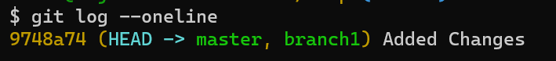
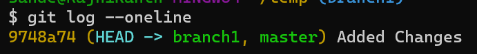
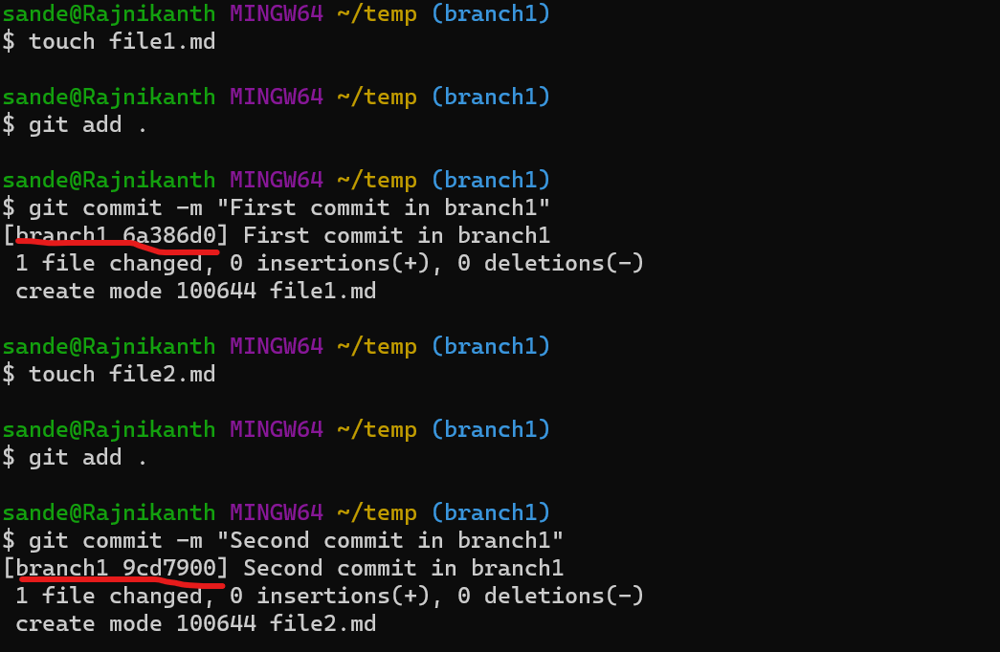
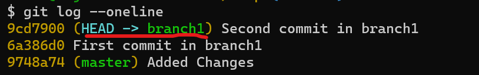
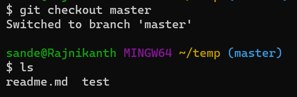
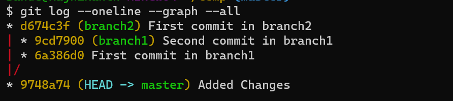

# Git Branches
* Git branches are used to make more versions of code with out changing the master branch.
* Master branch is the default branch created by the git.
* The branch will be created at the current commit.
* We can merge the branch with other branches including master branch.
## Creating Branches
* To create branch execute `git branch <branch-name>`.
* Lets create a branch called  `branch1`.
```
git branch branch1
```

* We had created branch 1.
* Now lets move our head to the branch1 `git checkout branch1`.
```
git checkout branch1
```

* We has changed our head to the branch1.
* Lets check where our head located at present `git log --oneline`.
```
git log --oneline
```

* We can see that our head is looking at the branch1.
* Now lets commit some changes in this branches.
```
touch file1.md
git add .
git commit -m "First commit in branch1"
touch file2.md
git add .
git commit -m "Second commit in branch1"
```

* Now lets check the commit history of the branch.
```
git log --oneline
```

* We can see that the commits we had is only in the branch1 and the master is still in `added changes` commit.
* Now lets create another branch `branch2` and add same changes like branch1.
```
touch file1.md
git add .
git commit -m "First commit in branch1"
touch file2.md
git add .
git commit -m "Second commit in branch1"
```
* Now lets checkout to master branch.
```
git checkout master
```
* Now lets check the files present in the current folder `ls`.

* We can see that there is no files add to the master which we created in the branches `branch1`, `branch2`.
* Now lets check the logs of the repository.
```
git log --oneline --graph --all
```

* We can see the tree that the commits are in the branches we have created and not in the master branch.
* Also the head is active in the current master branch.