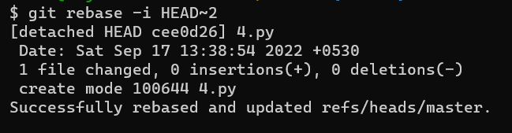

# Rewrite Git History
-----------------------------
* We can 
  * Rewrite the commit message
  * Delete the commit
  * Merge two commits
* Lets create a folder and convert the folder into git repository and add 5 commits to the repository.
```
mkdir commit
cd commit
git init
```

```
touch {1..5}.py
git add 1.py
git commit -am "1.py"
git add 2.py
git commit -am "2.py"
git add 3.py
git commit -am "3.py"
git add 4.py
git commit -am "1.py"
git add 5.py
git commit -am "1.py"
```

---------------------------------
### Rewriting the latest commit message
--------------------------------
* Now lets check the log of the repository.
```
git log --oneline
```

* Here while we commit 4 and 5 file we had given wrong commit messages.
* Now lets Rewrite these commit messages.
```
git commit --amend
```

* we can see that an editor with the latest commit message has poped up.
> **_NOTE:_** To start insert into the editor press `i`.
> 
> * To save and exit the changes press `esc` and enter `:wq`.
>
> * To exit without saving the changes press `esc` and enter `:q!`.
* Now lets Rewrite the commit message and save the message.

* We have rewrite the latest commit and now lets save and exit.
```
git log --oneline
```

---------------------------------------------
### Rewriting the commit message (Not latest)
---------------------------------------------
* Lets check the logs of the Local repository.
```
git log --oneline --all
```

* Here there is `1.py` instead of `4.py`.
* To rewrite this commit message, we can use `git commit --amend` if it is the latest commit.
* But we has another commit after the commit `1.py`.
* To rewrite the commit that is not latest commit we can use `rebase -i HEAD~<number-of-commits-away-from-head>`.
* Now lets rewrite the commit `1.py`.
> **_NOTE:_** Here the `1.py ` is 2 commits from the latest commit.
```
git rebase -i HEAD~2
```

* Here an editor poped up and we can see the laste two commit messages, Id's and some instructions below.
* We can see that there is `pick` before every commit id.
* We can see in the instructions that to rewrite the commit message replace the `pick` with `reword`.
> **_NOTE:_** To start insert into the editor press `i`.
> 
> * To save and exit the changes press `esc` and enter `:wq`.
>
> * To exit without saving the changes press `esc` and enter `:q!`.



* Now lets check the logs of the local repository.
```
git log --oneline --all
```

* Now we have rewrited the wrong commit message.
----------------------
### Merge two commits
-------------------------------------------------
* Now lets create two files `6.py` and `7.py` and commit each file separetly.
```
touch 6.py
git add .
git commit -am "Added 6.py"
touch 7.py
git add .
git commit -am "Added 7.py"
```

* Now we need to merge this two commits `Added 6.py`, `Added 7.py` and merge them into a single commit `Added 6.py and 7.py`.
* To merge two commits we use `rebase -i git rebase -i HEAD~<No-of-commits-from-the-head>`.
> **_NOTE:_** Here we need to merge `6.py` and `7.py` so we just need latest 2 commits `HEAD~2`
```
git rebase -i HEAD~2
```
> **_NOTE:_** To start insert into the editor press `i`.
> 
> * To save and exit the changes press `esc` and enter `:wq`.
>
> * To exit without saving the changes press `esc` and enter `:q!`.


* Now we have merged the two commits. Lets check the log of the repository.
```
git log --oneline
```

-----------------------------------
### Delete the unwanted commit
------------------------------
* Lets say we have added some unwanted files and commited them by mistake.
* Now we have to remove those commits. To do so we have to use `git rebase -i HEAD~<No-of-commits-from-the-head>`.

* We have have commit `Added 6.py 7.py` in our repository and we dont need this commit anymore.
* So lets this remove this commit.
```
git rebase -i HEAD~1
```
> **_NOTE:_** To start insert into the editor press `i`.
> 
> * To save and exit the changes press `esc` and enter `:wq`.
>
> * To exit without saving the changes press `esc` and enter `:q!`.


* Now we have deleted the commit. So lets check the log of the commits.

---------------------
### Git Ignore
-------------------
* We might have some folders or files which we don't wanted them to be commit every time we change them.
* While the devolopers are building some code they use dependencies.
* Those dependencies should not be part of our repository.
* We might get many unwanted files which are created by different softwares and we want them to be ignored by the `git`.
* So to ignore those files we need a .gitignore file.
##### Example: 
* Lets create a folder `ignore` and make it as a repository.
* Now lets create a .gitigore file and say ignore all the python file.
```
mkdir ignore
cd ignore
git init
echo "*.py" > .gitignore
```

* Now lets check the status of the repository.
```
git status
```

* Now lets add and commit this `.gitignore` file.
```
git add .
git commit -m "Added .gitignore file"
git status
```

* Now we can see that the working tree is clean.
* Now lets add a `.py` file and check the status of the working tree.
```
touch ignore.py
ls
git status
```

* Here we have added a `.py` file but the git didn't track this file because we added `*.py` in our .ignore file.
-------------------------------------
# Recover Deleted commit
-------------------------
* Lets say we have deleted a commit unfortunately and we need to recover it.
* The git by default maintains an extra log file `reflog`.
* There we can get all the merged, deleted, changes of the commits belongs to the repository.
* To recover those commits we use cherry-pick and the commit id of the deleted commit `git cherry-pick <commit-id>`
##### Example
* Lets create a folder `recover` and make it a git repository.
* Now lets add two commits to the repository.
```
mkdir recover
cd recover
git init
touch 1.py 2.py
git add 1.py
git commit -m "1.py"
git add 2.py
git commit -m "2.py"
```

* Now lets delete the recent commit.
```
git rebase -i HEAD~1
```
> **_NOTE:_** To start insert into the editor press `i`.
> 
> * To save and exit the changes press `esc` and enter `:wq`.
>
> * To exit without saving the changes press `esc` and enter `:q!`.


* Now we have deleted the commit `Added 2.py`.
* Now lets check the reflog for the commit id.
```
git reflog
```

* Now copy the id of the commit and cherry-pick the commit `git cherry-pick <id-of-the-deleted-commit>`.
```
git cherry-pick 3bedb0f
git log --oneline
ls
```

* We have recovered the file and commit we have deleted.