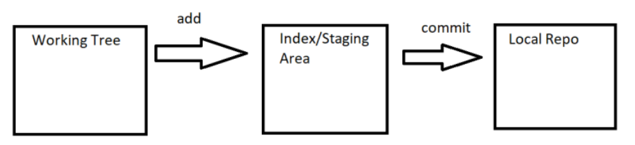

# Git

* Git has 3 main areas
  * Creating Change in the working tree
  * Adding Changes to the Staging area
  * Commit Changes to the local repository

* Lets create and navigate to a folder to save all the files and folders.
  * Let the folder be `git`
    ```
    mkdir git
    cd git
    ```

## Initiating git repository
------------------------------
* At current situation this git folder is just a folder and not a git repository.
* To make this as a git repository we need to initiate the git in this folder.
  * To convert any folder to git repository, Execute `git init` command in the folder.
    ```
    git init
    ```

## Checking git status
----------------------------
* To check the status of the git repository execute
  ```
  git status
  ```
  * At this situation we do not have any changes to add or we didn't add any changes previously.
    ```
    On branch master
    No commits yet
    nothing to commit (create/copy files and use "git add" to track)
    ```

# Creating changes in the git repository

## Adding Empty Folders
------------------------------
* Now Lets add an empty folder (test) to the repository.
  ```
  mkdir test
  ```
* Now lets check the status after adding a folder.
  ```
  git status
  ```

* Even though we had added an empty folder git repository doesn't considered it as a change.
* So adding an empty folder to the git repository doesn't considered as a change.

## Adding Empty Files
------------------------------
* Creating an empty file is considered as a changes
  * So, Let's create an empty file in the git folder.
  ```
  touch readme.md
  ```
* now Let's check the status of the git repository
  ```
  git status
  ```
  
* Here we can see that there is and untracked file which needs to be add to the staging area.

## Adding Empty Files to the Folders
------------------------------
* Lets create an empty file in the test folder.
  ```
  touch ./test/file.md
  ```
* Now lets check the status of the repository.
  ```
  git status
  ```

* We can see that the empty file created in the empty folder will be considered as a change.
  > **_NOTE:_** Any empty file in an empty folder will be considered as a change but an empty folder itself is not considered as a change.

# Adding Changes
------------------------------
* We had added changes by creating a folder and an empty file in it.
* Now let's add this changes to staging area.
* We had file in git folder and one empty file in the test folder.
* To add changes to the staging area we have three types of commands.
  * ```git add -A```
  * ```git add --all```
  * ```git add .```
  > **_NOTE:_** We can use any one of these commands.
  ```
  git add .
  ```
* Now lets check the status of the git again
    ```
    git status
    ```
  
* Now we can see that the files we had created has added to the staging area.

## Adding content to the empty files
------------------------------
* Now lets add any content into the empty file we created
  ```
  echo '# Test file' > readme.md
  ```
* Now lets check the status of the repository.

* We can see that there is a change that needs to be staged.
* Now lets add these changes to the staging area.
```
git add .
```
* Now lets check the status of the git repository.

* Now the changes has added to the staging area.

## Adding Changes to the existing non empty file
------------------------------
* Already we had a non empty file `readme.md`.
* Now lets add some extra content to this file.
  ```
  echo '#Adding content' > readme.md
  ```
* Now lets check the status of the repository `git status`.
* 
* Now we had a modified file needed to add to the staging area.

# Commit changes to the local repository
------------------------------
* Now we has already made enough changes in the repository to add into the staged area.
* Now lets commit the changes to the local repository.
* To commit changes into the local repository `git commit -m "<Commit Message>"`
  ```
  git commit -m "Added Changes" 
  ```

* Now lets chech  the status  of the git repository `git status`.

* There is no changes to add or to commit.

## Git Logs
------------
* Lets check the git Logs.
```
git log
```

* Now we can see the 
  * commit id `9748a746cb693d1562c25e01d3a7dba126d6e220`
  * Author `rajnikanth1999 <praveendba31@gmail.com>`
  * Date of commit `Wed Sep 14 12:31:07 2022 +0530`
  * Commit Message `Added Changes`
* To get log in online
  ```
  git log --oneline
  ```