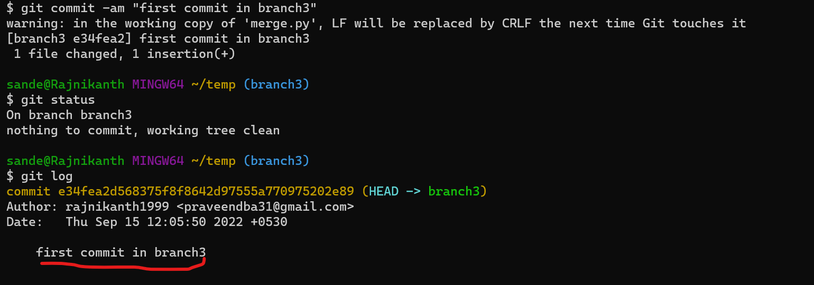
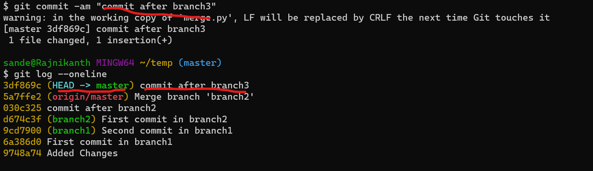

Merge Conflicts in Git
-----------------------
* Merge conflict comes when we have common files have some data.
* Example:
  * We has a file `merge.py` in both master and `branch3`.
  * But we made some changes in the `branch3` and whn we try to merge both branches it rises a conflict.
  * We have to decide what to do after the merge happen.
* Now lets create a new branch `branch3`.
```
git branch branch3
```
* Now checkout to the `branch3`.
```
git checkout branch3
```

* Now lets add some data to the `merge.py` file.
```
echo '#merge conflict 1 in branch3' > merge.py
``` 

* Now lets add and commit this change.
```
git commit -am "first commit in branch3"
```

* Now lets checkout to master branch.
```
git checkout master
```
* Now lets add some other changes to the same `merge.py` file.
```
echo '#merge conflict 1 in master' > merge.py
```

* Now lets add changes and commit
```
git commit -am "commit after branch3"
```

* Now we have added two different content in the same file in two different branches.
* Now Lets try to merge this branch3 with master.
    > **_NOTE:_** Navigate to master if you are in other branch.  `git checkout master`.
```
git merge 
```

* We can see there is a conflict.
* Now to merge `branch3` to `master` we need to resolve this conflicts.

* We have resolved all the conflicts.
* Now lets add the changes and commit.
```
git add .
git commit -m "merged"
```

* This way of merging is called `Three way merging`.