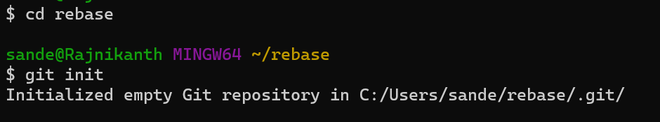
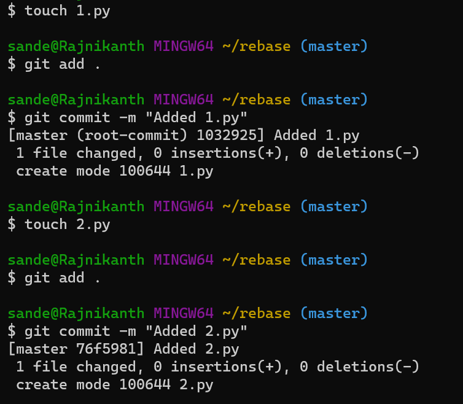
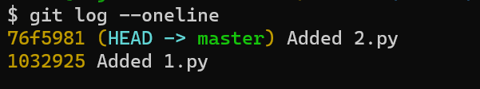
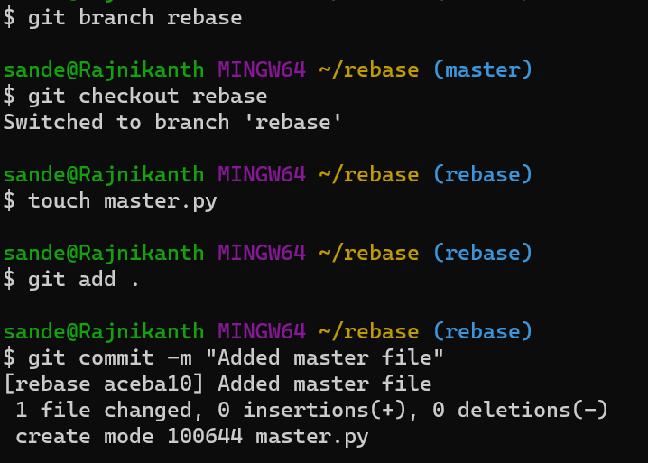
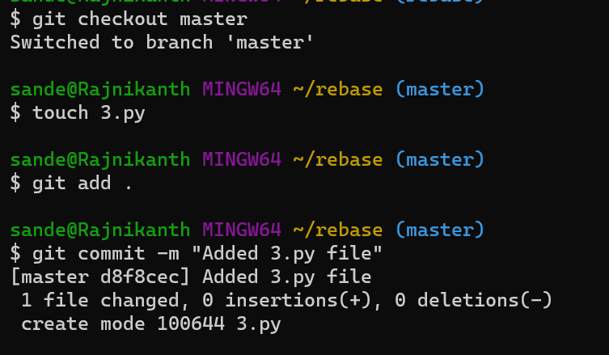
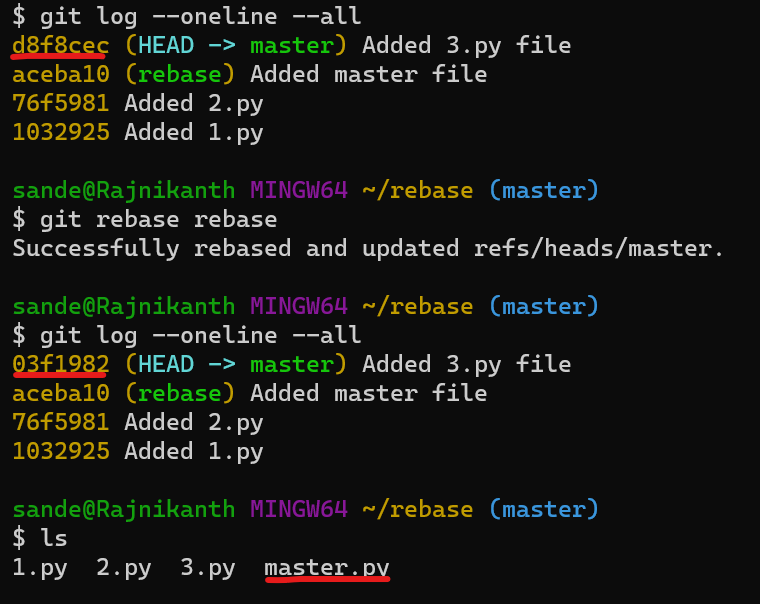

# Rebase in git
------------------
* Lets say we have `master` branch and another branch `rebase`.
* Unfortunately we have commited some changes in the `rebase` branch which should be commited in the `master` branch.
* Now to get those commits to the `master` we can use merge.
* But when we have commited some changes in the master branch after creating the `rebase` branch the merging will create unnecessary commit which make the master branch a mess.
* Now to merge the commits with out creating any unnecessary commits we use `rebase`.
--------------------------------
# Example of Rebase
* Lets create a folder `rebase` and make it git repository.
```
mkdir rebase
cd rebase
git init
```

* Now lets create two files and commit after creating each file.
```
touch 1.py
git add .
git commit -m "Added 1.py"
touch 2.py
git add .
git commit -m "Added 2.py"
```

* Now lets check the log of the repository.
```
git log --oneline
```

### Creating Rebase branch
* Now lets create a branch `rebase`.
* Checkout to the `rebase` branch.
* Create a file and commit in the `rebase` branch.
```
git branch rebase
git checkout rebase
touch master.py
git add .
git commit -m "Added master file"
```

### Master branch
-------------------------
* Now lets checkout to `master` branch and commit another file.
```
git checkout master
touch 3.py
git add .
git commit -m "Added 3.py file"
```

### Rebasing the master file commit to the master branch
-----------------------------------
  * Now we has added the `master` file in the rebase branch but we need this in the `master` branch.
* Now lets rebase the `master` file commit to `master` branch from `rebase` branch.
```
git rebase rebase
```

> **_NOTE:_** Refer to the picture above to understand below lines.
* Before we rebase the `master` file to the `master` branch, the id of the latest commit in `master` branch is `d8f8cec` and after rebase the id of the latest commit in the `master` branch is changed to `03f1982`.
* The commit has changed because one more file `master.py` is added.
* Here we have merged two branches without making any new commit.
* We can see that `master.py` file has added to the `master` branch.