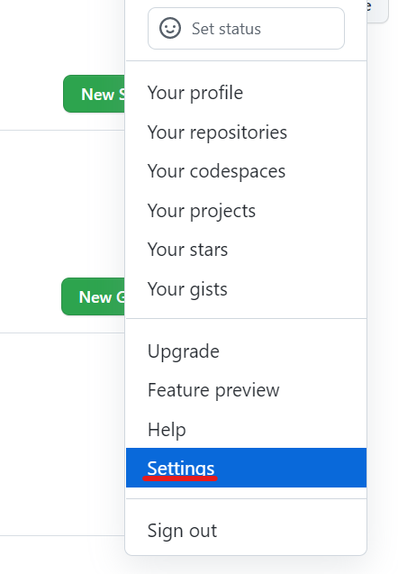
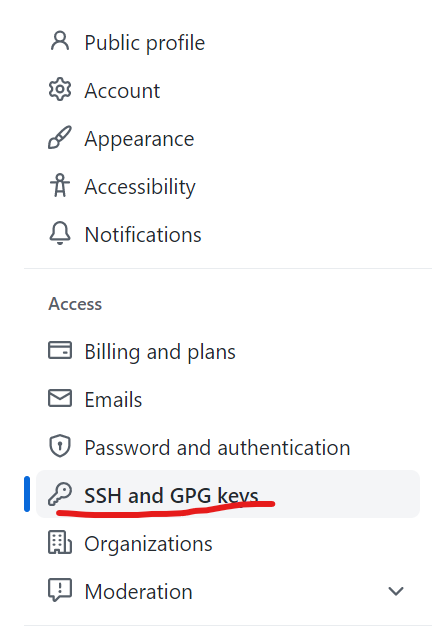
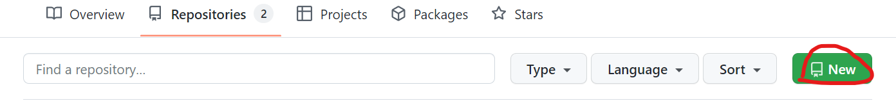
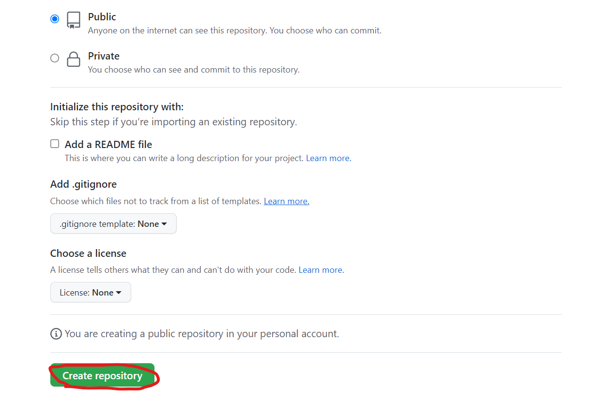
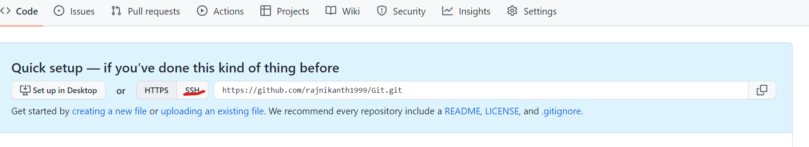
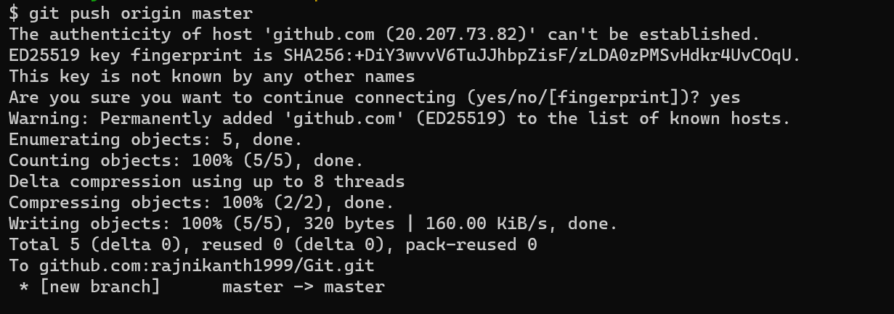

# Remote Repository
* Remote repository is used to make the repository available to others.
* Currently we are working in the local repository.
* The changes or the commits we have done is available only in the local repository.
* But to make this available and allow others add changs and do some commits we need remote repository.
* To make our local repository as a remote repository we need some servers and deamons.
* But rather than creating all those we use some other popular remote repositories.
* Remote Repositories are two types.
  * Self-Hosted
  * Cloud-Hosted
* Remote Repository can be Self hosted (Where we install on one of our servers)
    * Gitolite
    * Gitlab
    * BitBucket
* Cloud Hosted (Where the git with server featuers is preinstalled and you just need to configure users, repositories etc)
  * GitHub
  * GitLab
  * BitBucket
  * Azure Source Repos
  * AWS Code commit
# GitHub Push
* To push the local repository to github we need to create a github account.
* We use ssh Authentication for github.
* Lets create a ssh key in our local system.
```
ssh-keygen
```
* After executing this command in our home directory a `.ssh` folder is created.
* In this .ssh folder there will be `id_rsa` nad `id_rsa.pub` will be created.
  * The `id_rsa` is the privite key and need to store securely in the local system itself.
  * The `id_rsa.pub` is a public key and we need to copy this to the git repository.
* Now lets login to the git hub and create a SSH key.



* Now lets get the public key we have generated
```
cat .ssh/id_rs
```
* Copy the code.

* Fill all the coloumns and click Add SSh.





* Now we have copied the ssh url.
* Now we have to add the connection of remote repository to our local Repository.
* To add remote repositories the command is `git remote add <name-of-remote> <remote-repository-url>`
* In git remote repositories the default name is origin.
```
git remote add origin git@github.com:rajnikanth1999/Git.git
```
* Now lets push the changes we created in the `init-add-commit.md` file.
* To push any local repositories `git push <remote-name> <branch-name>`
```
git push origin master
```

* Now lets refresh the git portal.

* Here we can see the commits we had made in the master branch.