# Remote Repository
* Remote repository is used to make the repository available to others.
* Currently we are working in the local repository.
* The changes or the commits we have done is available only in the local repository.
* But to make this available and allow others add changs and do some commits we need remote repository.
* To make our local repository as a remote repository we need some servers and deamons.
* But rather than creating all those we use some other popular remote repositories.
* Remote Repositories are two types.
  * Self-Hosted
  * Cloud-Hosted
* Remote Repository can be Self hosted (Where we install on one of our servers)
    * Gitolite
    * Gitlab
    * BitBucket
* Cloud Hosted (Where the git with server featuers is preinstalled and you just need to configure users, repositories etc)
  * GitHub
  * GitLab
  * BitBucket
  * Azure Source Repos
  * AWS Code commit
# GitHub Push
* To push the local repository to github we need to create a github account.
* We use ssh Authentication for github.
* Lets create a ssh key in our local system.
```
ssh-keygen
```
* After executing this command in our home directory a `.ssh` folder is created.
* In this .ssh folder there will be `id_rsa` nad `id_rsa.pub` will be created.
  * The `id_rsa` is the privite key and need to store securely in the local system itself.
  * The `id_rsa.pub` is a public key and we need to copy this to the git repository.
* Now lets login to the git hub and create a SSH key.
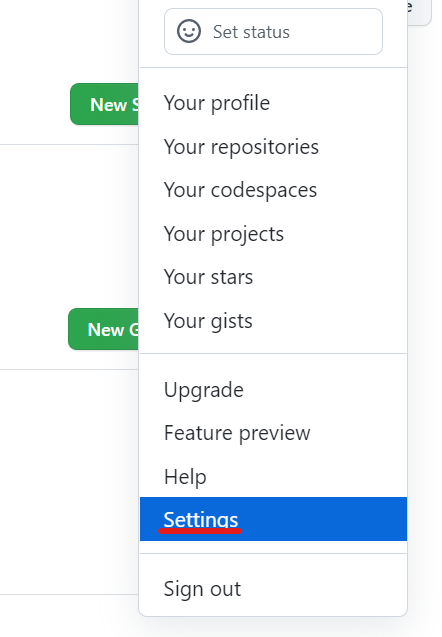
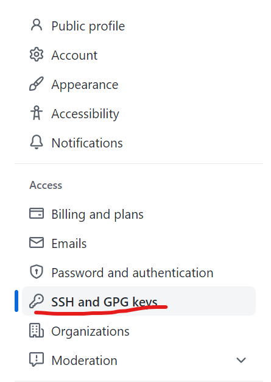
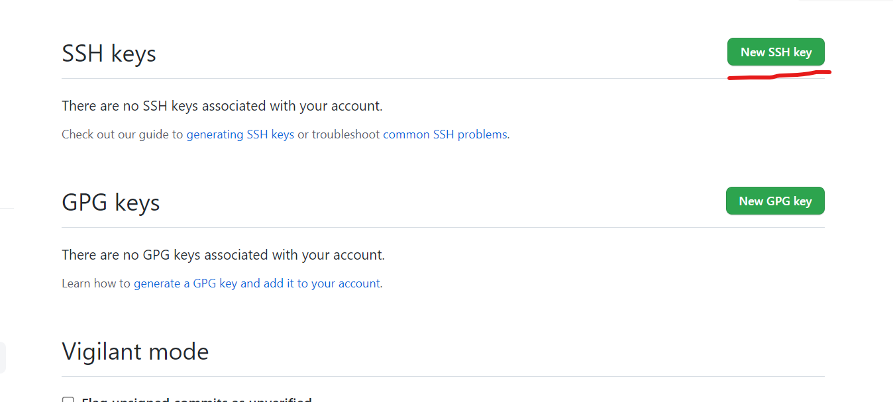
* Now lets get the public key we have generated
```
cat .ssh/id_rs
```
* Copy the code.
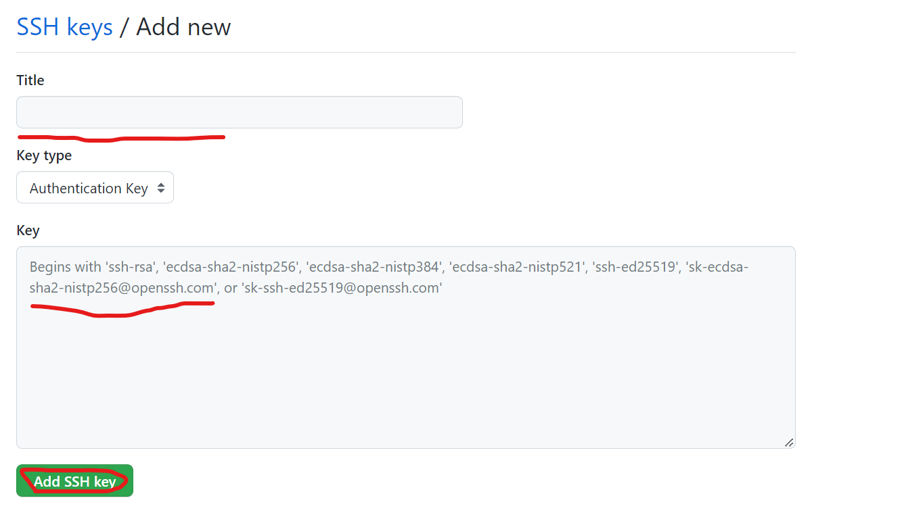
* Fill all the coloumns and click Add SSh.
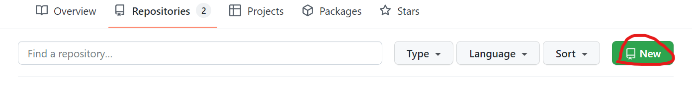
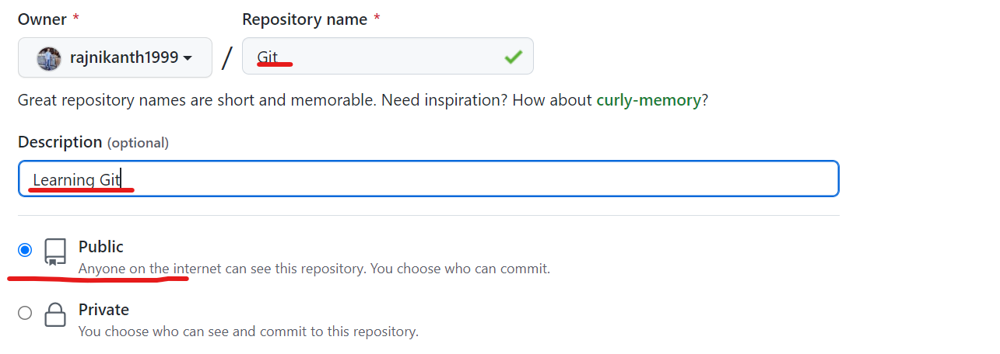
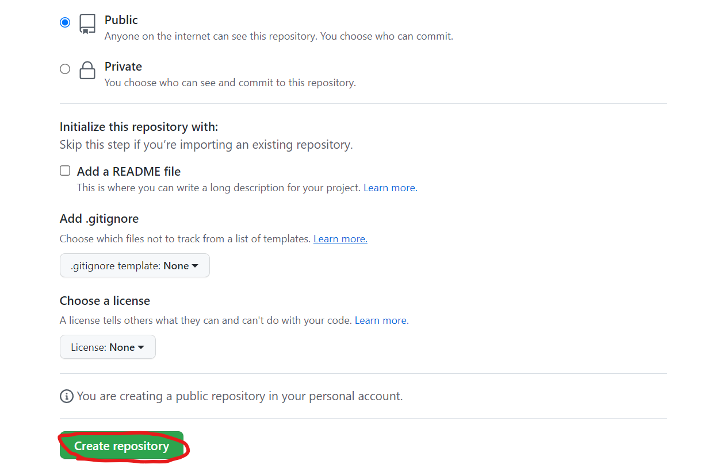
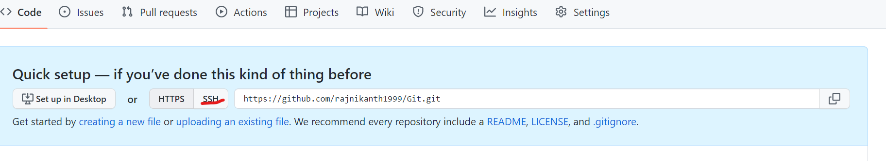
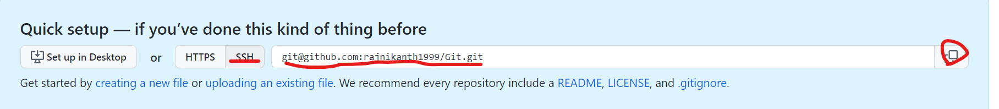
* Now we have copied the ssh url.
* Now we have to add the connection of remote repository to our local Repository.
* To add remote repositories the command is `git remote add <name-of-remote> <remote-repository-url>`
* In git remote repositories the default name is origin.
```
git remote add origin git@github.com:rajnikanth1999/Git.git
```
* Now lets push the changes we created in the `init-add-commit.md` file.
* To push any local repositories `git push <remote-name> <branch-name>`
```
git push origin master
```
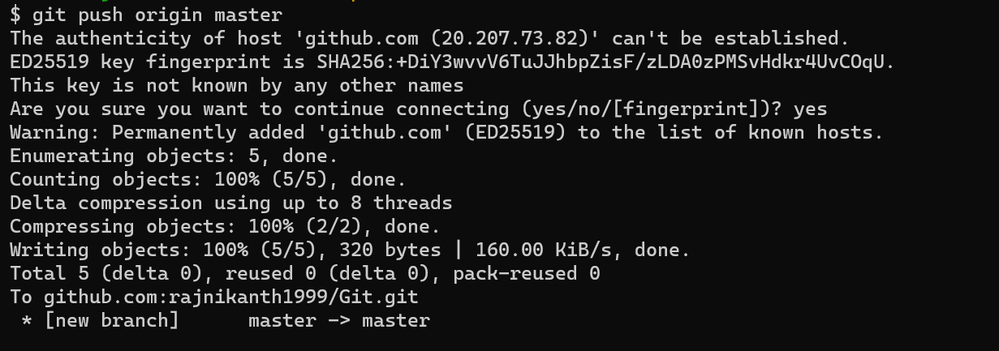
* Now lets refresh the git portal.
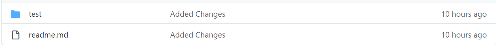
* Here we can see the commits we had made in the master branch.
---------------------------------
# Pull from remote repositories
* Now we have made some commites in our local repository.
* But we have some other persons working on the same remote repository and pushed some changes into the same remote repository before we try to push.
* The commits created by the other persons are in the remote repository but not in our local repository.
* So when we try to push the changes to the remote, the head will look into the different commit which is latest and created by some other.
* Now we have to pull the changes before we push our changes into the remote repository.
> **_NOTE:_** If there is no commit created by other persons then no need to pull.
----------------------------------------
### Example with conflict
* Now we have a git repository in the github.
* Lets clone this repository to the local system.
* [Refer Here](https://github.com/rajnikanth1999/Git) for the repository.
```
git clone https://github.com/rajnikanth1999/Git.git
```
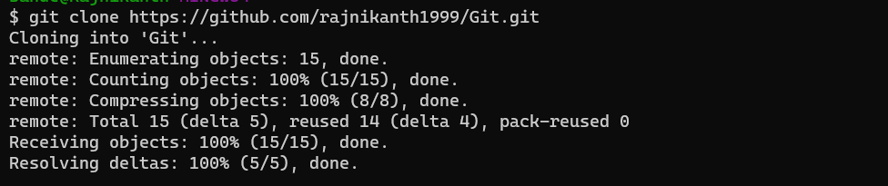
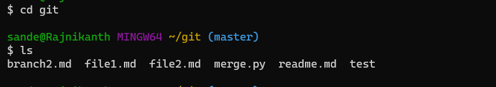
* We have all the files from the git remote repository in the local repository.
* Now lets add some changes into the local repository and commit them.
```
ls
echo "# From local repository" > branch2.md
git add .
git commit -m "Added chanes from local"
```
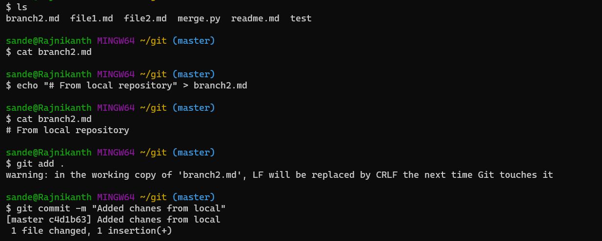
* Now we have made some changes and commited them.
* Now lets add some changes and commit them from the github.
> **_NOTE:_** Usually we don't do commits in the github portal.
> 
> But now there is no other persons to commit, lets do the commit in the github ourself.
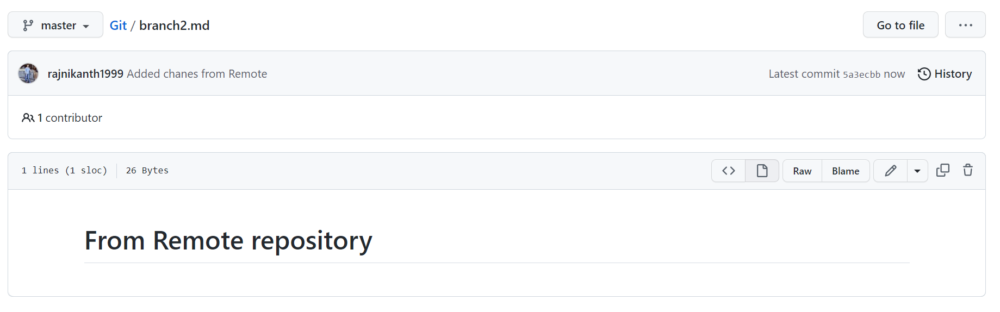
* Now we have commited some changes onbehalf of the other devoloper.
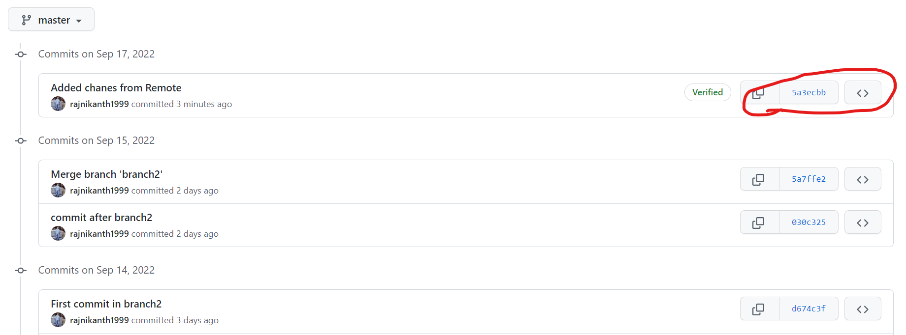
* Currently the head of the remote repository is looking towards the commit id `5a3ecbb`.
* But our local repository head is at the commit `5a7ffe2`.
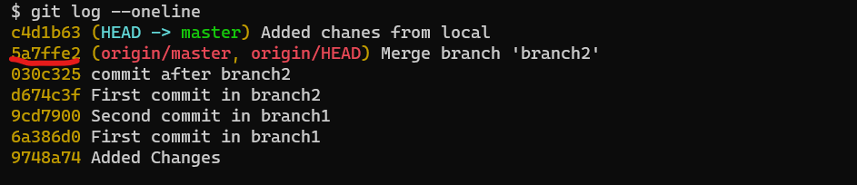
* Now lets try to push this repository to the remote repository.
```
git push origin master
```
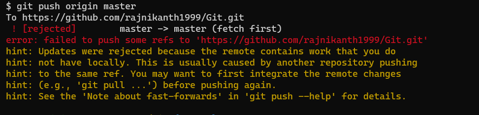
* We got an error while pushing because of the changes commit by some other devoloper.
* Now to push this commit to the remote repository we have to pull these changes to the local repository and then we have to push.
* Now lets pull the changes to the local repository.
```
git pull
```
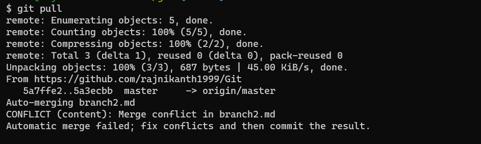
* Now we have an error because of the merge conflict.
* Now lets resolve this and pull.
```
code .
```
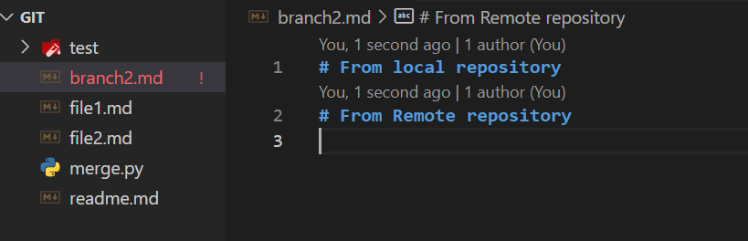
```
git add .
git commit -m "pull conflict"
git log --oneline
```
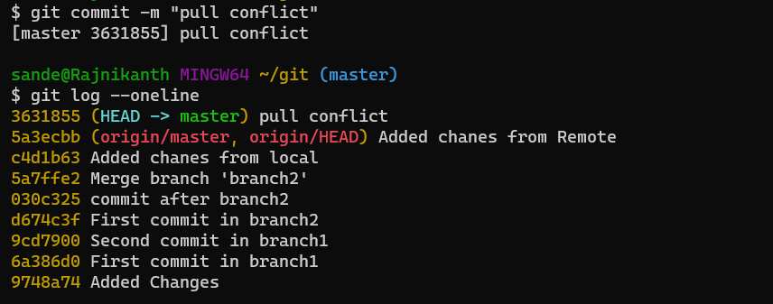
* Now we have pull request conflict resolved and pull the changes from the remote repository.
* Now lets push the local commits to the remote repository.
```
git push origin master
```
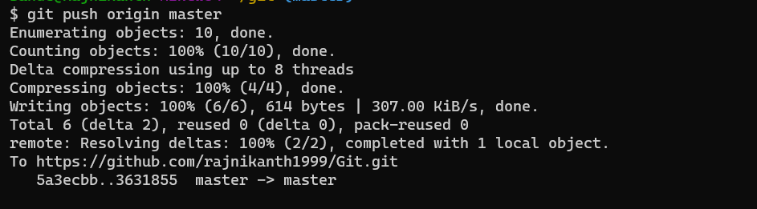
* Now we have push the local commits to the remote repository after resolving the conflict.
--------------------------------------
### Example without conflict
* Now we have same commits in the local and remote repository.
* Now lets add two different files in the loacl and remote repositories and commit.
* Lets add local.py file in the local repository and commit.
```
echo "# Created in local repository" > local.py
git add .
git commit -m "Added local.py locally"
```
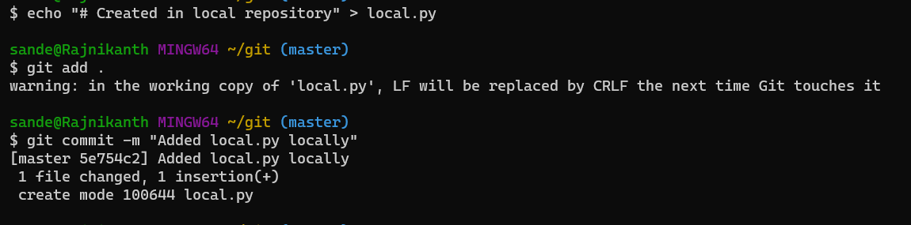
* Lets add remote.py file in the remote repository and add `# Created in Remote Repository` and commit.
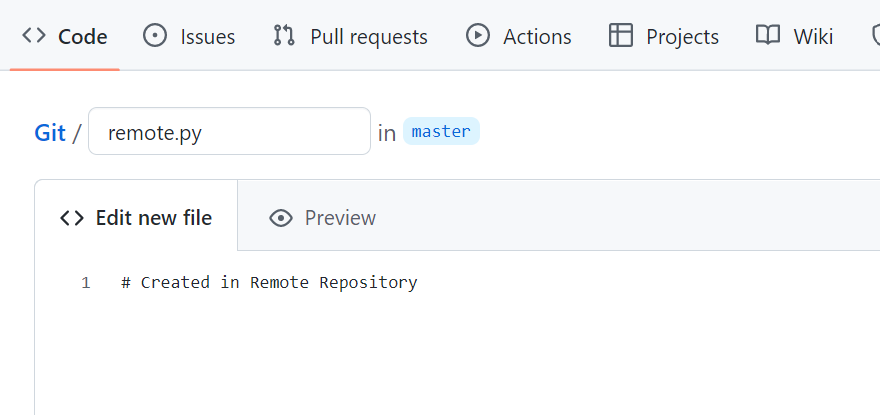
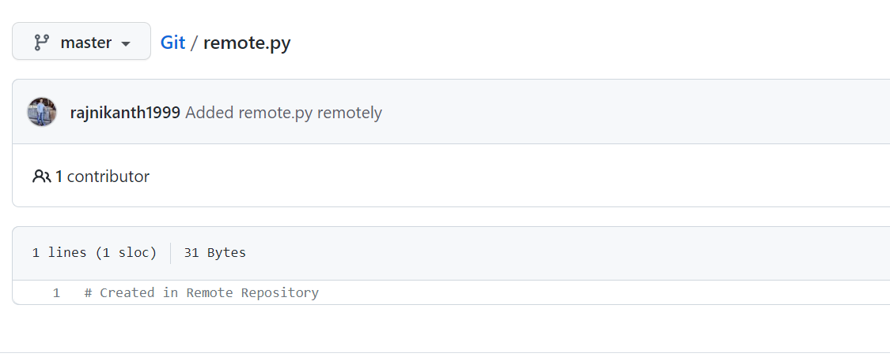
* Now we have some commits in the local repository.
* Lets try to push the local commits to the remote repository.
```
git push origin main
```
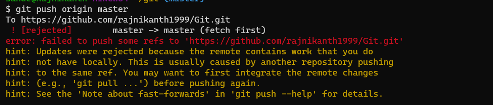
* The push has rejected because there is some commits which are in remote repository and not in the local repository.
* To push the local commits we have to pull the remote commits into the local repository and then we can push.
* Now lets pull the remote commits.
```
git pull
```
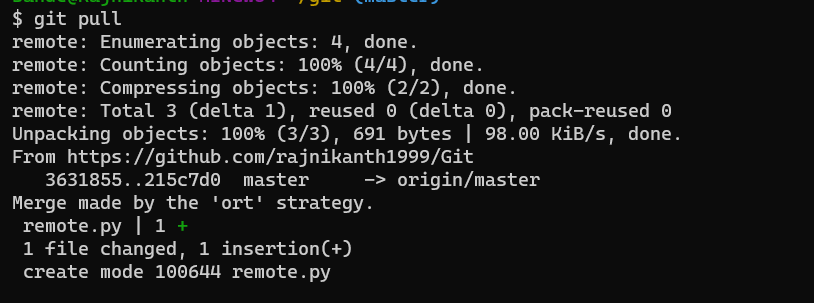
* Now we have pull all the commits from remote repository to the local repository.
* Now the head of our local repository and head of the remote repository is in same commit.
* Now lets push the commit we have locally into the remote repository.
```
git push origin master
```
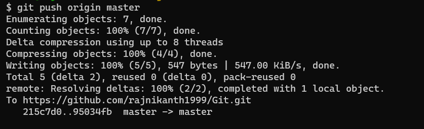
* Now lets check the log of the local repository.
```
git log --oneline --all
```
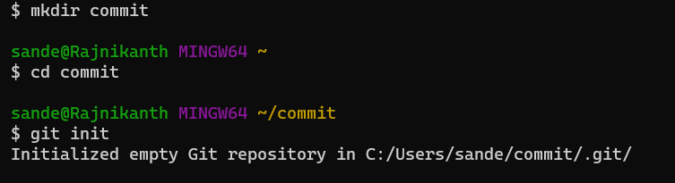