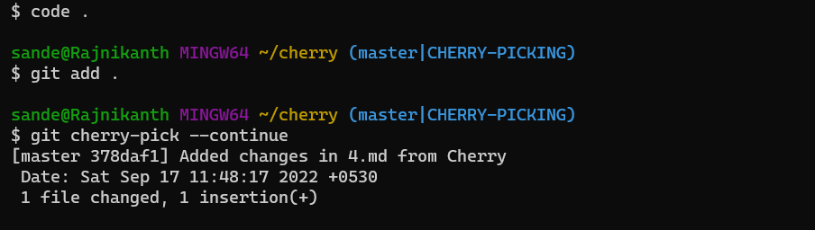

# Cherry Pick
* Cherry pick is used to get the particular commits from other branches.
* If we add some changes in a commit in the `master` branch and we need changes from only that particular commit and not all of them.
* If we merge or rebase the branch then we will get all the commits from the other branches.
* To get only changes from the particular commit we use `cherry-pick`.
* To cherry-pick we need the commit id which we need to pick.
> **_NOTE:_** `cherry-pick` will not create new merge.
### Example without conflict
-------------------
* Lets create a folder `cherry` and convert this folder to local repository.
```
mkdir cherry
cd cherry
git init
```

* Now lets create some changes and commit them in the `master` branch.
```
touch 1.py 2.py
git add 1.py
git commit -m "Added 1.py"
git add 2.py
git commit -m "Added 2.py"
```

* Now lets create a branch `cherry` and add some changes and commit them.
```
git branch cherry
git checkout cherry
touch 1.md 2.md 3.md 4.md
git add 1.md
git commit -m "Added 1.md"
git add 2.md
git commit -m "Added 2.md"
git add 3.md
git commit -m "Added 3.md"
git add 4.md
git commit -m "Added 4.md"
```

* We have 4 commits in the `cherry` branch.
* Now we need the 4th commit in the master branch.
* Now lets check the log of the commits in the `cherry` branch.
```
git log --oneline --all --graph
```

* 4th commit id `7ab3690` and the file that is commited in the 4th commit is `4.md`.
* Now we have the commit is we need to cherry pick.
* Lets cherry-pick this commit to the master branch `git cherry-pick <commit-id>`.
> **_NOTE:_** Make sure you are in the target branch before cherry pick.
```
git checkout master
git cherry-pick 7ab3690
```

* Now we cherry-pick the commit we need.
* We can see that there is only `4.md` in the `master` but not the remaining files.
### Example with conflict
-----------------------------
* Now we have 4.py file in both the branches.
* But both of them are empty files.
* Now Lets add some content to the `4.md` file in `master` branch.
```
echo "#From Master branch" > 4.md
git add .
git commit -m "Added changes in 4.md from Master"
```

* Now Lets add some content to the `4.md` file in `cherry` branch.
```
git checkout cherry
echo "#From Cherry branch" > 4.md
git add .
git commit -m "Added changes in 4.md from Cherry"
```

* Now lets check the log of the repository.
```
git log --oneline --all
```

* Now we can see fro above picture that we had 4.md has changed in both `master` and `cherry` branches.
* Now we need this both changes in the master branch but not in the `cherry` branch.
* Now we need to cherry-pick the commit in the `cherry` branch commit to the `master` branch.
> **_NOTE:_** checkout to the target branch before cherry-pick.
```
git checkout master
git cherry-pick 3c829c4
```

* Now we can see that there is a conflict.
* To resolve this conflict open the conflicted file in any editor.
* Lets open this in vscode.
```
code .
```

* Now we have to remove the conflict and save the changes.

* We have removed the conflict. Now lets add and confirm the cherry-pick.
```
git add .
git cherry-pick --continue
```

* It will give an option to change the commit message.
* If you want you can change or simply enter the below command.
```
:wq
```
* Now we had cherry pick the changes from `cherry` branch.

* Now lets check the logs of the `master` branch.
```
git log --oneline --all
```

* Here we can see that we had a new commit `378daf1` in the `master` branch because we had a conflict and also changed the `4.md` file.
* Earlier when we don't have any merge conflict no new commit is created.