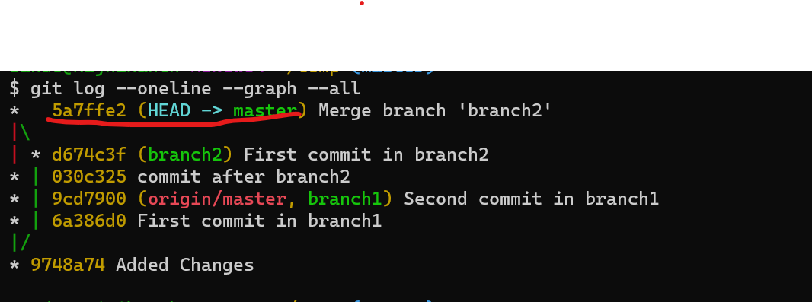

Merging git branches
--------------------------
## Merging Git branches
* Lets Create a branch `branch1`.

* We have two branches `branch1` `branch2`.
* Now we have to merge `branch1` and `master branch`.
* We can do it in two ways.
  * Fast Forward
  * Merge 
### Fast Forward
* To merge the `branch1` with `master` its enough if the head is looking towards the `master` branch.
* Now lets merge the `branch1` with `master` branch.
* To merge we neeg to checkout to the `master`.
  * Ignore if the head is already looking to master.
```
git checkout master
```
* Now lets merge the branches by fastforward `git merge <branch1>`.
```
git merge branch1
```

* Now the `master` branch has merged with `branch1`.
* Now lets look into the DAG.

* Now we can see that the `head` is looking towards the `branch1`.
* But our `origin/master` is still at old `head` because we didnt push our merge into the remote repository.
* Now lets push local repository to the remote repository.
```
git push origin master
```

* Now lets check the graph of our local repository.

* Now we can see that the head of remote repository also looking to the `master` branch.
> **_NOTE:_** if you don't want to fastforward
```
git merge branch1 --no-ff
```
> **_NOTE:_** But this will create an extra commit in the master branch.
> 
> We can fastforward only if we didn't have any commits in the master branch after the branch1 has created.

## Merge
* Now lets create some changes in the `master` branch and commit those changes.
```
touch merge.py
git add .
git commit -m "commit after branch2"
```

* Now we have commits after the branch2 is created.
* Now lets try to fastforward to merge this branch2 to master.
```
git merge branch2
```

* Now lets check the graph of the repository.

* Now we can see that the `branch2` has merged with `master branch`.
* But this direct merge creates a new commit while merging.
* Now lets push this local repository to the remote repository.
```
git push origin master
```

* Now lets check the remote repository for the changes.

* We can see that the files we had is present in the master.
* Now lets have breif on the commits.

* We can see all the commits we had done.