Configuring path variables
--------------------------
* To run game of life we need java 8 version.
* To run spring pet clinic we need java 11 version.
* But when we need to run both applications in one server we need to Configure path variables.
* Install jdk-8 in the node which already has java-11 version.
```
sudo apt install openjdk-8-jdk -y
```
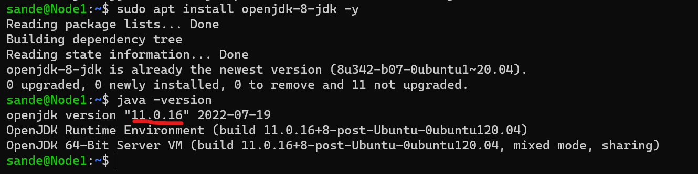
* We can see that java 8 is installed but still our server is looking to the java-11 version.
* Now lets find which versions of java is present in our server.
```
update-alternatives --list java
```
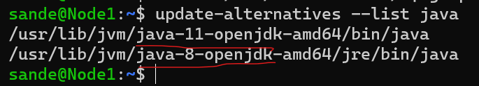
* We can see that there is java-11 and java-8 is installed in our server.
* ```/usr/lib/jvm/java-8-openjdk-amd64/jre/bin/java```
* This is the path where java-8 version has installed.
* Now lets check the java version in this folder.
```
/usr/lib/jvm/java-8-openjdk-amd64/jre/bin/java -version
```
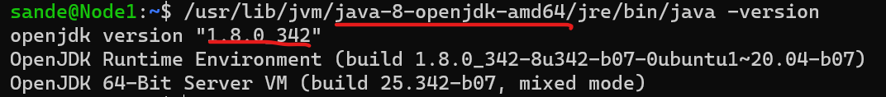
* The java version in this folder is 8.
* Lets add this path to the path variable.
```
export JAVA_HOME=/usr/lib/jvm/java-8-openjdk-amd64
echo $JAVA_HOME
```
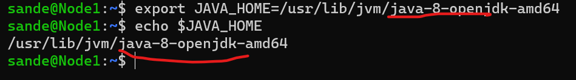
* Now we have partially added java-8 version to the path variable.
* But this will lost when the server is restarted.
* Now lets add this path variable to the user's path  varia file.
```
nano ~/.bashrc
```
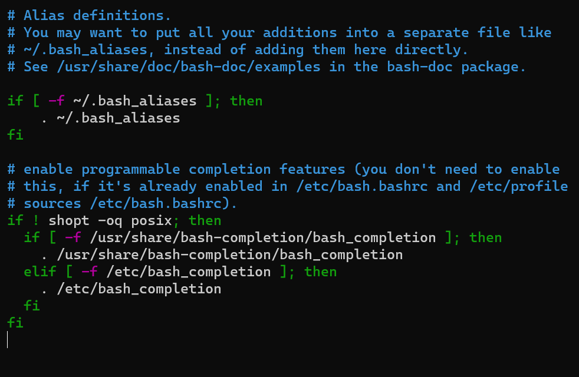
* Now add the path variable to this file.
```
export JAVA_HOME=/usr/lib/jvm/java-8-openjdk-amd64
export PATH=$PATH:$JAVA_HOME/bin
```
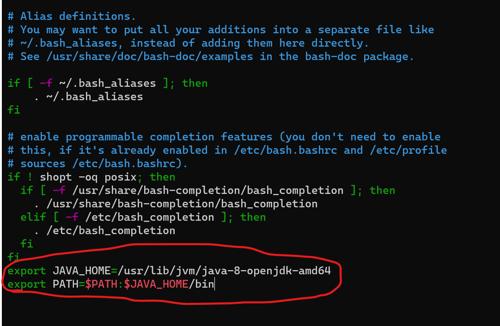
* We have added path variable to the file.
* Lets source this file to make this variable work.
```
source ~/.bashrc
```
* Now lets add this to the jenkins global variables.
* Go to the jenkins dashborard.
* Navigate to the `Global Tool Configuration`.
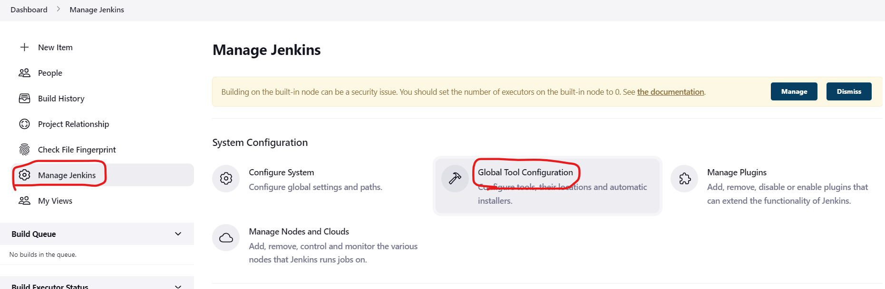
* Since we need to add jdk lets check the JDK Installations.
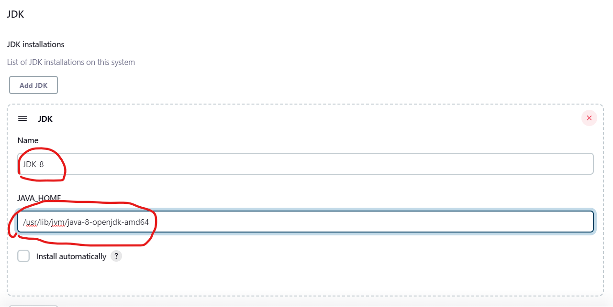
* Now lets create `Game-of-Life` project.
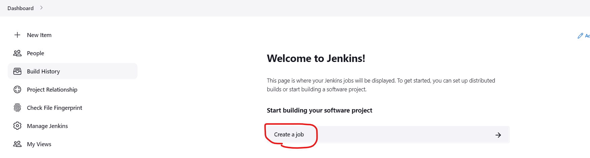
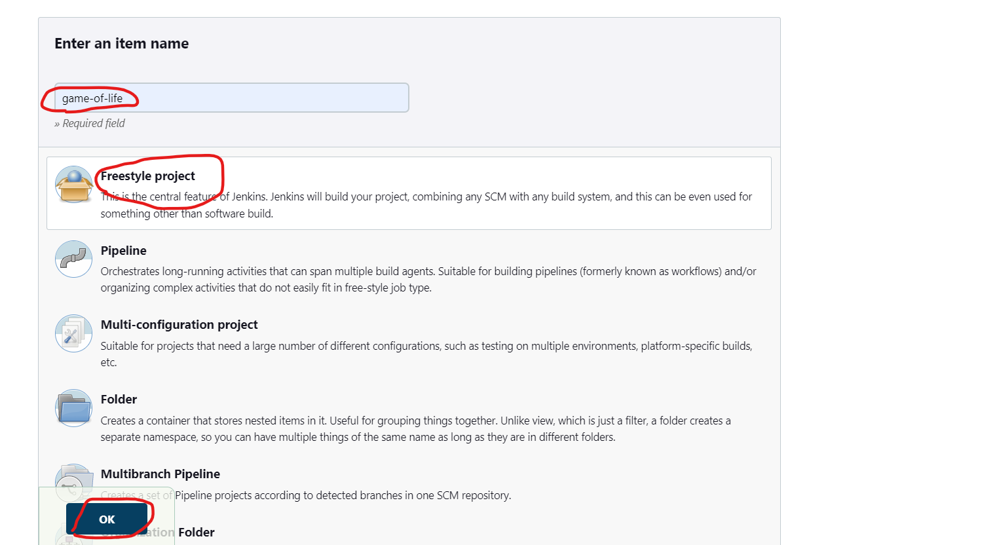
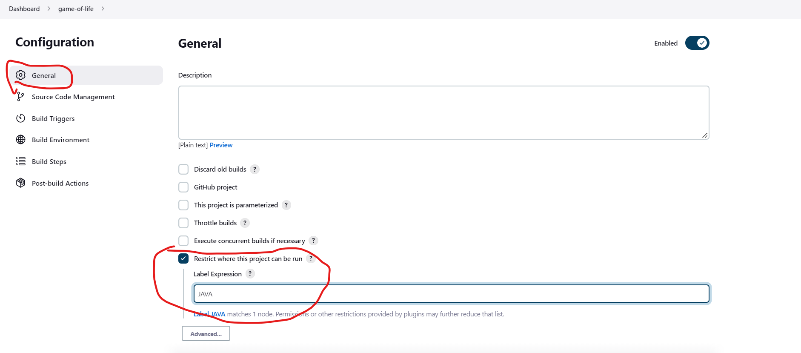
> **_NOTE:_** 
> * Replace JAVA in the above picture to your node label.
> If you're running this project in the master please ignore the above picture.

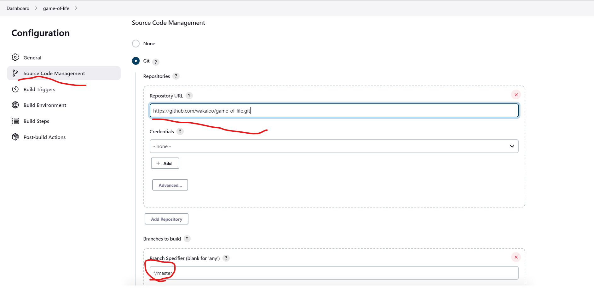
```
https://github.com/wakaleo/game-of-life.git
```
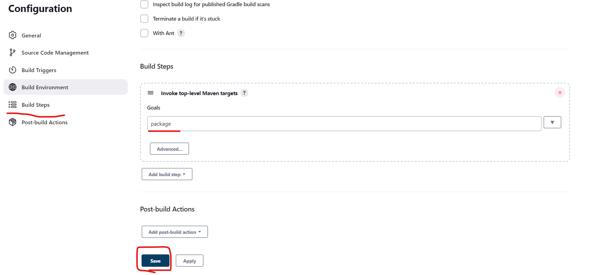
* We have created the project.
* Now lets build the project.
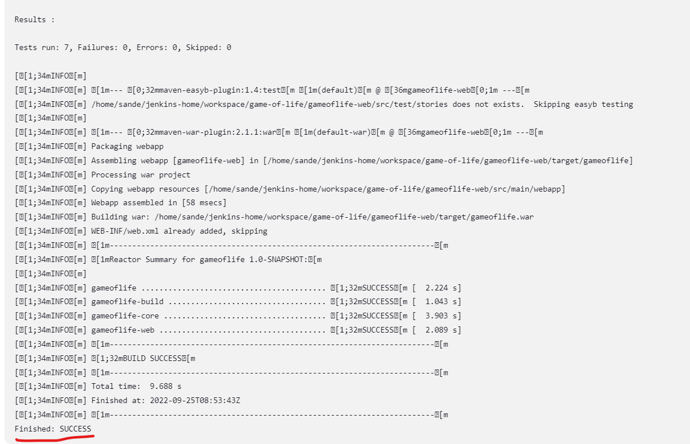
* The build has successful.

* The build was successful.
* We has run the java-8 project with java-11 is also installed using path variable.