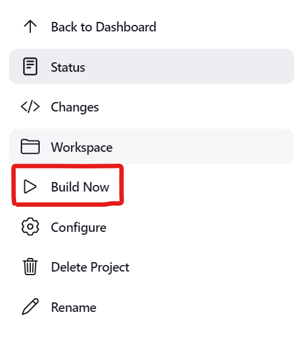
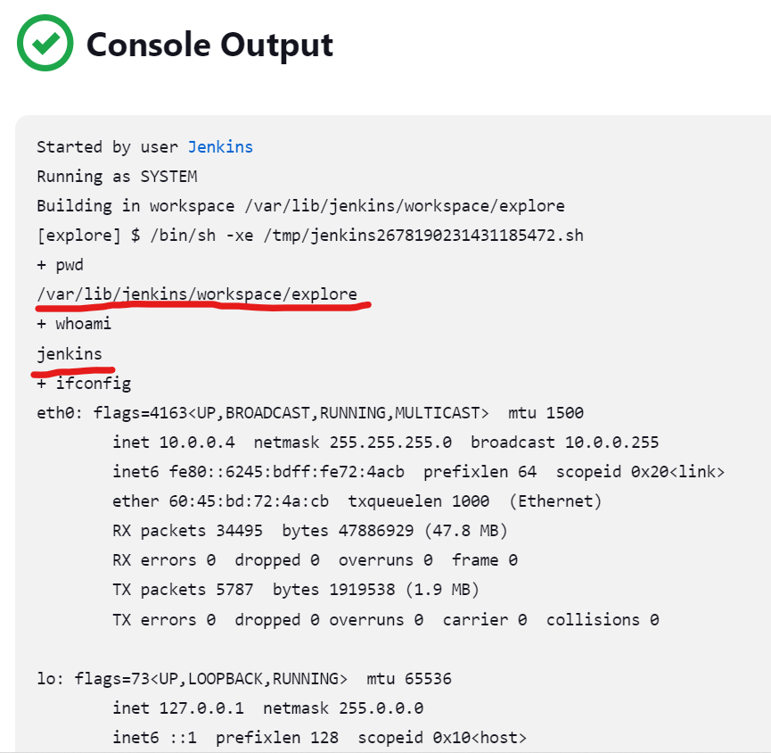

# Exploring Jenkins
-------------------
### Jenkins Home Directory
---------------------------
* Lets know about how the jenkins store everything and how it works.
* Lets create a project `explore`.


* Enter the below commands or commands of your choice.
```
pwd
whoami
ifconfig
```





* Now we have build some thing in our jenkins user.
* Now lets check what jenkins user Directory has.
* Connect to the jenkins server.
* Execute the following commands to change to the jenkins user.
```
cd /var/lib/jenkins
tree -L 1
```
> **_NOTE:_** Replace jenkins in the above command with the user name you given in the jenkins admin.


* This is the jenkins home Directory and list of folders.
* The projects we had created so far will be located in the jobs folder.
```
cd jobs
ls
```

* To explore the project we had created `explore`.
```
tree
```

* We has build only once.
* So we have only one foler in the explore folder.
* All the records of the builds will be store in this folder.
* Lets build again to check this again.

* Now lets check the jobs folder tree again.
```
cd /var/lib/jenkins/jobs/explore/
tree
```

* We can see there is 2 folder after we have build for the second time.
------
### Config.xml
--------------
* We can see there is a `config.xml` file.
```
cat config.xml
```

* All the commands which we have given in the build steps are recorded in this config.xml file.
------------
### Workspace
-------------
* Lets check the Workspace in our project in the jenkins UI.

* There is no file present in the project.
* So lets go back to build steps and check the workspace again.
* Go back to the build steps.


* Add the following command to the build steps and savve.
```
touch 1.txt
```
* Click on build.

* Now lets go back to the workspace.

* We can see that the file we want is created.
* Now lets go back to the server command line.
* Lets check the workspace in the server.
```
cd /var/lib/jenkins/workspace/
tree
```

* The file we have created in the build steps is stored in the workspace of the project we have created.    