# Configuring the nodes
-----------------------
### Configuring Jenkins Master
*  [Refer Here](./jenkins-Install.md) for instructions of installing node.
----------------
### Create a VM to configure jenkins node
--------------
* To configure jenkins node we need a vm.
* Lets create a virtual machine.
* Create a VM using the same `Resource group`, `Location`, `virtual network`, subnet and `network security group.`
* Create virtual machine using username and password.
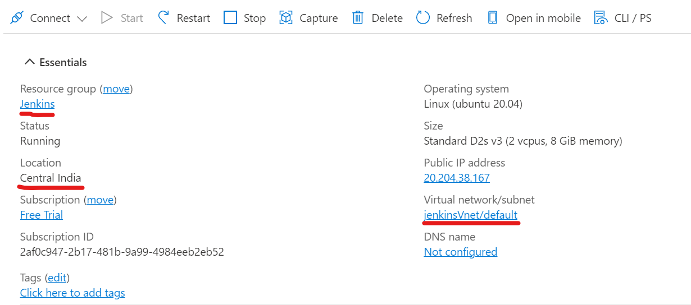
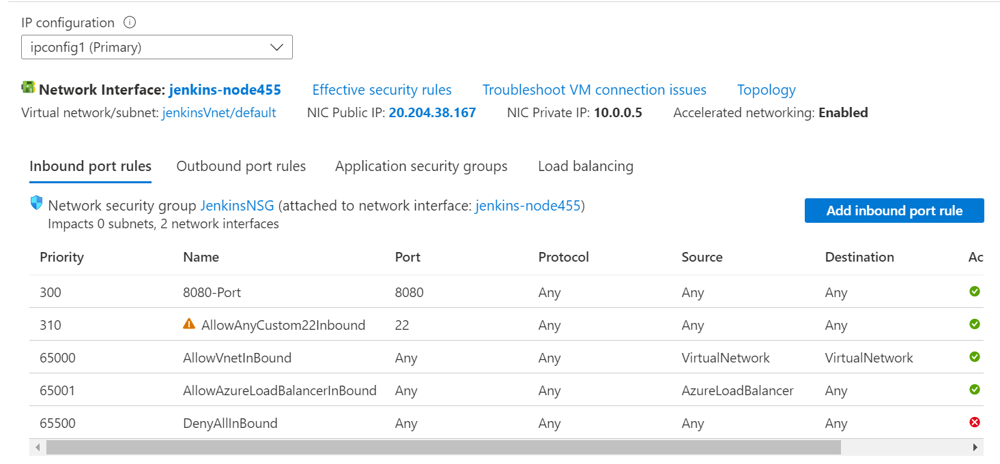
----------------------------------
### Configuring the jenkins node using username and password.
------------------
* To configure the vm as a jenkins node and to run the projects using jenkins it needs java packages.
* Now lets connect to the jenkins node using ssh and install java 11 `ssh <username>@<ip-address>`.
* After connecting to the node execute the following commands to install java.
```
sudo apt update
sudo apt install openjdk-11-jdk -y
```
* Now we have java installed in our nodes.
* Now connect to the jenkins through any web browser.
> **_NOTE:_** * Ignore if you have already connect to the Jenkins Master
```
http://<ip-address>:8080
```
* Now lets add our jenkins node to the jenkins master.
* Follow the picture below to configure the jenkins node to the jenkins master.
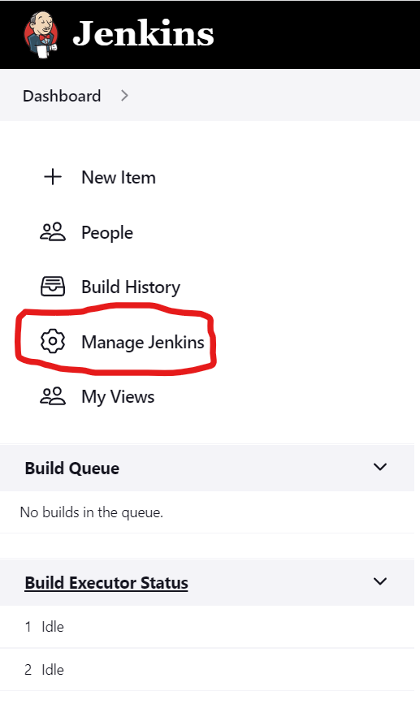
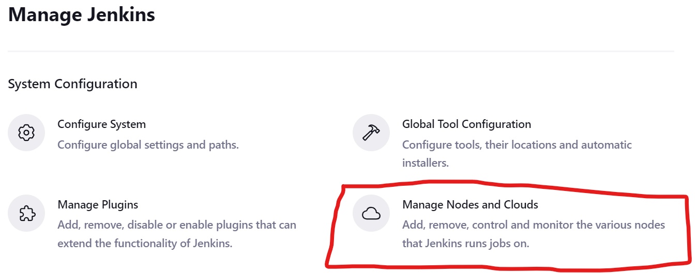
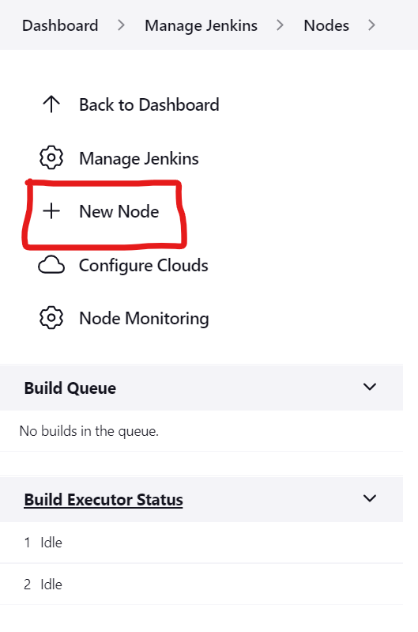
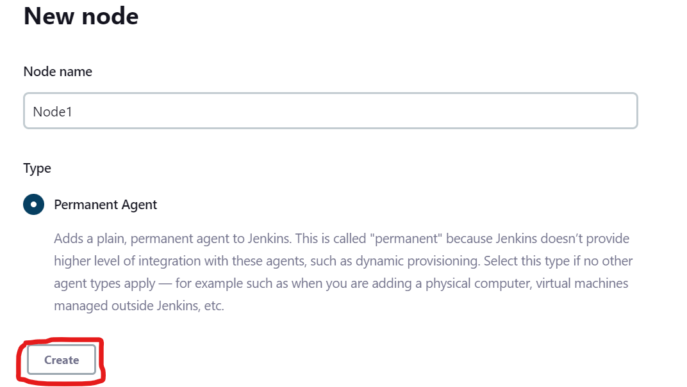
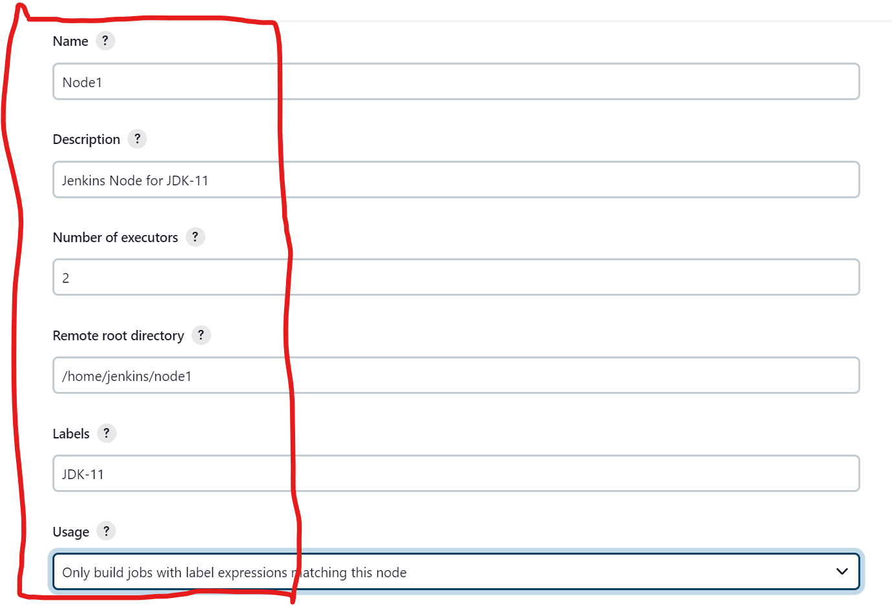
> **_NOTE:_** Change the Remote Root Directory to your node user home directory 

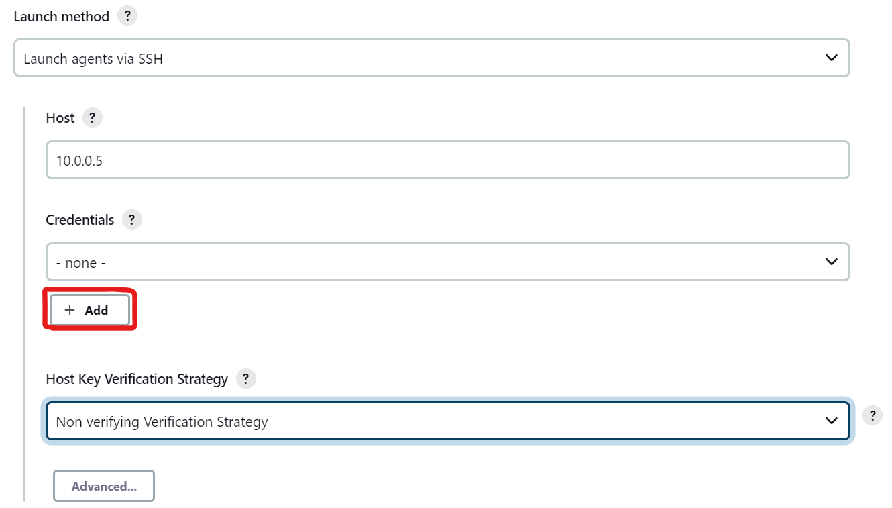
> **_NOTE:_** Change the Host to your node's private ip-address.

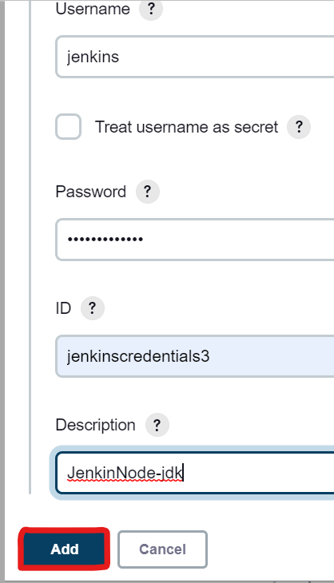
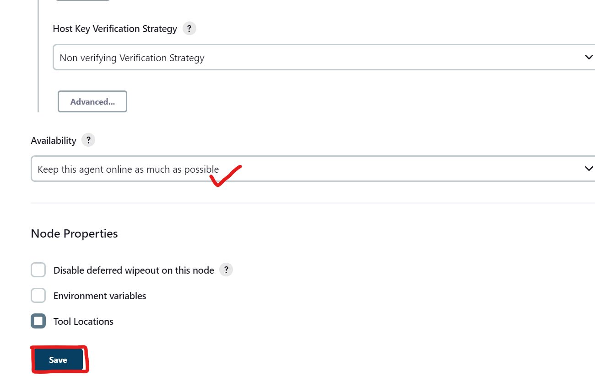
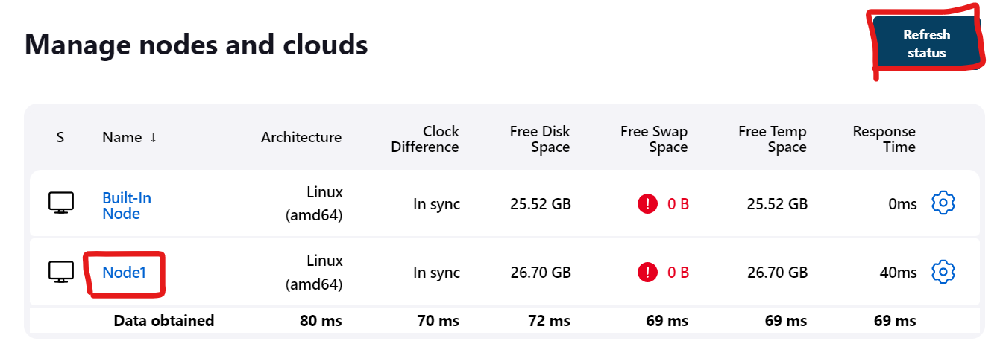
------------------------------
### Configuring the jenkins node using username and SSH KEY.
------------------
* To configure the vm as a jenkins node and to run the projects using jenkins it needs java packages.
* Now lets connect to the jenkins node using ssh and install java 11.
* `ssh -i <path-to-pem-file> <username>@<ip-address>` OR
* `ssh <username>@<ip-address>`
* After connecting to the node execute the following commands to install java.
```
sudo apt update
sudo apt install openjdk-11-jdk -y
```
* Now we have java installed in our nodes.
* Now connect to the jenkins master through any web browser.
> **_NOTE:_** * Ignore if you have already connect to the Jenkins Master
```
http://<ip-address>:8080
```
* Now lets add our jenkins node to the jenkins master.
* Follow the picture below to configure the jenkins node to the jenkins master.
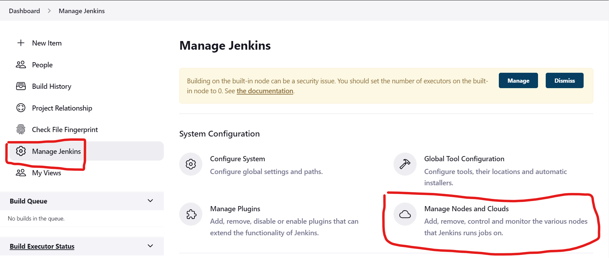
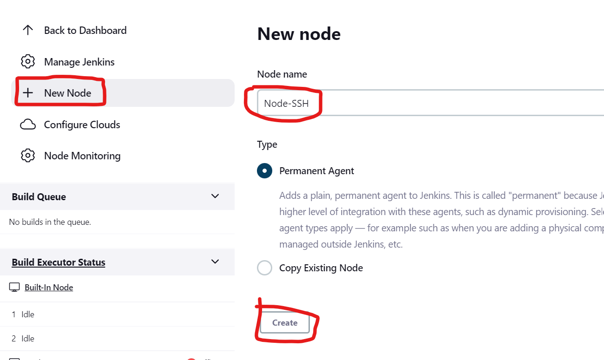
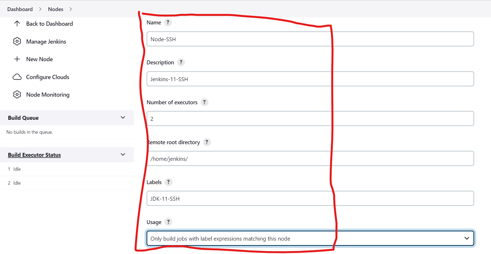
> **_NOTE:_** Change the Remote Root Directory to your node user home directory 

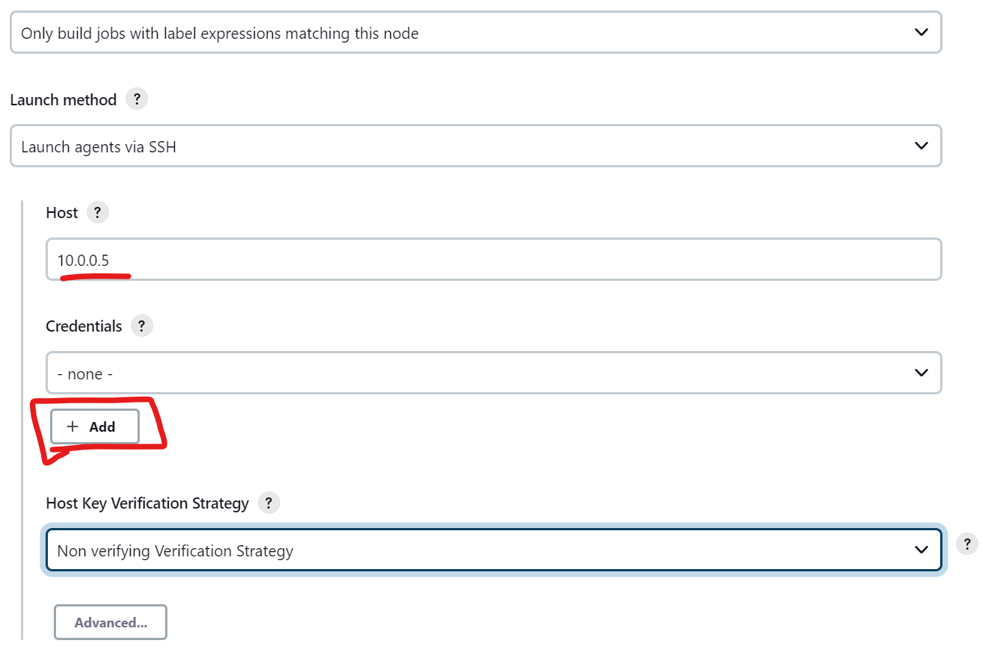

> **_NOTE:_** Change the Host to your node's private ip-address.

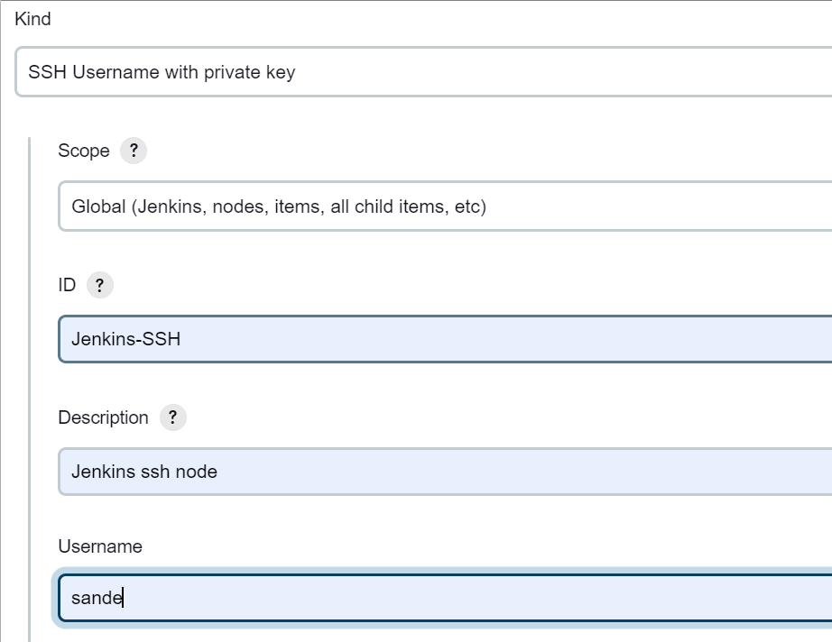
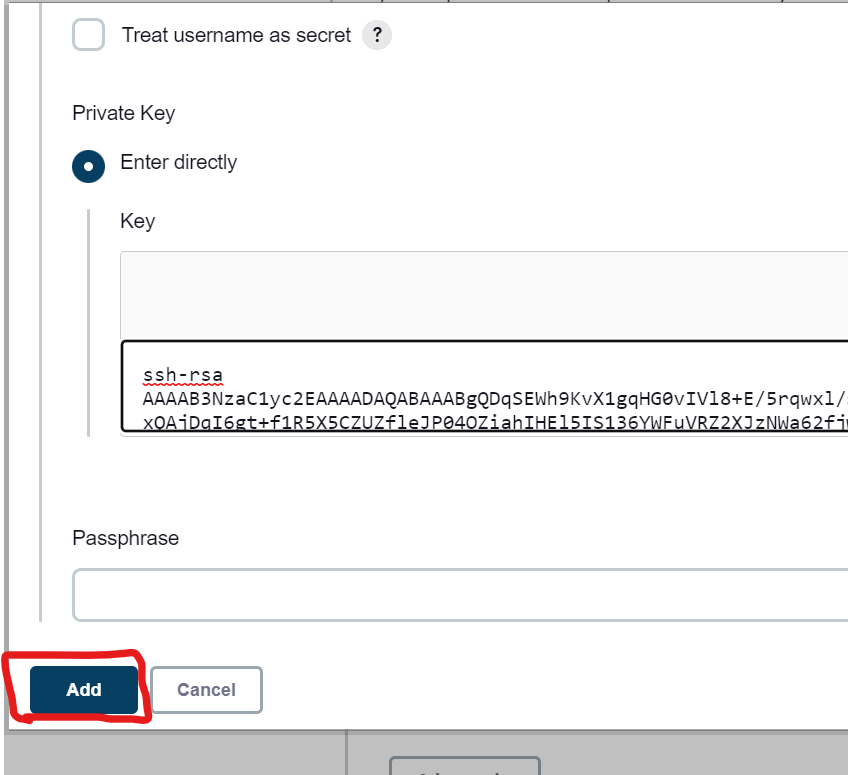
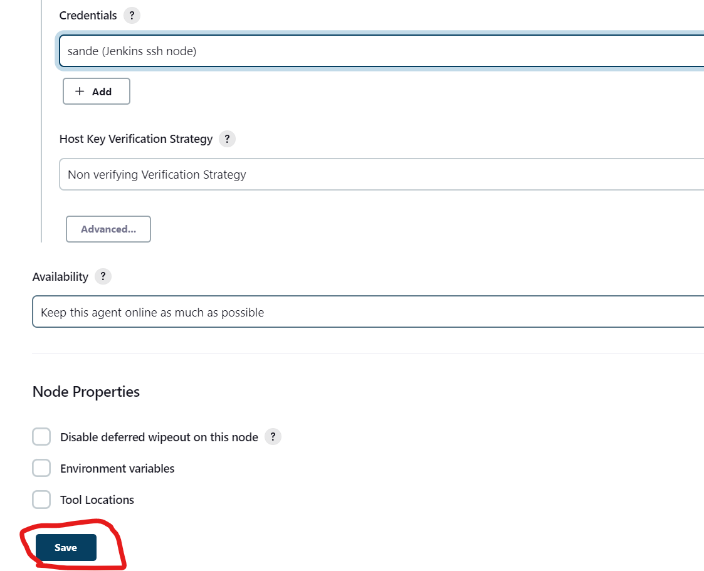
------------------------
* To run project in node  [Refer Here](spring-pet-clinic-node.md)