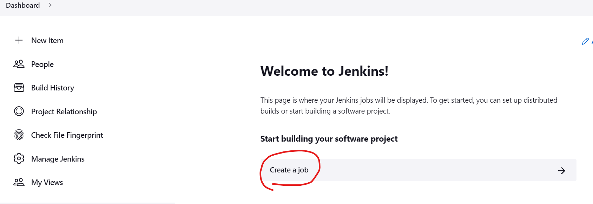
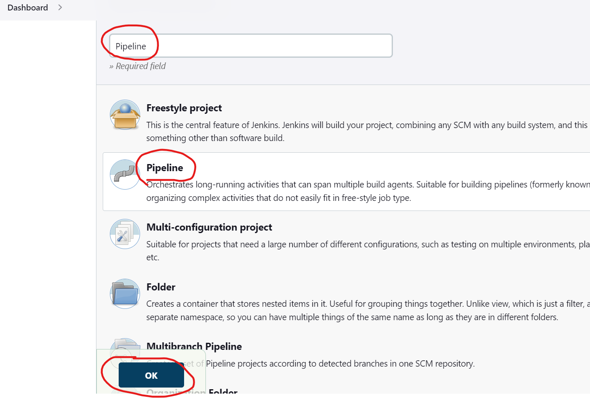
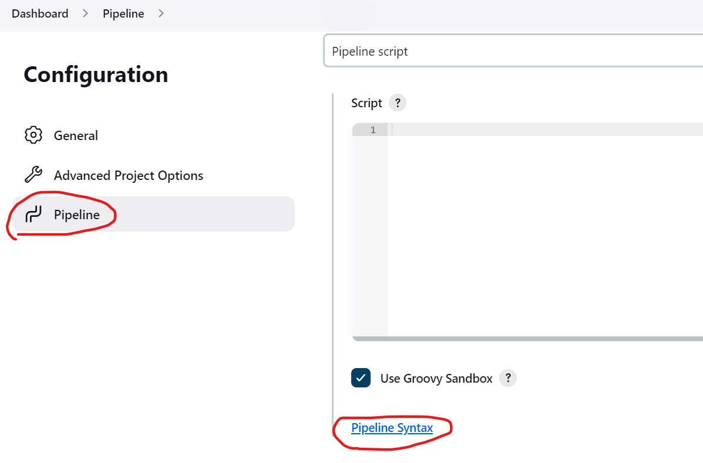
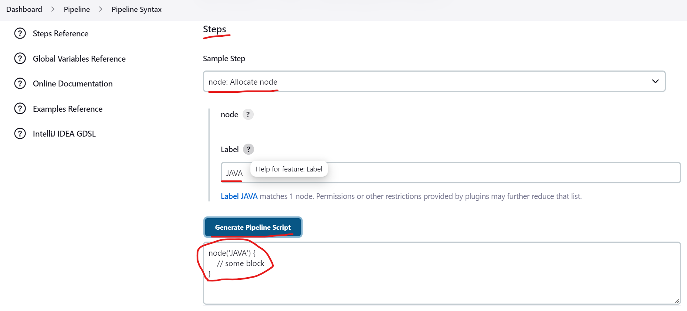
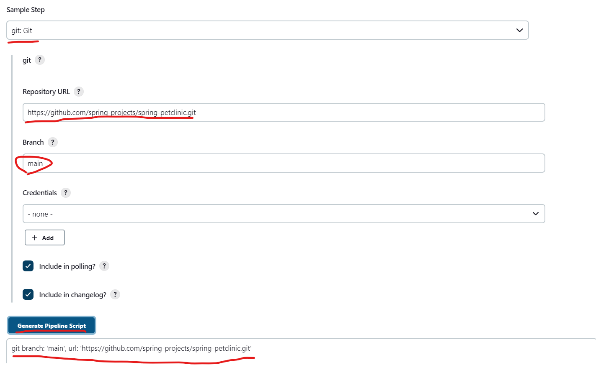
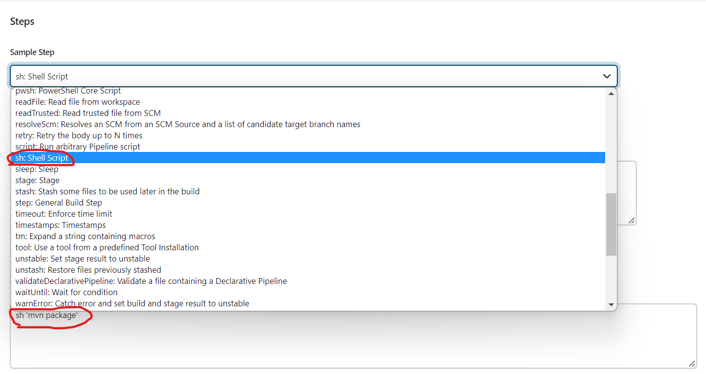
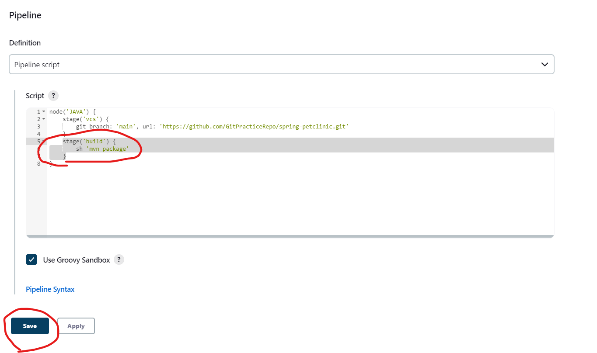
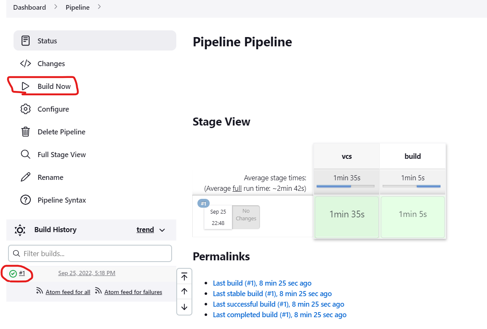

Scripted Pipeline
-------------------
* Lets create a pipeline project.



* In this we can generate the Pipeline syntax.
* First we need to configure the node so lets select node in the sample Step.

* Copy this code to the pipeline script.
* Lets build Spring pet clinic project for example.
* you can build whatever project you want.
* Paste the repository url in the URL box and branch name.

* Copy the generated content and paste it in the pipeline script.
* In the pipeline script every part is written in stages.
* The basic syntax of the stage is
```
stage('vcs') {
        git branch: 'main', url: 'https://github.com/GitPracticeRepo/spring-petclinic.git'
    }
```
* We have given the repository.
* Now lets give the package build stage.
* Search for mvn
* But Maven is not present in the script generator.
* But we know the command `mvn package`.
* So lets check for the shell script.

* Again copy this code and paste in the new stage inside the node.
```
stage('build') {
        sh 'mvn package'
    }
```

``` groovy
node('JAVA') {
    stage('vcs') {
    git branch: 'main', url: 'https://github.com/spring-projects/spring-petclinic.git'
}
stage('build') {
    sh 'mvn package'
}
}
```
* Now lets build the project.

* The build was successful.
* Just like this we can generate the script and add in the Scripted pipeline.