# Sending Email notifications when build failed or success or completed.
--------------------------- <br>
### When Build started
----------------------
* We will send Email notifications when the build has failed.
* We know the basic syntax of the scripted pipeline.
```groovy
node {
    stage ('') {
        //steps
    }
}
```
* Now lets get the steps for sending Email.
* For scripted pipeline we have `try` `catch` `finally` blocks because the scripted pipeline is written in groovy programming language.
* For now lets configure email just when the build failed.
* We will catch the error when the build failed using catch block.
* Then we will add the mail steps.
* The catch block will get executed only when the try block gets error.
> **_NOTE:_** 
> * MAke sure you configure the email and credentials before build.
> * [Refer Here](../freestyle/Email-notification.md) for the mail configuration steps.
> * We had already configured the mail.
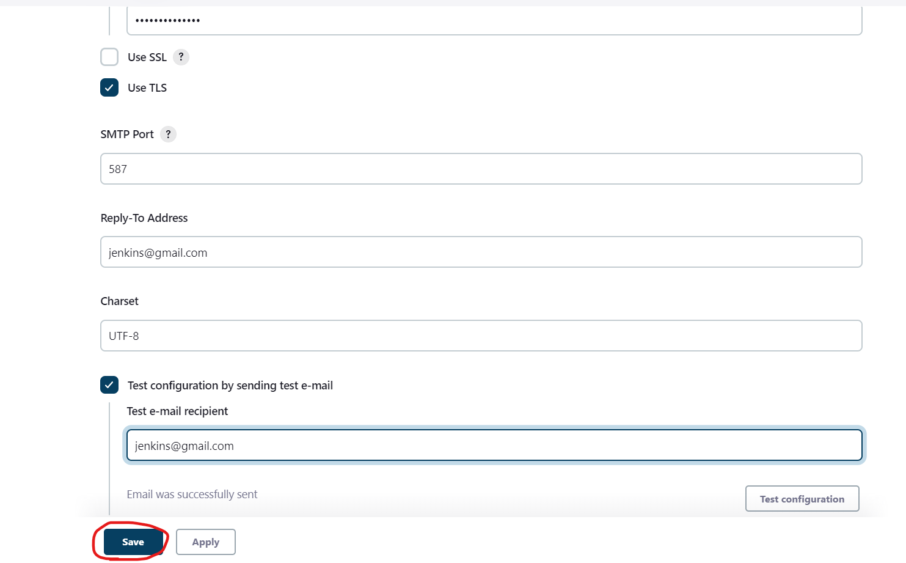
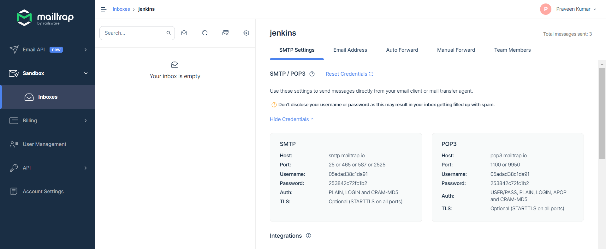

```groovy
node {
    try {
        stage('mail') {
            git url: 'https://github.com/GitPracticeRepo/game-of-life.git',
                branch: 'master'
        }
    }
    catch(err) {
        mail subject: "Build Failed",
            body: "Build Failed", 
            to: 'mail@gmail.com'
    }
}
```
* Now we have the pipeline script.
* Now lets add this to the pipeline and build the project.
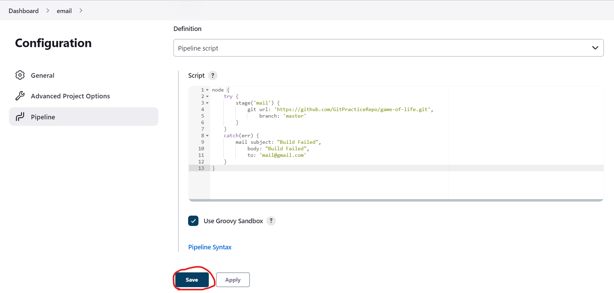
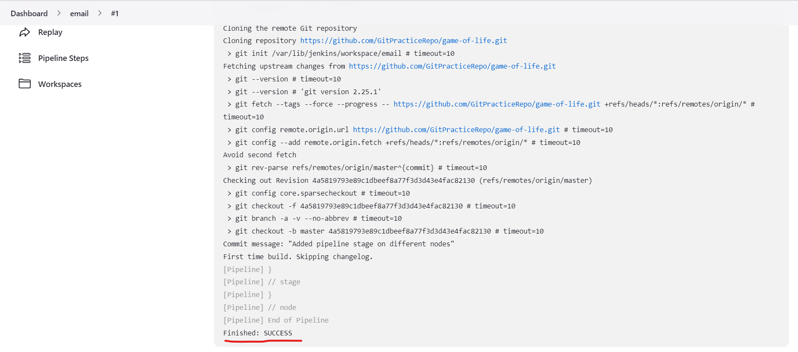
* Now the build was success and we didn't got any mail.
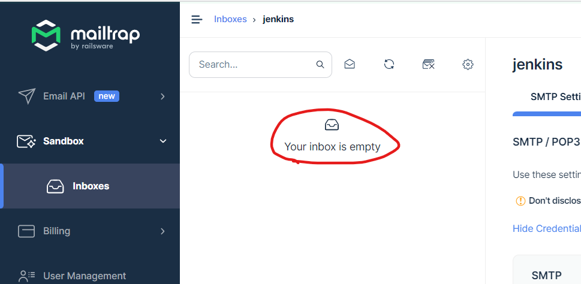
* Now lets make the build failed and check the mail.
* Lets change the branch from `master` to main but we didn't have main branch.
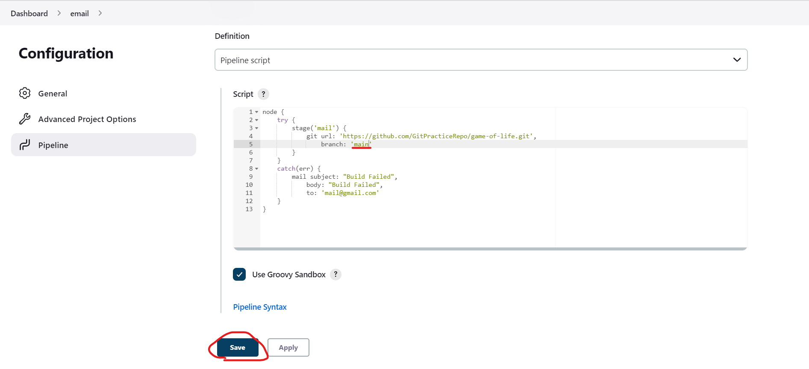
* Now lets build again.
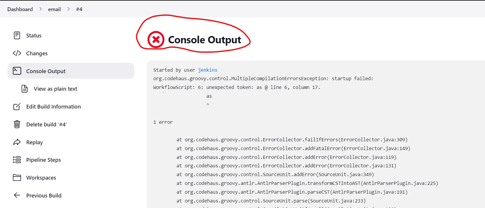
* The build has failed.
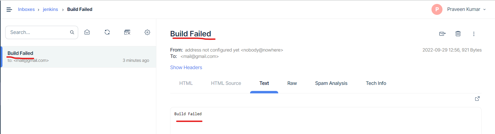
* We got a mail.
-------------------------------------<br><br><br>
### When Build started
----------------------
* Now lets add a stage to send email when the build has started even it is failed or success.
* Add the email step to the try block.
```groovy
mail subject: "Build Started",
    body: "Build Started", 
    to: 'mail@gmail.com'
```
* Now lets add this to the pipeline script.
```groovy
node {
    stage ('Started') {
            mail subject: "Build Started",
                body: "Build Started", 
                to: 'mail@gmail.com'
        }
    try {
        stage('mail') {
            git url: 'https://github.com/GitPracticeRepo/game-of-life.git',
                branch: 'master'
        }
    }
    catch(err) {
        mail subject: "Build Failed",
            body: "Build Failed", 
            to: 'mail@gmail.com'
    }
}
```
* This script will send email when the email has started and when build failed.
* Now lets add this to the pipeline project and build.
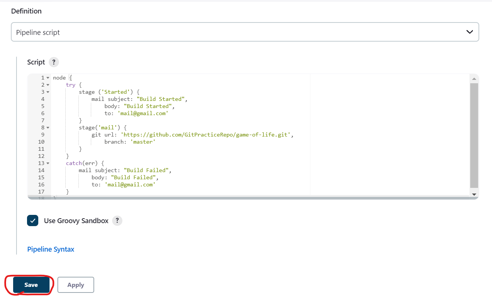
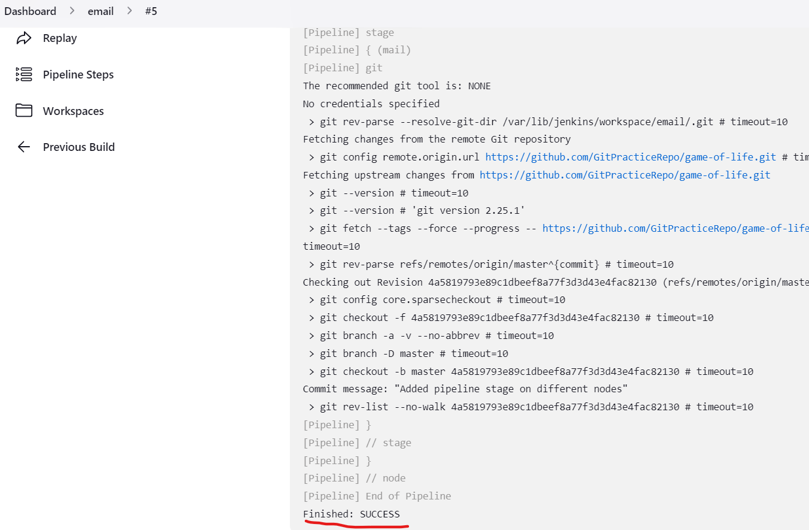
* The build has success.
* Now lets check the mail box.
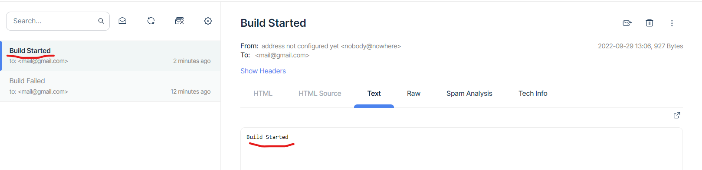
* We recieved the email.
---------------------------------<br><br><br>
### When build success
----------------------
* Now lets add the email step to the try block.
* This will send email only when the build was success.
```groovy
node {
    stage ('Started') {
            mail subject: "Build Started",
                body: "Build Started", 
                to: 'mail@gmail.com'
        }
    try {
        stage('mail') {
            git url: 'https://github.com/GitPracticeRepo/game-of-life.git',
                branch: 'master'
        }
        stage ('Success') {
            mail subject: "Build Success",
                body: "Build Success", 
                to: 'mail@gmail.com'
        }
    }
    catch(err) {
        mail subject: "Build Failed",
            body: "Build Failed", 
            to: 'mail@gmail.com'
    }
}
```
* Now lets add this to the pipeline script and build the project.
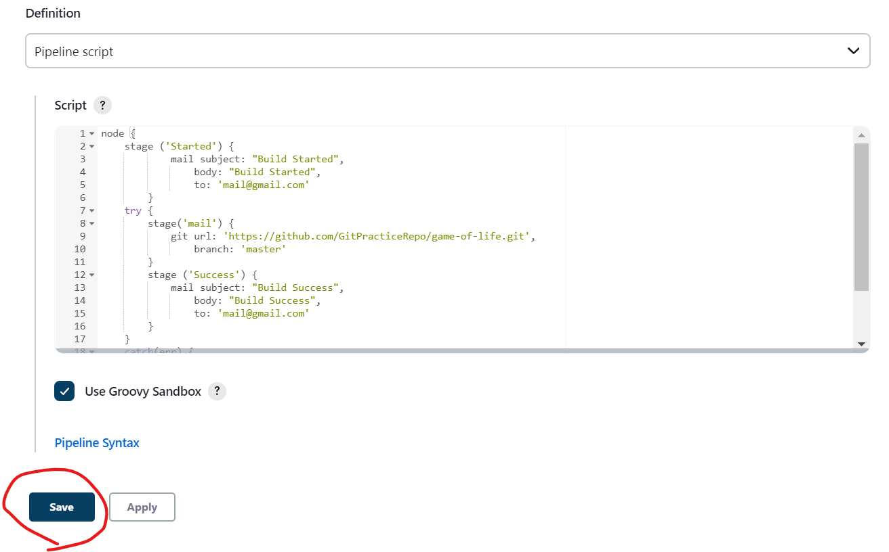
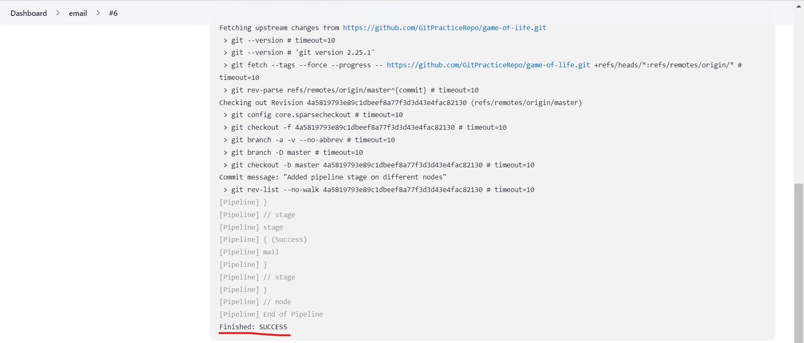
* The build was success so lets check the email.
* We should get two mails.
  * One with build started
  * One with build succes
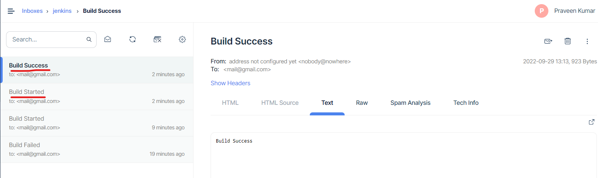
* We has recieved the mails.
-------------------------------------------
# To run the same script in node
* Add the `node('LABEL') { stages }` in the above script.
* 