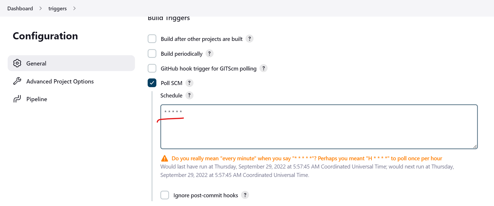

# Poll SCM with scripted pipeline
---------------------------------
* Create pipeline project.
* PollScm is different from triggers.
* Pollscm will trigger only when new commits are noticed in the repository.
* But trigger will build irrespective of any other.
* Now lets build the steps to configure the triggers.
* We have the basic syntax for the scripted pipeline.
```groovy
node {
    triggers {
        //PollScm
    }
}
```
* For now lets trigger build for every minute.
* For the triggers complete configuration [Refer Here](https://issues.jenkins.io/browse/JENKINS-49502) cron.
```groovy
properties([pipelineTriggers([cron('* * * * *')])])
```
* Now lets add this to the triggers.
```groovy
node {
    properties([pipelineTriggers([cron('* * * * *')])])
    stage('build') {
        sh ' echo "I will get build every minute" '
    }
}
```
* Now we have the script for the trigger pipeline.
* Now lets configure this and build to test.


* We can see that this build has started by user.
* Now another build has started.

* We can see that the build was started by the timer.
* Also when we build for the first time manually then only the poll scm will trigger.

* The triggers has set automatically.
------------------------------------------------------
# To run this on node execute the below script.
* Replace `JAVA` in the below node label with your node label.
```groovy
node ('JAva') {
    properties([pipelineTriggers([cron('* * * * *')])])
    stage('build') {
        sh ' echo "I will get build every minute" '
    }
}
```