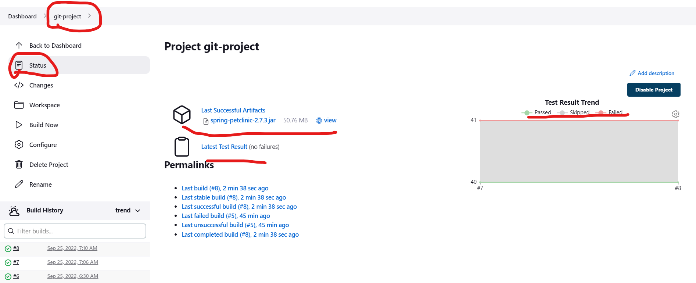

Configuring Artifacts and test results
--------------------------------------
* Open the project you want to acrchive the artifacts.

* Now lets build the project.

* The project has build successfully.
* Now lets check the artifacts and test results.
