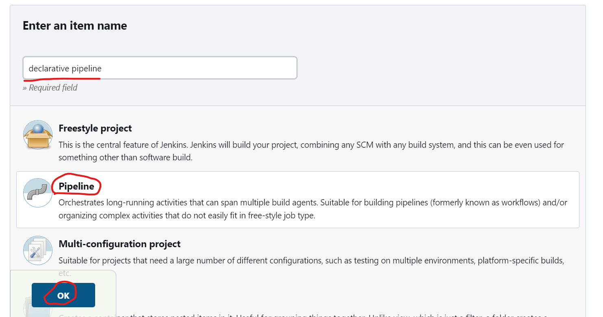
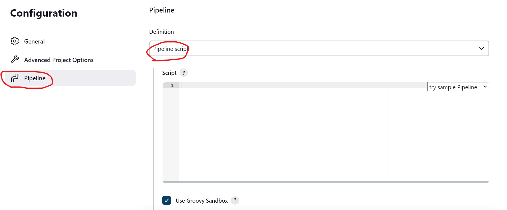
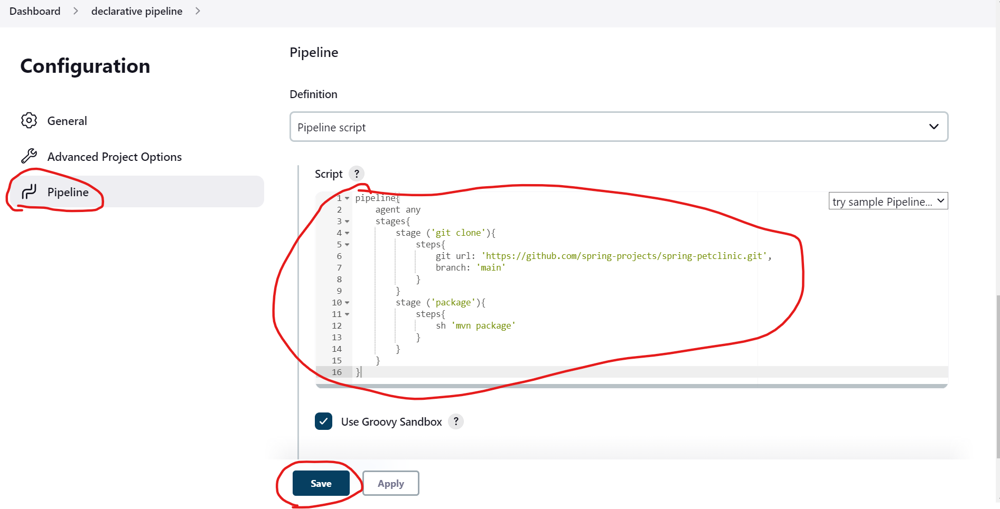
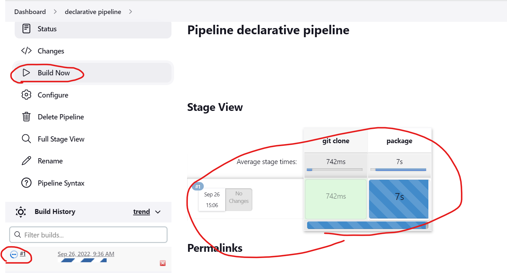
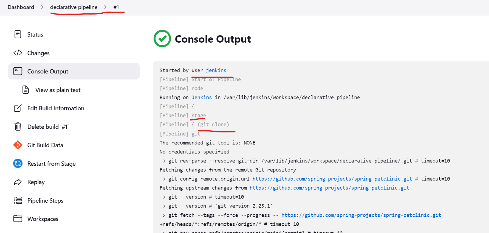
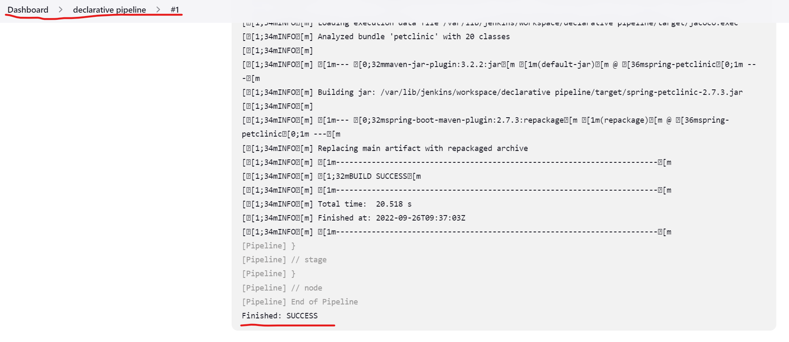

Declarative Pipeline
--------------------

* All valid Declarative Pipelines must be enclosed within a pipeline block, for example:
```
pipeline {
    /* insert Declarative Pipeline here */
}
```
* In pipeline line we need to declare `agent` and `stages` which are mandatory.
* In one stage we can have many steps.
* The basic mandatory syntax is given below.
```groovy
pipeline {
    agent any 
    stages {
        stage('stage1') {
            steps {
                sh 'echo This is stage 1'
            }
        }
        stage('stage 2') {
            steps {
                sh 'echo This is stage 2'
            }
        }
        .
        .
        .
        .
        .
        stage('stage n') {
            steps {
                sh 'echo This is stage n'
            }
        }
    }
}
```
* Now lets build spring petclinic project using declarative pipeline.
* Install jenkins and connect to the portal.
* If you don't know how to install and connect to jenkins  [Refer Here](jenkins-Install.md).
* Now we lets build a project for declarative pipeline.


* Now we have to write the pipeline for building project.
* At first we have to clone git repository.
```groovy
pipeline{
    agent any
    stages{
        stage ('git clone'){
            steps{
                git url: 'https://github.com/GitPracticeRepo/game-of-life.git'}
        }
}
```
* Now we have to build the project.
* So lets add the shell command to build the project.
```groovy
pipeline{
    agent any
    stages{
        stage ('git clone'){
            steps{
                git url: 'https://github.com/spring-projects/spring-petclinic.git',
                branch: 'main'
            }
        }
        stage ('package'){
            steps{
                sh 'mvn package'
            }
        }
    }
}
```
* We have written the declarative pipeline code to build our project.

* Now lets build the project.



* The build has successful using declarative pipeline.