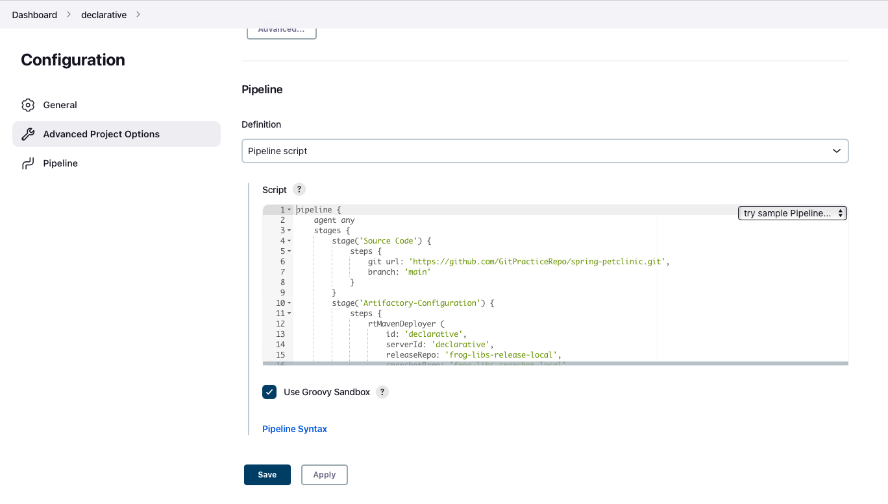
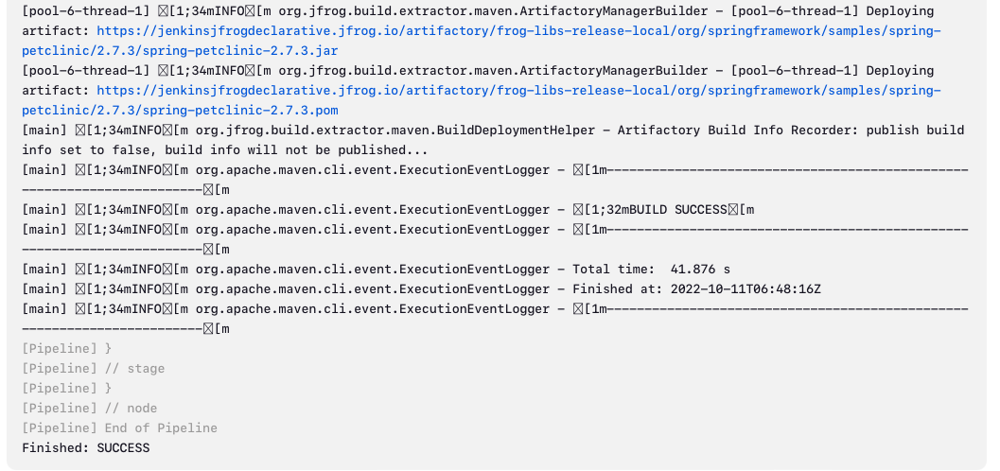

# Jfrog 
-----------
* For JFrog freestyle project  [Refer Here](../freestyle/jfrog.md).
* Create jfrog account and integrate with jenkins  [Refer Here](../jfrog.md).
* Now we need to create pipeline.
* We have the basic syntax for the declarative pipeline.
```groovy
pipeline{
    agent any
    stages{
        stage ('started') {
            steps{
                //steps
            }
        }
    }
}
```
* Now lets create a pipeline for the jfrog artifactory deployment.
* At first we have to clone the remote repository.
```groovy
stage('Source Code') {
            steps {
                git url: 'https://github.com/GitPracticeRepo/spring-petclinic.git', 
                branch: 'main'
            }
        }
```
* We need to deploy this package to the artifactory so we have to give the deployer id of our choice.
* Now we need to configure the steps for deploying the package.
*  [Refer Here](https://www.jfrog.com/confluence/display/JFROG/Declarative+Pipeline+Syntax#DeclarativePipelineSyntax-MavenBuildswithArtifactory) for the more detailed documentation.
* To deploy the package we have a step `rtMavenDeployer`.
```groovy
rtMavenDeployer(
    #parameters
)
```
* We need to provide the artifactory `server-id`, `release-repo`, `snapshot-repo`, `depoloyer-id`.
```groovy
rtMavenDeployer (
                    id: 'spc-deployer',
                    serverId: 'jfrogdeclarative',
                    releaseRepo: 'declarative-libs-release-local',
                    snapshotRepo: 'declarative-libs-snapshot-local',
                )
```
* Next we need to build the package.
* Now lets configure the steps for build and package.
```groovy
rtMavenRun (
    # Parameters
)
```
* Now we need to configure the next required steps.
* We need to give the maven path as an environmental variable or we can configure the path in global tools configuration in jenkins portal.
*  [Refer Here](https://github.com/rajnikanth1999/cloud/blob/main/DevOps/Jenkins/freestyle/jfrog.md#maven-path-configure) for configuring the maven path in the portal.
*  Now we also need to provide the deployer id also.
*  The steps are: 
```groovy
rtMavenRun (
    tool: '#Maven Path variable'
    pom: '#path of your pom.xml file in the repository'
    goals: '# clean install package'
    deployerId: 'deployer-unique-id',
)
```
* Now we have the steps for maven run.
* We had configured all the steps required to build the project.
* The pipeline has successfully configured.
*  [Refer Here](./scripts/jfrog.md)
* Now lets create and build the pipeline project.
* Create a new pipeline project.
* Add the developed pipeline.

* Now run the project.

* The build was successful and click on the links to check the deployments.