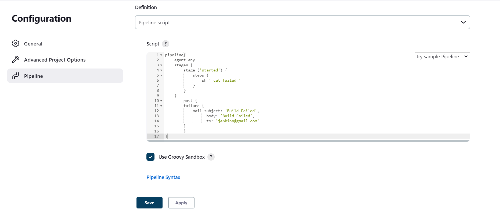

# Sending Email notifications when build failed or success or completed.
--------------------------- <br>
### When Build started
----------------------
* We will send Email notifications when the build has started.
* We know the basic syntax of the scripted pipeline.
```groovy
pipeline{
    agent any
    stages{
        stage ('started') {
            steps{
                //steps
            }
        }
    }
}
```
* Now lets get the steps for sending Email.
* For declarative pipeline we have `post` option in which we have `always` `sucess` `failure` blocks [Refer Here](https://www.jenkins.io/doc/book/pipeline/syntax/#post).
* For now lets configure email just when the build succes.
* Now lets configure the steps for email when build succes.
* Then we will add the mail steps to the declarative pipeline.
> **_NOTE:_** 
> * MAke sure you configure the email and credentials before build.
> * [Refer Here](../freestyle/Email-notification.md) for the mail configuration steps.
> * We had already configured the mail.


```groovy
pipeline{
    agent any
    stages{
        stage ('started') {
            steps {
                sh '''echo "Job Started"
                    echo " Email sent"
                '''
            mail subject: 'Build Started', 
                  body: 'Build Started', 
                  to: 'jenkins@gmail.com'
            }
        }
    }
}
```
* Now we have the pipeline script.
* Now lets add this to the pipeline and build the project.


* We got a mail.

-------------------------------------<br><br><br>
### When Build failed
----------------------
* Now lets add a stage to send email when the build has failed.
* Add the email step to the failure in post.
```groovy
mail subject: "Build Failed",
    body: "Build Failed", 
    to: 'mail@gmail.com'
```
* Now lets add this to the pipeline script.
```groovy
pipeline{
    agent any
    stages {
        stage ('started') {
            steps {
                sh ' cat failed '
            }
        }
    }
        post {
        failure {
            mail subject: 'Build Failed', 
                  body: 'Build Failed', 
                  to: 'jenkins@gmail.com' 
        }
        }
}
```
* This script will send email when the build has failed.
> **_NOTE:_** 
> * This build will failed because we didn't has the file failed.
* Now lets add this to the pipeline project and build.


* The build has failed.
* Now lets check the mail box.

* We recieved the email.
---------------------------------<br><br><br>
### When build success
----------------------
* Now lets add the email step to the succes block.
* This will send email only when the build was success.
```groovy
pipeline{
    agent any
    stages {
        stage ('started') {
            steps {
                sh ' echo "Build Success" '
            }
        }
    }
        post {
            always {
                mail subject: 'Build Started', 
                  body: 'Build Started', 
                  to: 'jenkins@gmail.com' 
            }
            failure {
                mail subject: 'Build Failed', 
                  body: 'Build Failed', 
                  to: 'jenkins@gmail.com' 
        }
        success {
                mail subject: 'Build Success', 
                  body: 'Build Success', 
                  to: 'jenkins@gmail.com' 
        }
    }
}
```
* Now lets add this to the pipeline script and build the project.


* The build was success so lets check the email.

* We has recieved the mail.
-------------------------------------------
# To run the same script in node
* [Refer Here](./scripts/email-notifications.md)