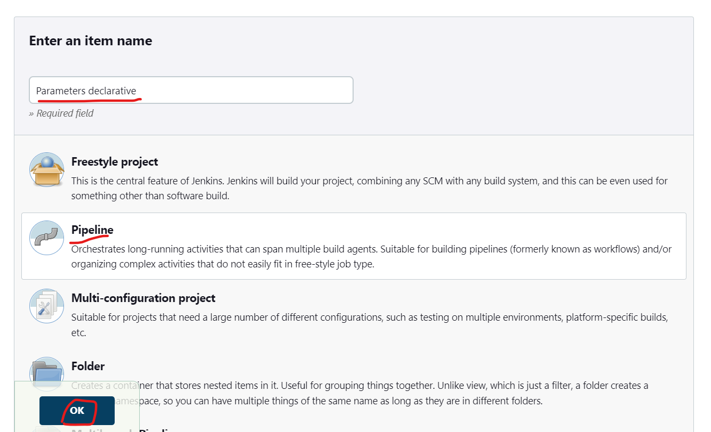
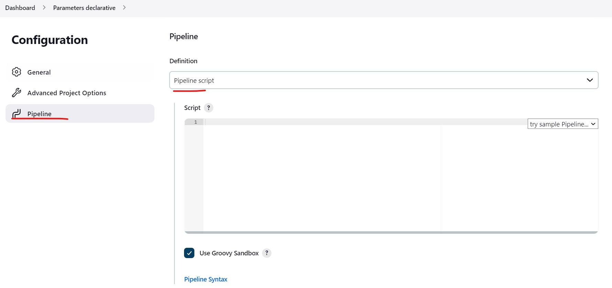
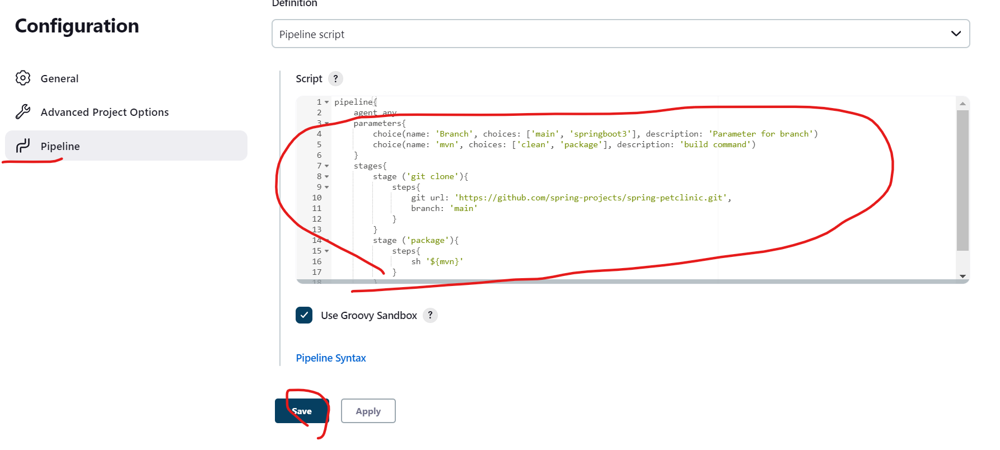
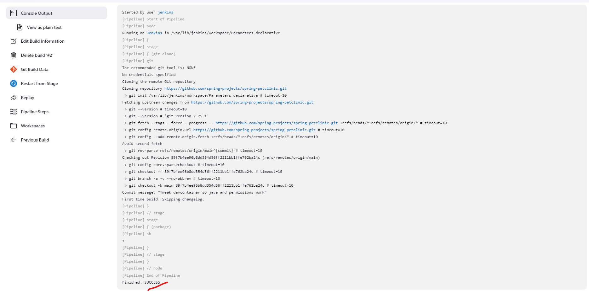

### Build pipeline project with parameters <br>
------------------------------------------------
* Now lets create a pipeline project with parameters.
* Lets create a Declarative pipeline project and build spring petclinic.


* Now we know the script to build the Declarative pipeline script.
* [Refer Here](../declarative-pipeline/scripts/spring-pet-clinic-without-parameters.md) for the script.
* Now we need to add some parameters to this project.
* [Refer Here](https://www.jenkins.io/doc/book/pipeline/syntax/#parameters) for the syntax to use parameters.
* The parameters should writte at the level of agents and stages.
* Now declare a parameter for the git branch.
```groovy
choice(name: 'Branch', choices: ['main', 'springboot3'], description: 'Parameter for branch')
```
* Now lets give parameter for the maven build.
```
choice(name: 'mvn', choices: ['clean', 'package'], description: 'build command')
```
* Now we have the parameter configured.
* Now lets add this parameters to the script.
```
parameters{
    choice(name: 'Branch', choices: ['main', 'springboot3'], description: 'Parameter for branch')
    choice(name: 'mvn', choices: ['clean', 'package'], description: 'build command')
} 
```
* Add the above code to the pipeline in the agent and stage level.
* Now lets declare this parameters to the stages.
* To declare Branch parameter.
```groovy
steps{
        git url: 'https://github.com/spring-projects/spring-petclinic.git',
        branch: '$Branch'
            }
```
* Now we have added the branch parameter.
* Now lets add the build parameter.
```groovy
steps{
    sh '${mvn}'
}
```
* Now the declaration of the parameters has completed and our pipeline script is ready to ececute.
* For the pipeline developed [Refer Here](../declarative-pipeline/scripts/spring-petclinic-with-parameters.md).
* Now lets add the pipeline to the project and build the project.


* The build was successful.
* For running same project on node [Refer Here](../declarative-pipeline/scripts/spring-petclinic-with-parameters.md).