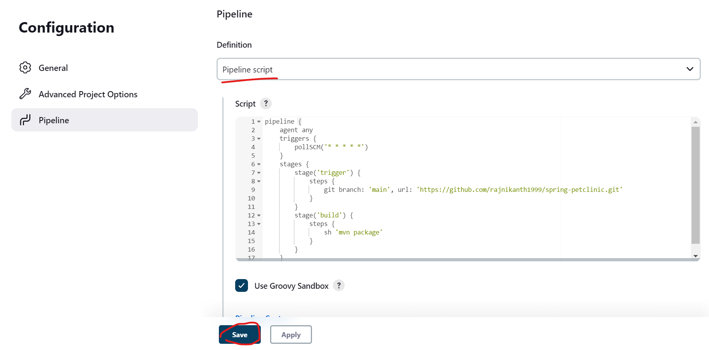

# Poll SCM Declarative pipeline
-------------------------------
* Poll scm is building the repository when ever a new change was commited.
* We will create a trigger which will track the repository for every minute or hour of our requirement which will trigger build when ever there is new commit.
* Now lets create a Declarative pipeline for the pollscm.
* We know the syntax of the Declarative pipeline.
```groovy
pipeline {
    agent any
    stages {
        stage('syntax') {
            steps {
                //steps
            }
        }
    }       
}
```
* Now lets check the syntax for the pollscm triggers [Refer Here](https://www.jenkins.io/doc/book/pipeline/syntax/#triggers) pollscm.
```groovy
triggers {
        pollSCM('* * * * *')
    }
```
* Now we have the trigger step which will build for every minute.
* Now lets add this trigger and add git repository to build.
```groovy
pipeline {
    agent any
    triggers {
        pollSCM('* * * * *')
    }
    stages {
        stage('trigger') {
            steps {
                git branch: 'main', url: 'https://github.com/rajnikanth1999/spring-petclinic.git'
            }
        }
        stage('build') {
            steps {
                sh 'mvn package'
            }
        }
    }
}
```
* Now we have the script for the pollSCM.
* Now add this script to the pipeline.

* Build manually for the first time to make the pollSCM added to the pipeline.

* Now the manual build has successful.

* The pollSCM was activated and will start build when there is new commits.
* Now add some commits and wait for a minute to start build.

* The build has start by the SCM.
------------------------------------------------------
# To run this on node execute the below script.
* Replace `JDK` in the below node label with your node label.
```groovy
pipeline {
    agent {
        node 'JDK'
    }
triggers {
        pollSCM('* * * * *')
    }
    stages {
        stage('trigger') {
            steps {
                git branch: 'main', url: 'https://github.com/rajnikanth1999/spring-petclinic.git'
            }
        }
        stage('build') {
            steps {
                sh 'mvn package'
            }
        }
    }
}
```