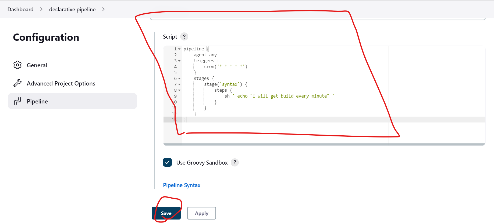
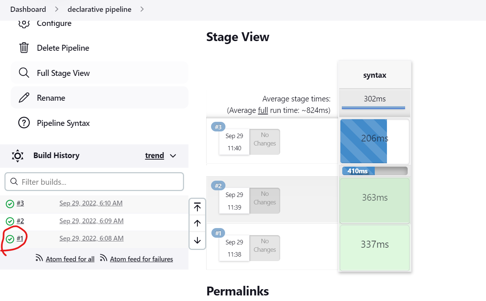
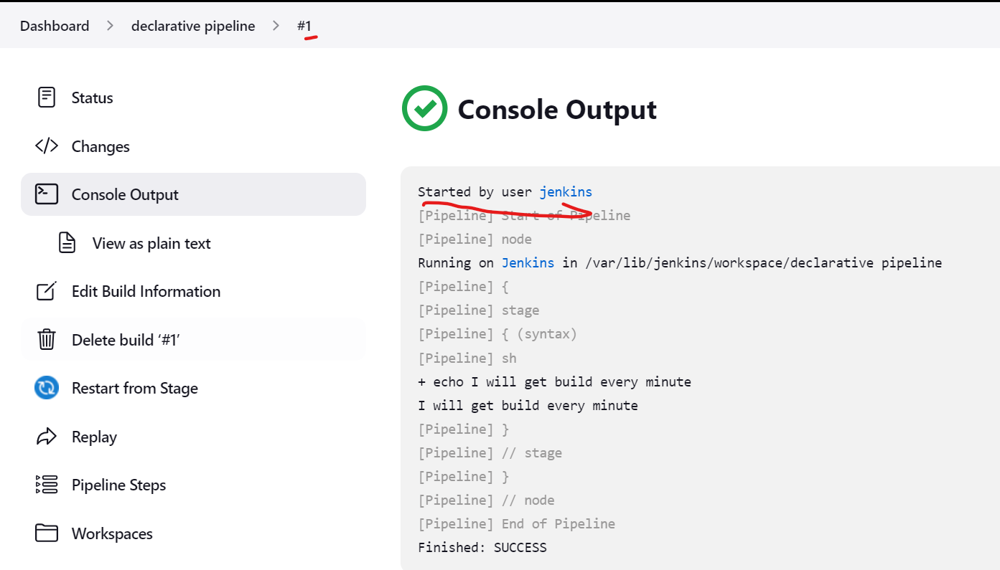
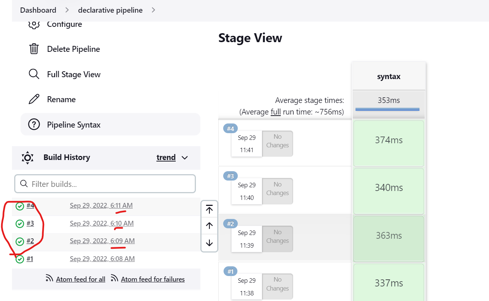
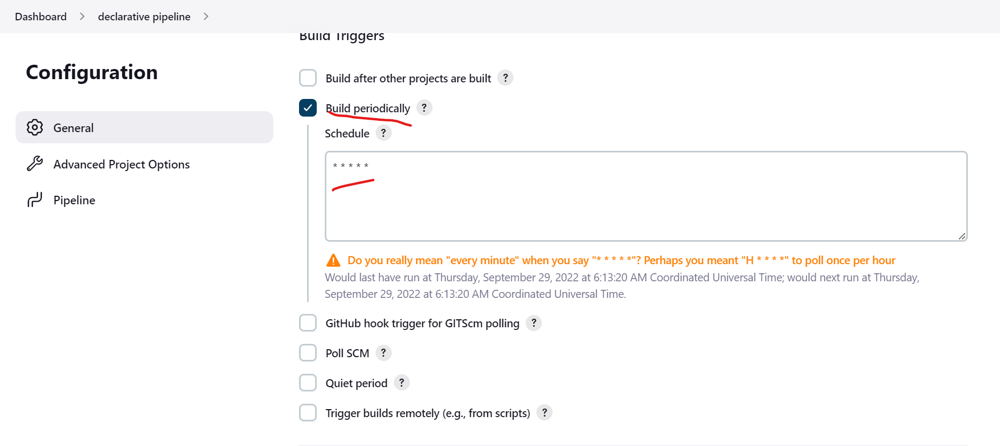

# Poll SCM with declarative pipeline
---------------------------------
* Create pipeline project.
* Now lets build the steps to configure the triggers.
* PollScm is different from triggers.
* Pollscm will trigger only when new commits are noticed in the repository.
* But trigger will build irrespective of any other.
* We have the basic syntax for the declarative pipeline.
```groovy
pipeline {
    agent any
    stages {
        stage('syntax') {
            steps {
                //steps
            }
        }
    }       
}
```
* For now lets trigger build for every minute.
* For the triggers complete configuration [Refer Here](https://www.jenkins.io/doc/book/pipeline/syntax/#triggers).
```groovy
triggers {
        cron('* * * * *')
    }
```
* Now lets add this to the triggers.
```groovy
pipeline {
    agent any
    triggers {
        cron('* * * * *')
    }
    stages {
        stage('trigger') {
            steps {
                sh ' echo "I will get build every minute" '
            }
        }
    }
}
```
* Now we have the script for the trigger pipeline.
* Now lets configure this and build to test.



* We can see that this build has started by user.
* Now another build has started.

* We can see that the build was started by the timer.
* Also when we build for the first time manually then only the poll scm will trigger.

* The triggers has set automatically.
-------------------------------------
# To run this on node execute the below script.
* Replace `JDK` in the below node label with your node label.
```groovy
pipeline {
    agent {
        node 'JDK'
    }
    triggers {
        cron('* * * * *')
    }
    stages {
        stage('trigger') {
            steps {
                sh ' echo "I will get build every minute" '
            }
        }
    }
}
```