### Sending Email Notification
------------------------------
* For the jenkins install and configu [Refer Here](../jenkins-Install.md).
* For now lets use some fake Email tracker.
* create a mailtrap account using gmail.
* To create an account [Refer Here](https://mailtrap.io/).
* Now we have a mailtrap id.
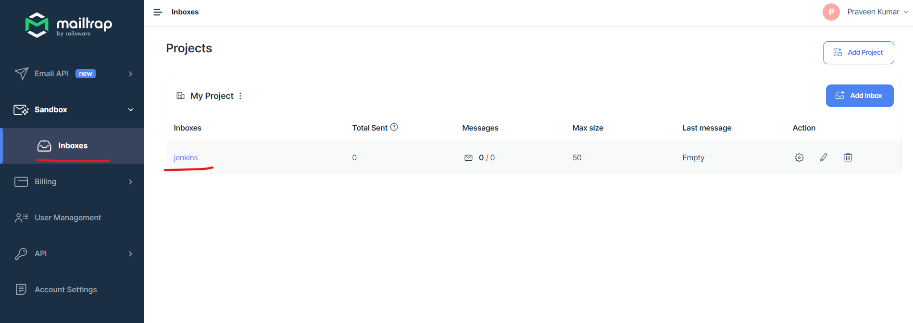
* Now lets configure the mail.
* Click on manage jenkins.
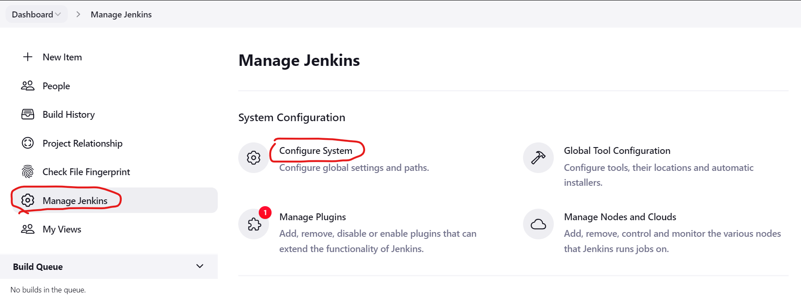

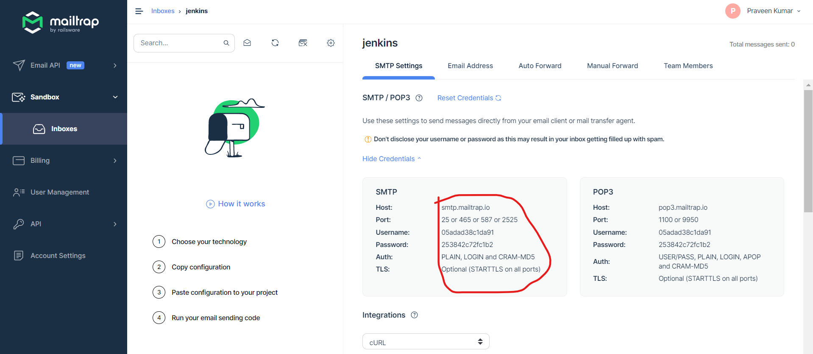
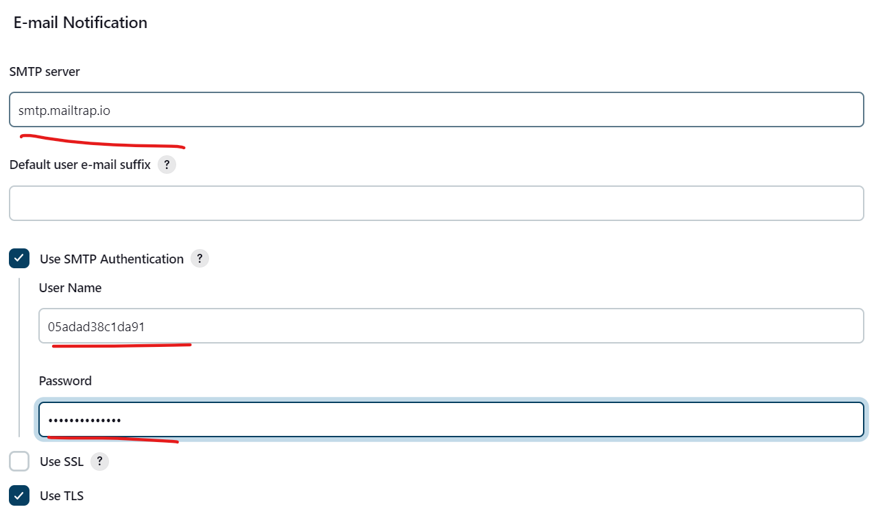
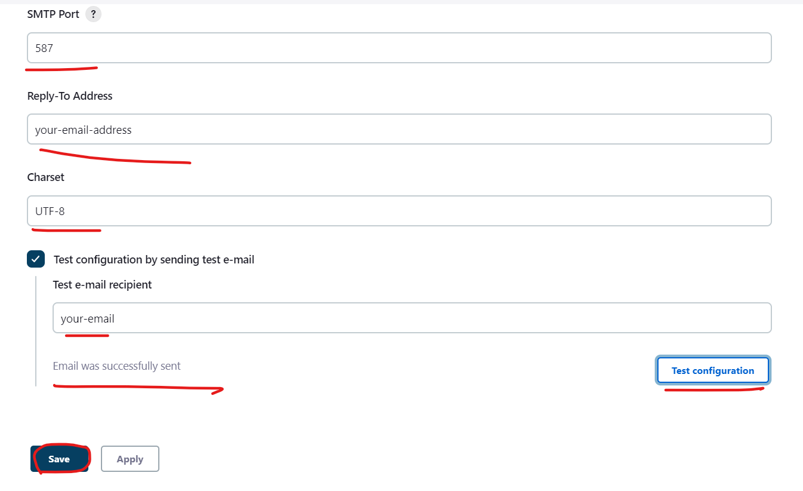
* Now we have configured the email alerts for the jenkins.
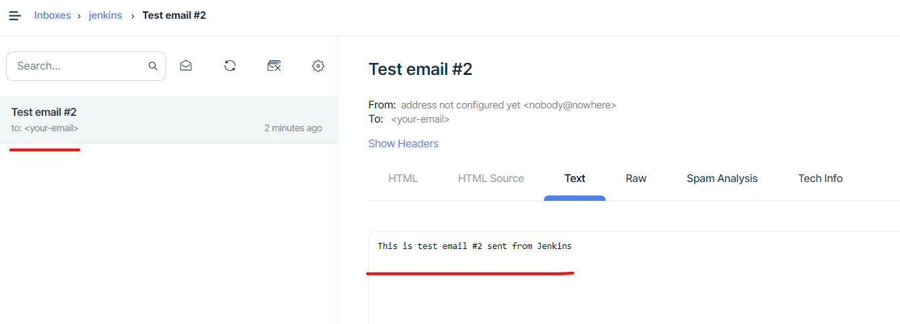
* Now we need to enable the email Notification in the projects.
* Now lets create a project and enable Notifications for failed builds.
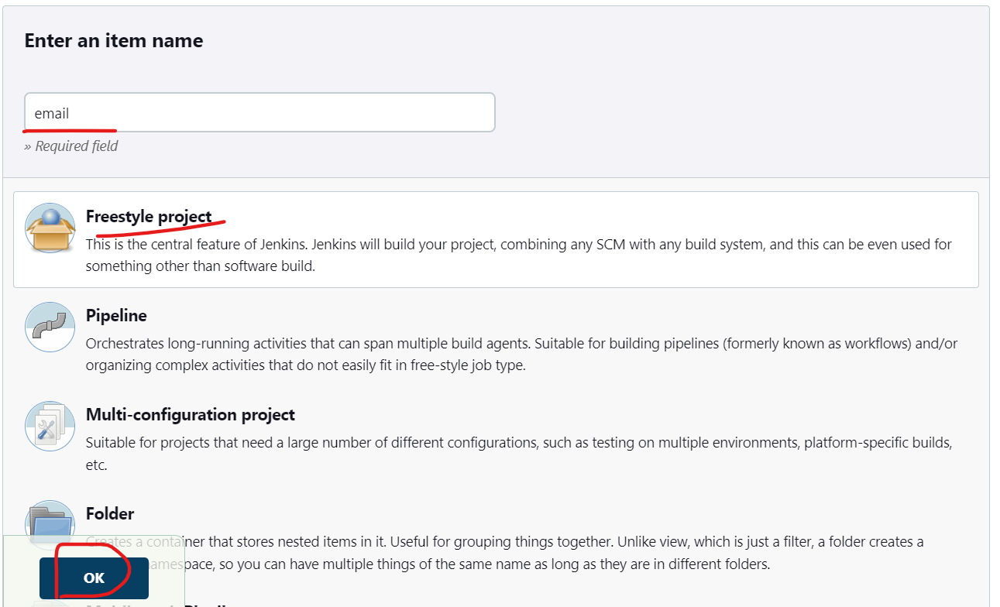
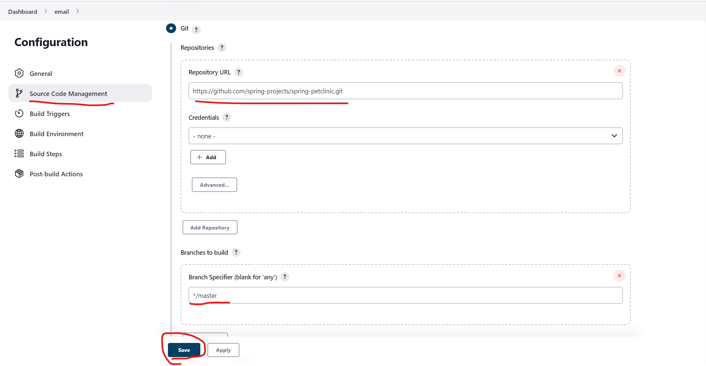
* Spring petclinic actually has main branch but we have given master branch.
* Now lets add post build email Notification.
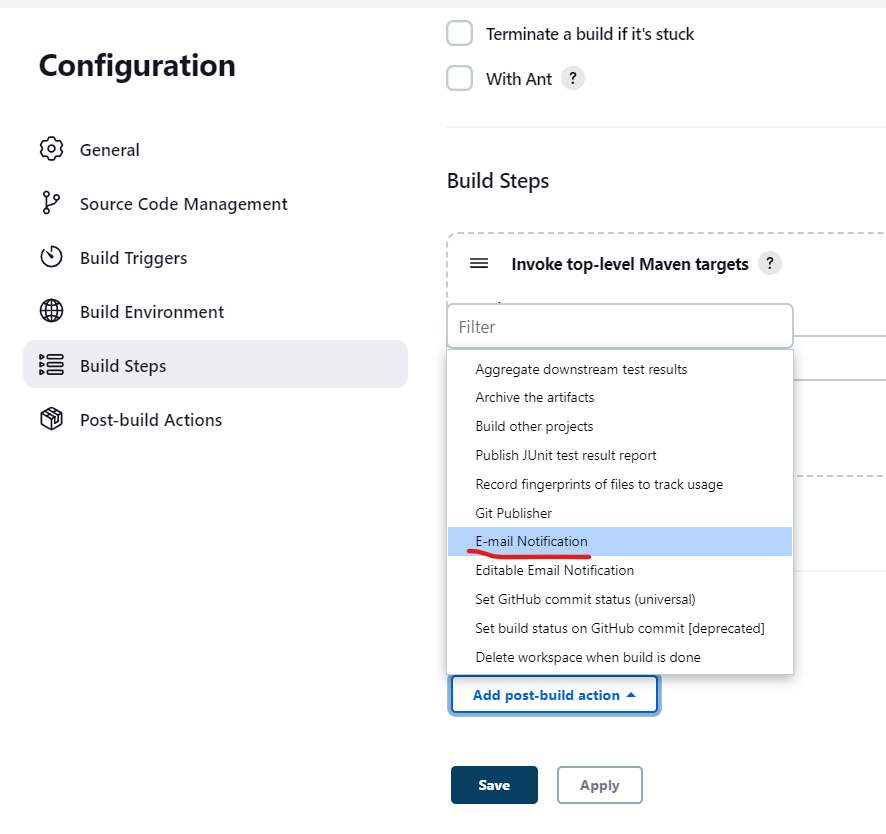
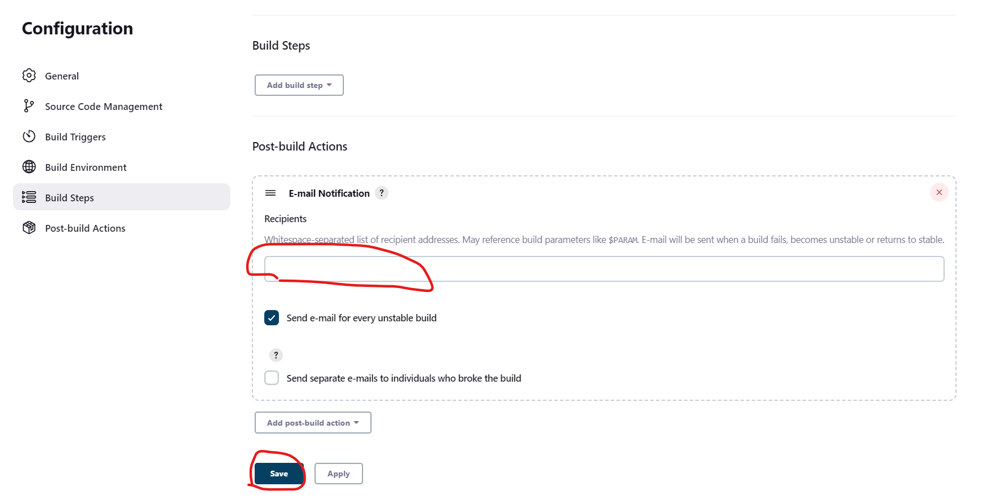
* Now we ahve added email alert for the failed builds.
* Now lets build the project.
* Lets build the project.
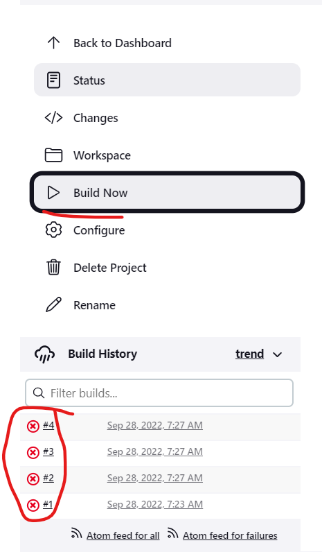
* The builds are failed and lets check the mail trap.
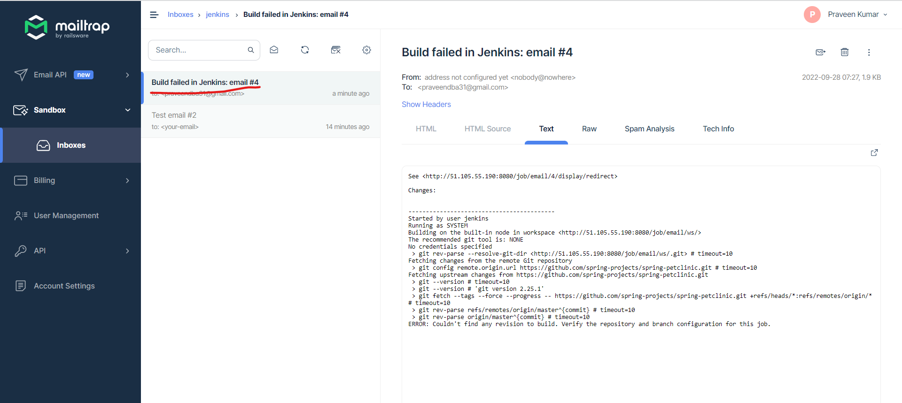
* We have recieved the mail for the failed build.
* Now lets change the branch to main and again build the project.
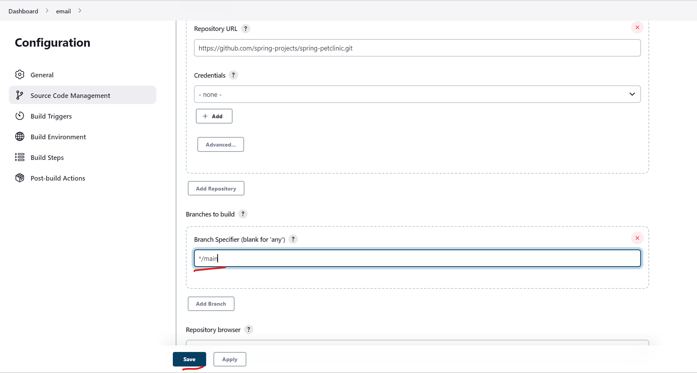
* Now lets build and check the mailtrap.
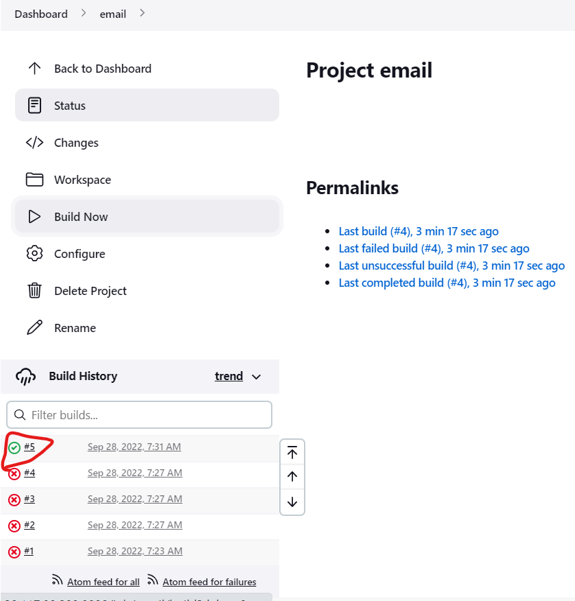
* The build was success and lets check the mailtrap.

* We had received the mail when the build has completed.