Upstream & Downstream
---------------------
# Upstream
* Upstream is the process of triggering another job after completing the running of current job.
# Downstream
* Downstream is the process of getting triggered by another job after completing the running of previous job.
-------------------------------------------------
# Creating trigger
------------------
* Lets create a job `first job`.
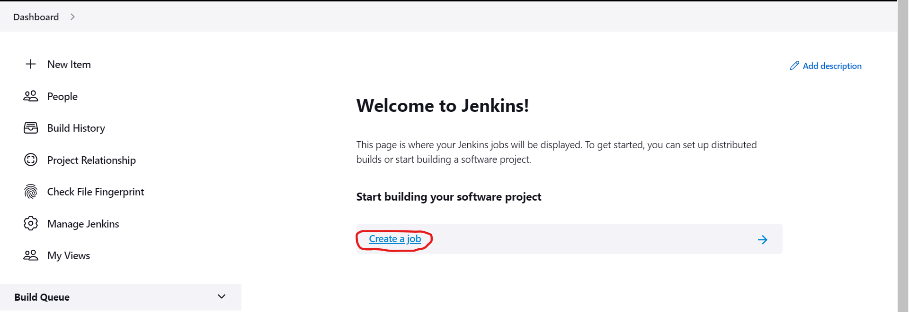
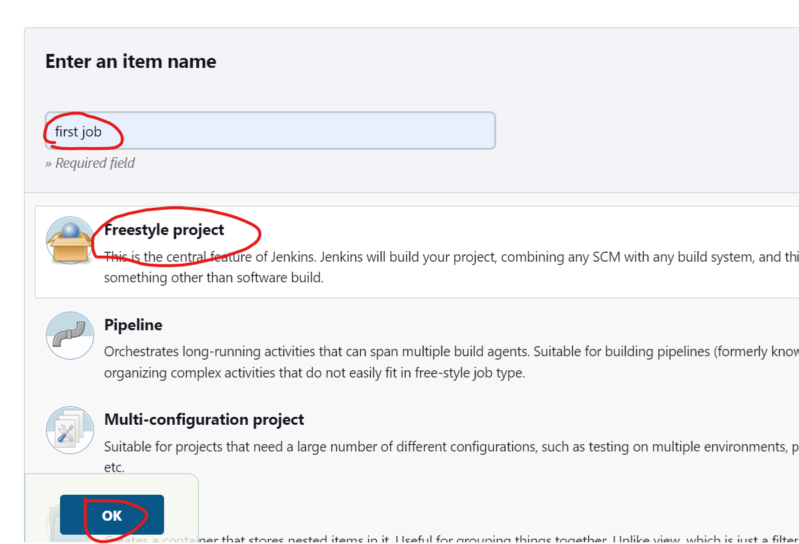
* For now just build a sample project.
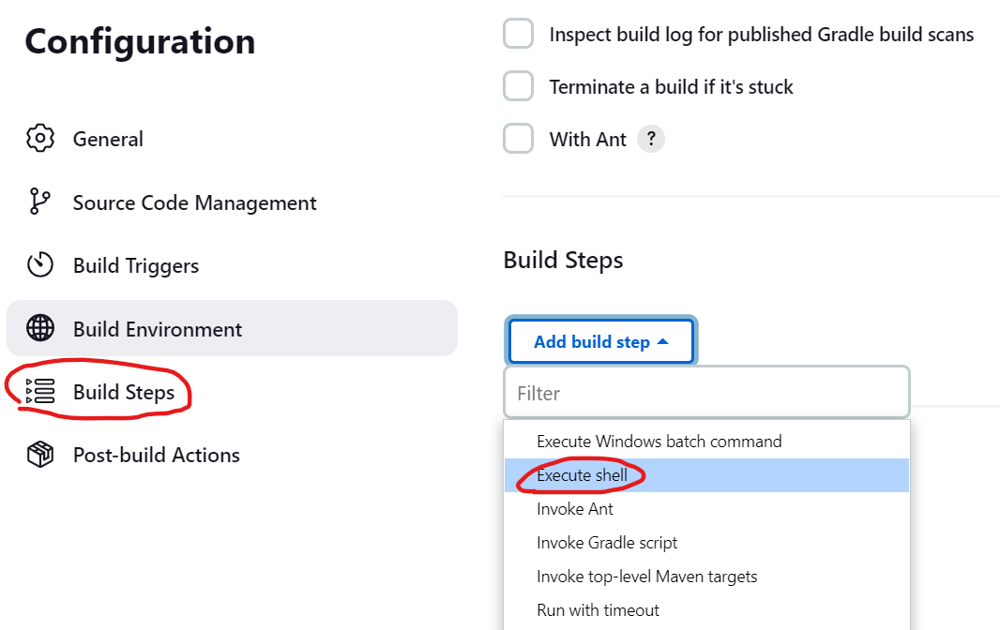
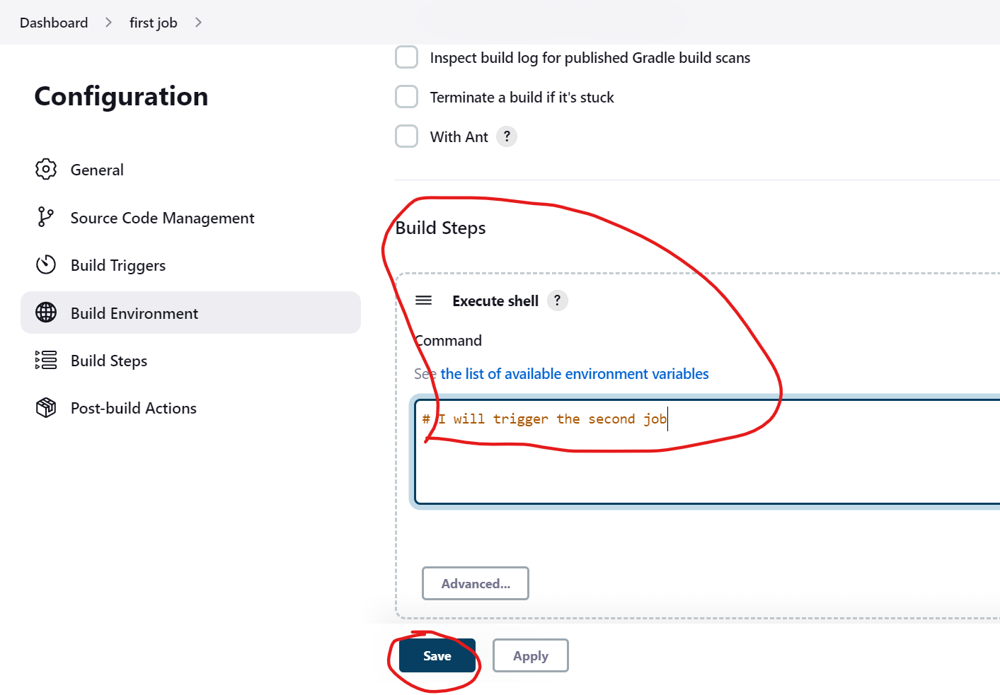
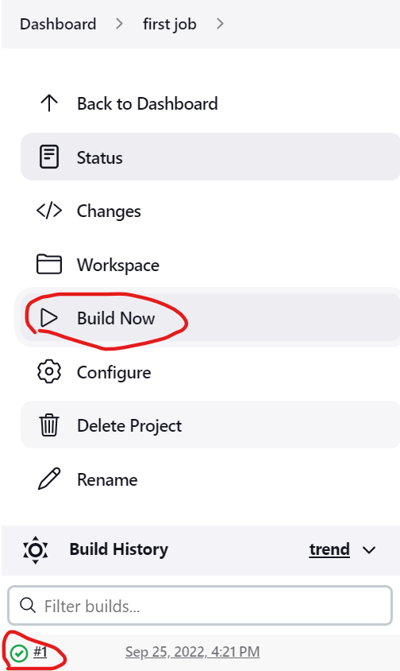
* Just to confirm the working condition build the project.
* Now Lets create a new job `Second job`.
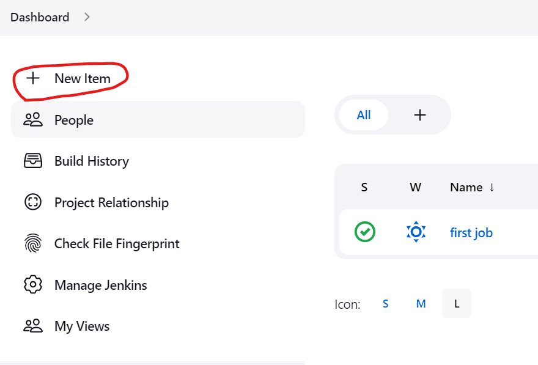
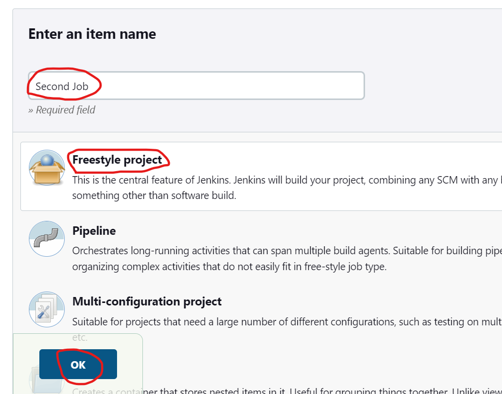
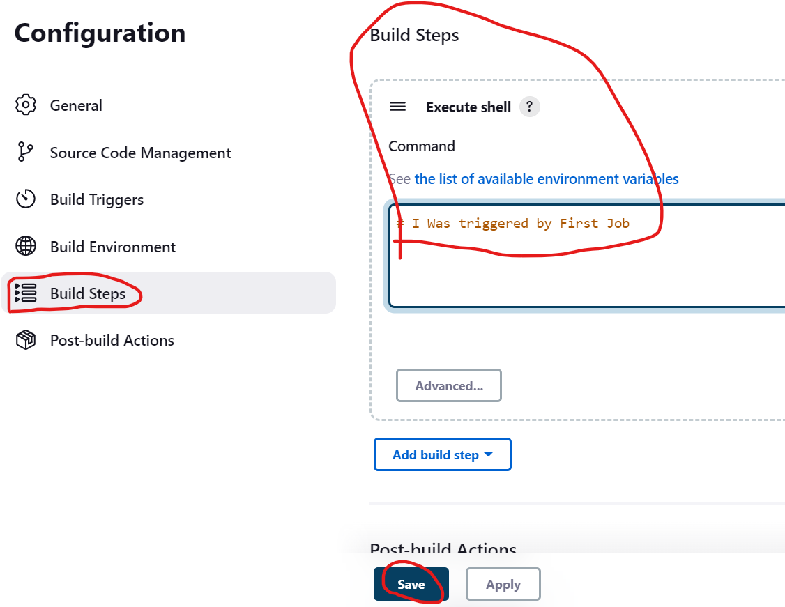
* We have created the `Second job`.
* Lets create the post build trigger.
* go to the configure of `first job`.
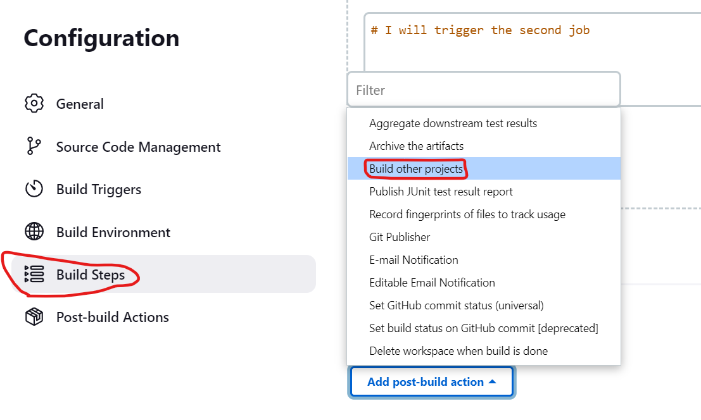
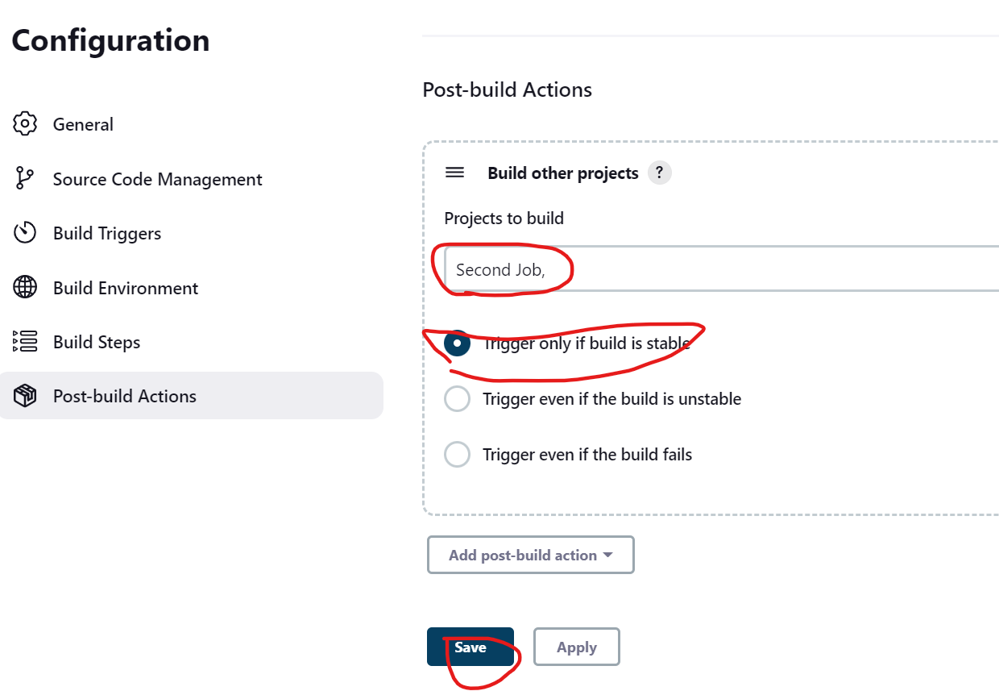
* We have created the trigger to Second job.
* Now lets build the first job.
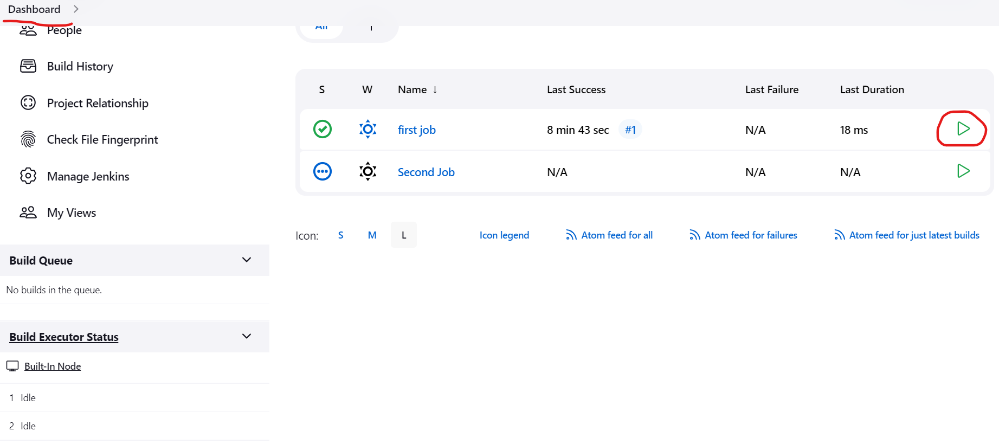
* Now navigate to the second job.
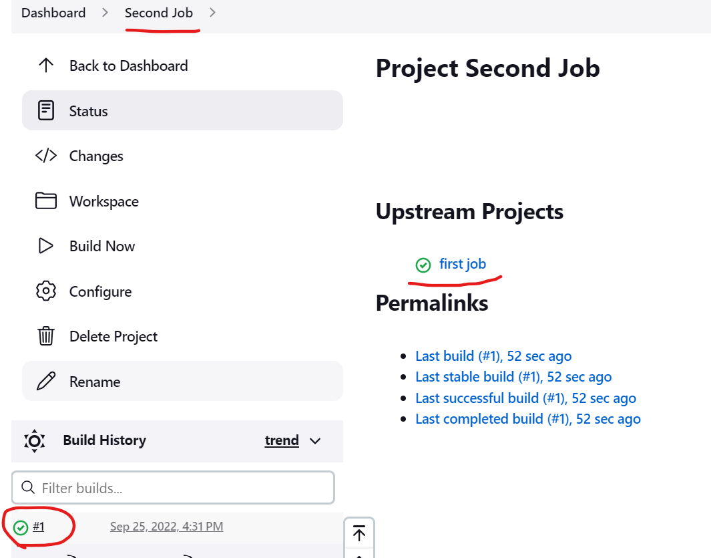
* We can see that the second job was triggered by the first job.
* First job is the Upstream project of the Second job.
* Now lets check the status of the first job.
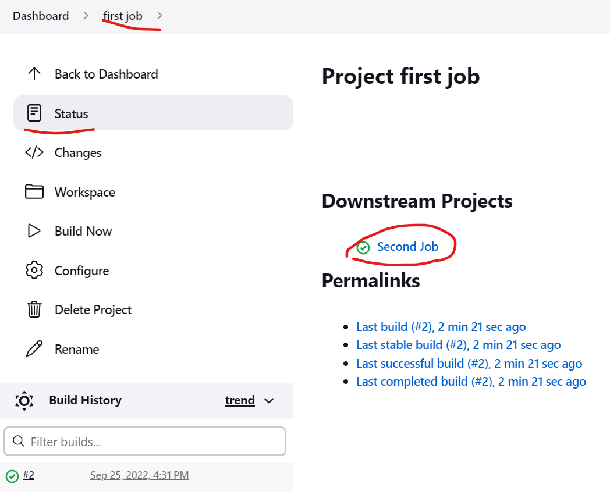
* The first job is the Downstream project of the Second job.

* We can add as many jobs using this process by adding trigger to the every last job.