# Jfrog Project Freestyle
-----------------------
* First we need to configure the jfrog using jenkins plugin.
* If you have not configured the jfrog in your jenkins server  [Refer Here](../jfrog.md).
* Now we have jfrog has configured the jfrog.
# Maven Path configure
--------------------
* We have to configure the maven path before we deploy the maven artifacts.
* Navigate to the `manage jenkins` > `Global Tool Configuration`.
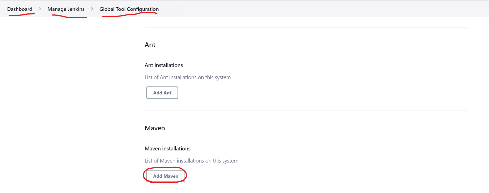
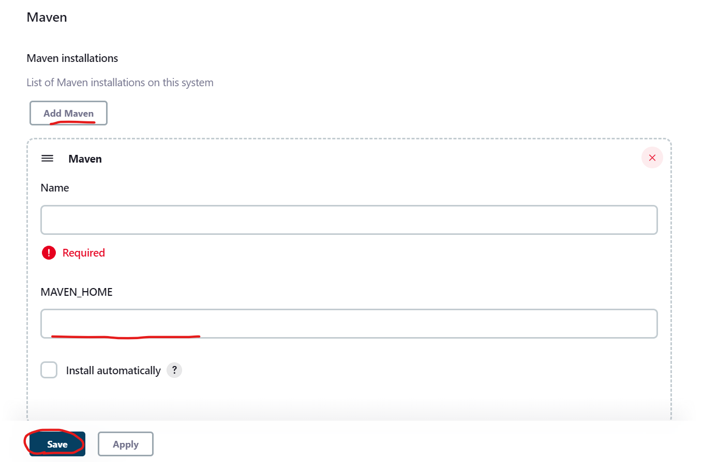
* Give the name of `maven`.
* Give the path of your maven home.
* Generally it is in `/usr/share/maven`.
```
/usr/share/maven
```
* Save the changes.
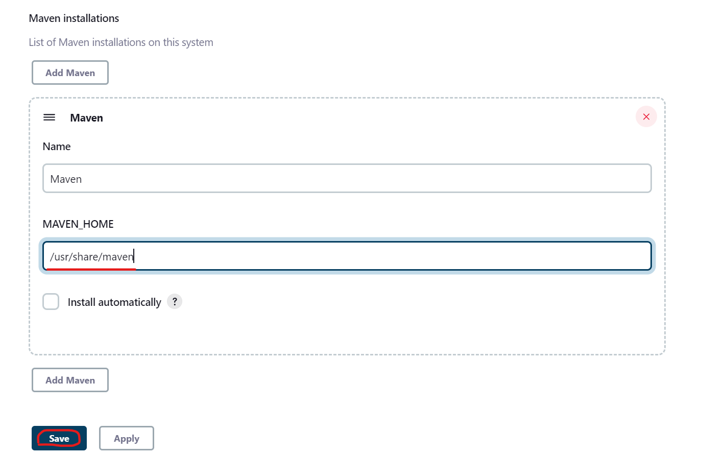
# Freestyle Project
------------------
* create a project.
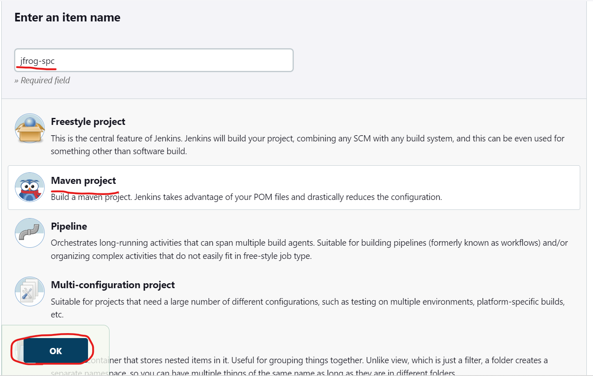
* Select maven Project and click on ok.
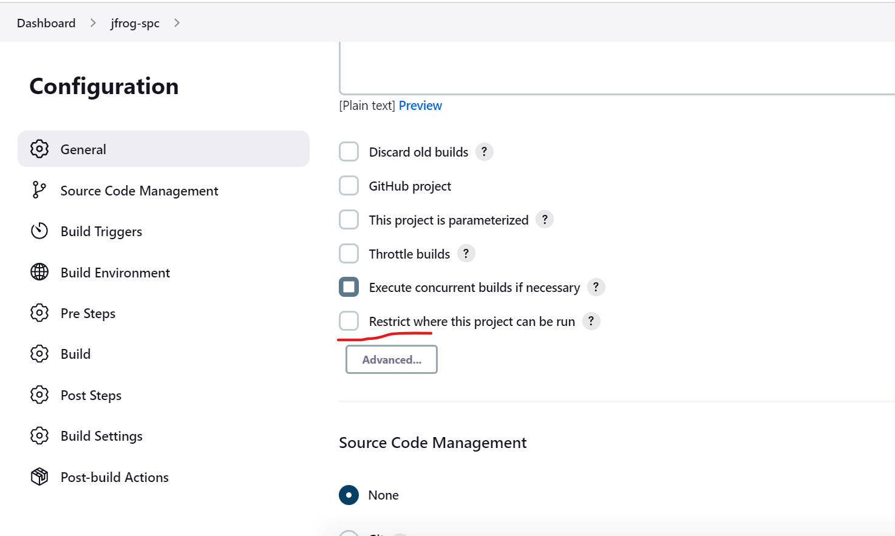
* If you want to run the project in the node Select restrict and provide your label of the node.
* Now get the url and branch of the repository which you want to build.
* For this project im using spring pet clinic to build.
```
https://github.com/spring-projects/spring-petclinic.git
```
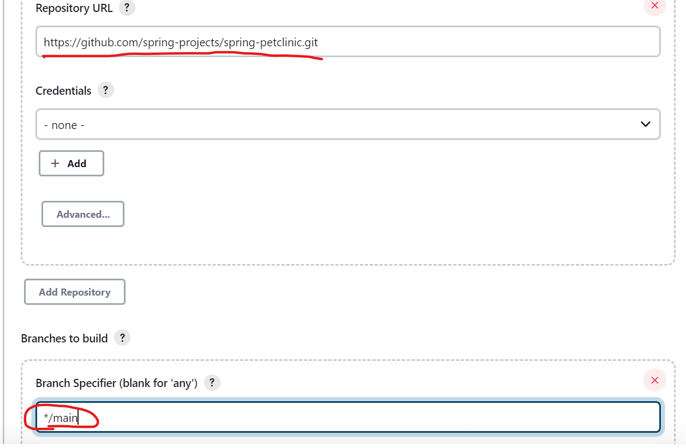
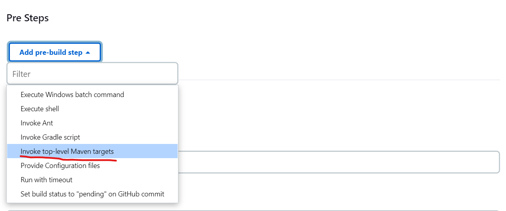
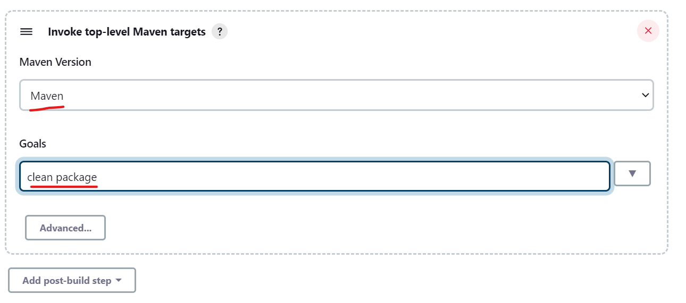
* Select the maven path and give the steps.
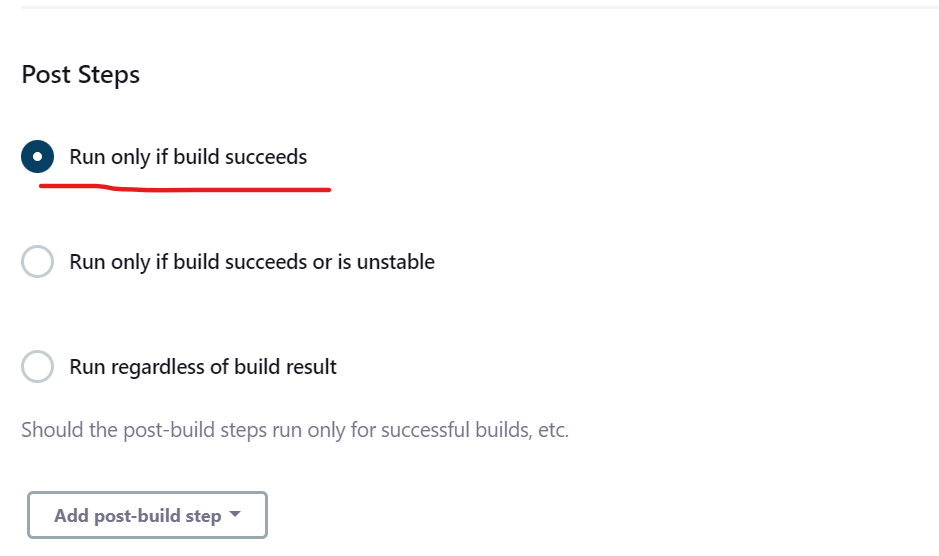
* Select run only if build succeeds to stop deployment failed when the build failed.
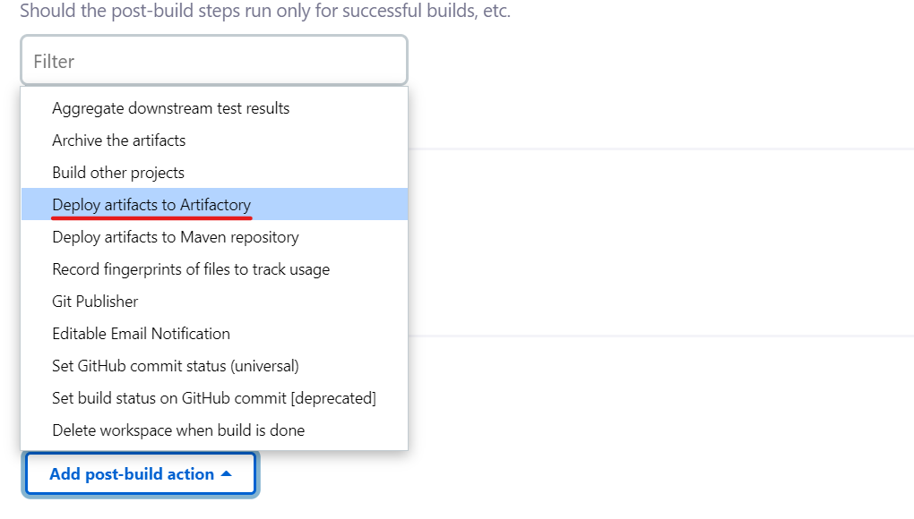
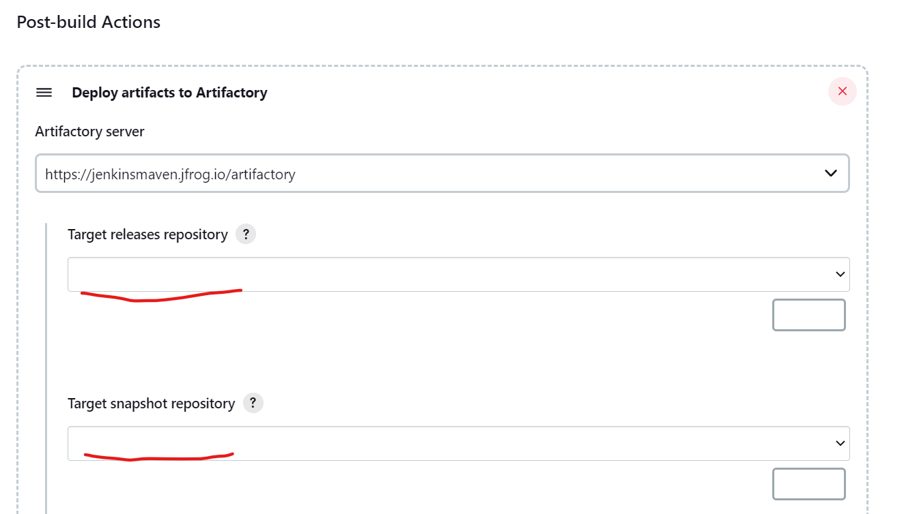
* Now we need these releases repository and snapshot repository.
* These are present in the jfrog portal.
* Now lets get back to the jfrog.
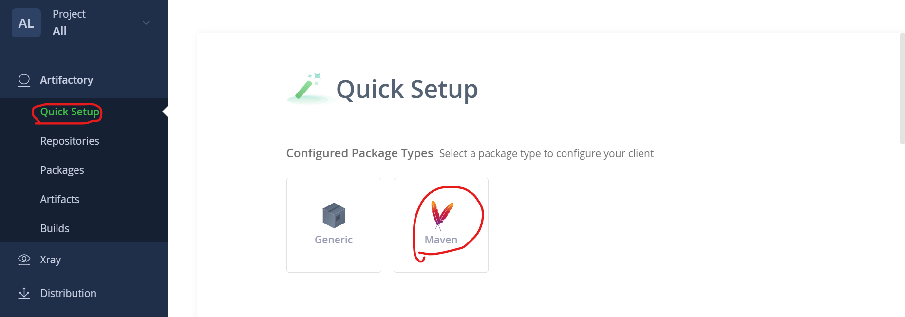
* Select the maven.
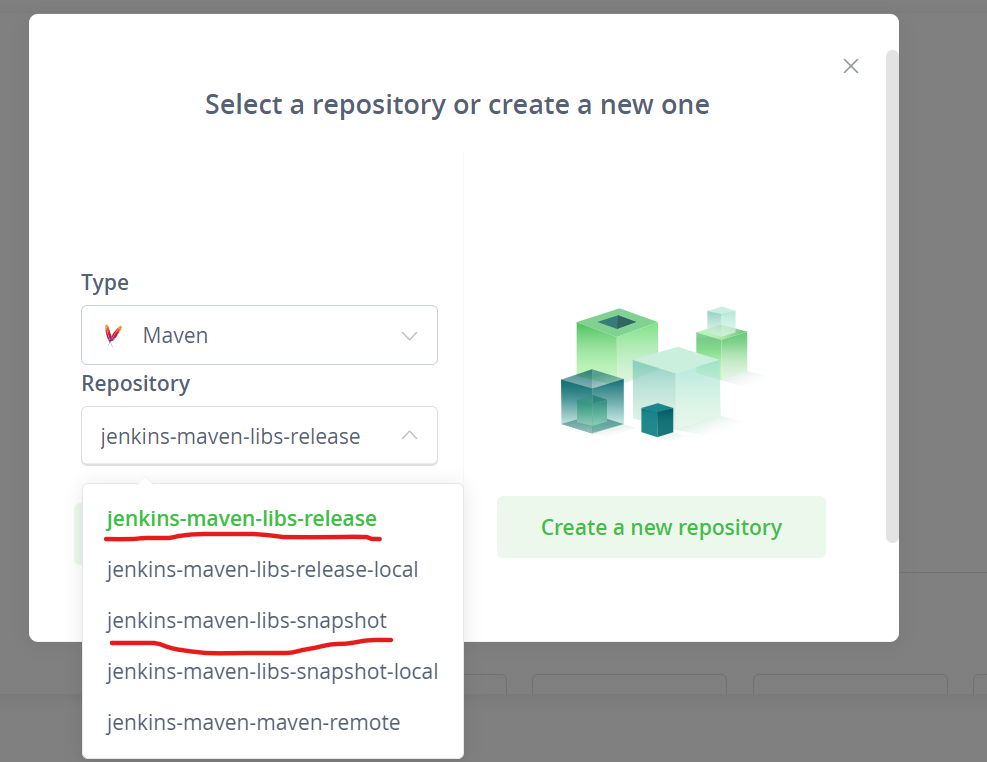
* These are the releases and snapshot repositories.
* Now lets go back to jenkins server and enter these repositories names.
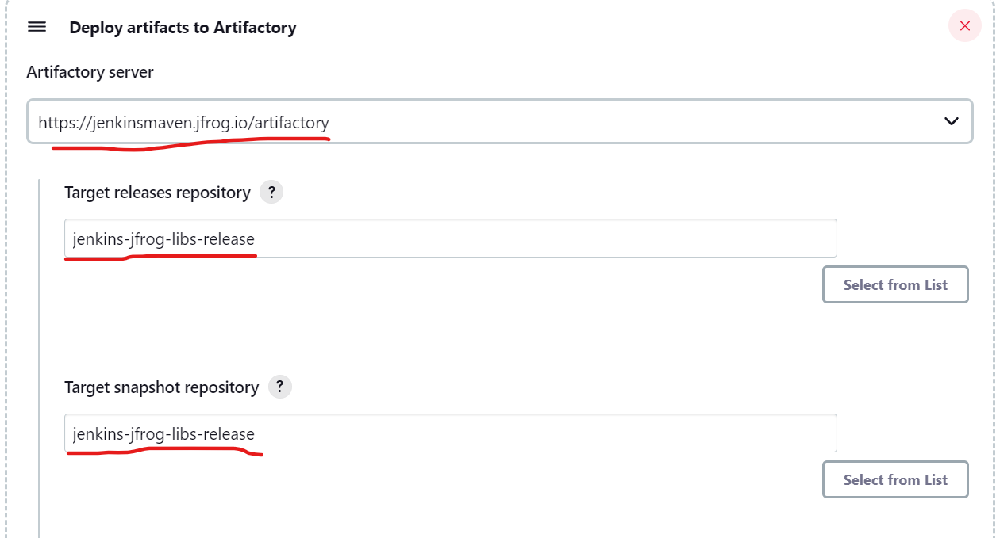
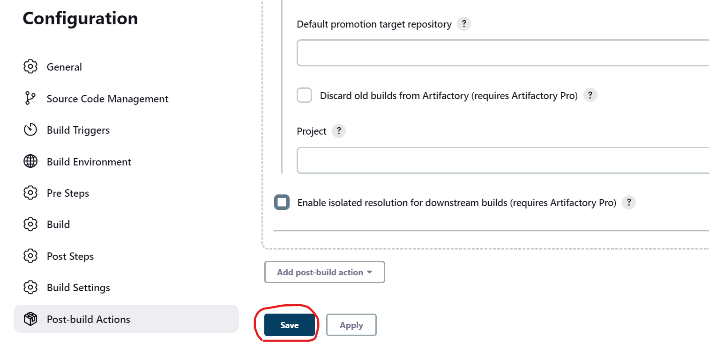
* Now save the project and build the project.
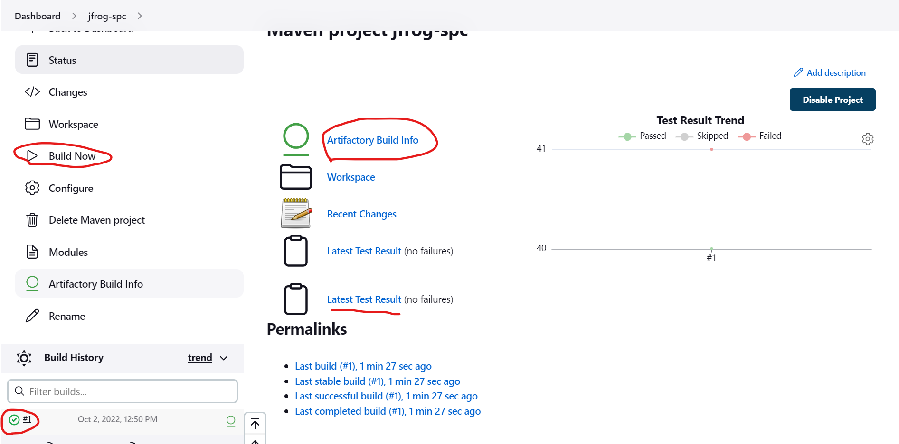
* The build was succeed.
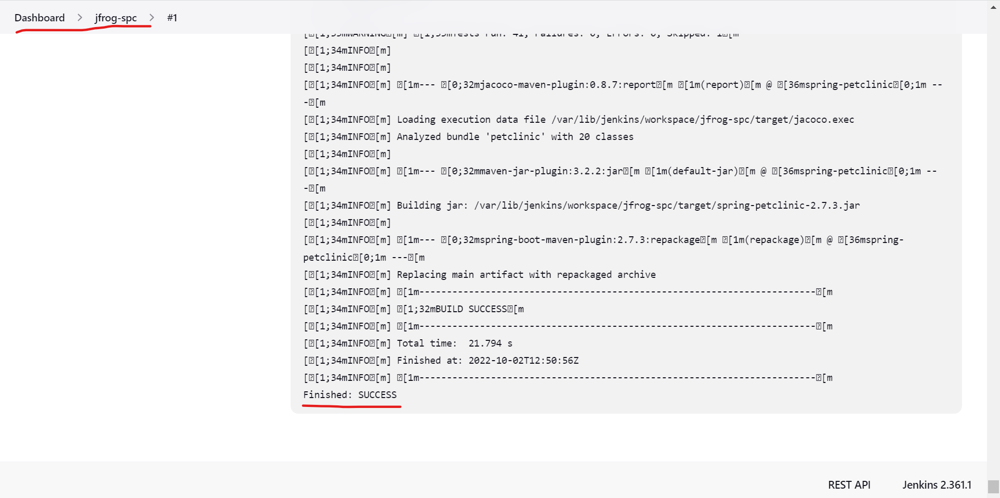
* Now lets check the jfrog portal.
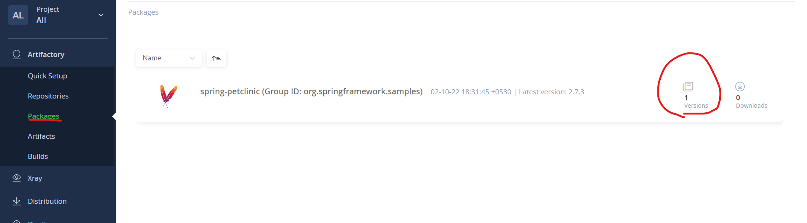
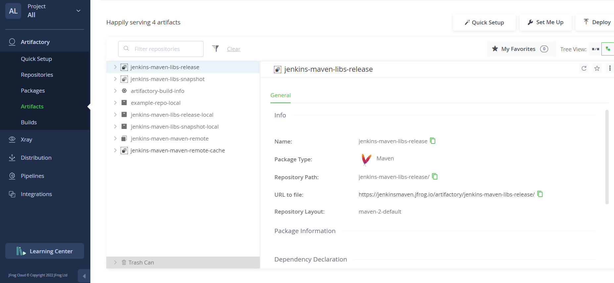
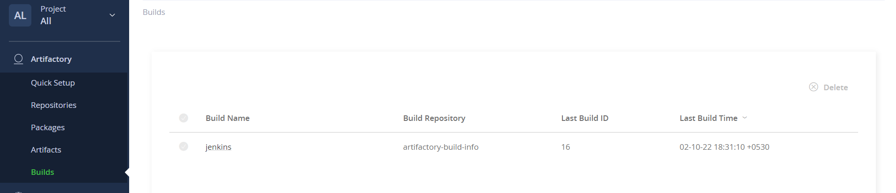
* Deployment succeed.