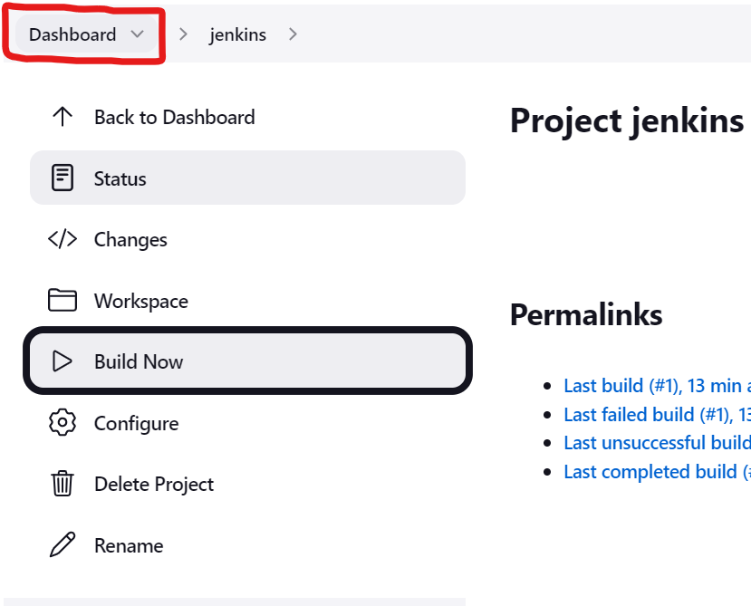
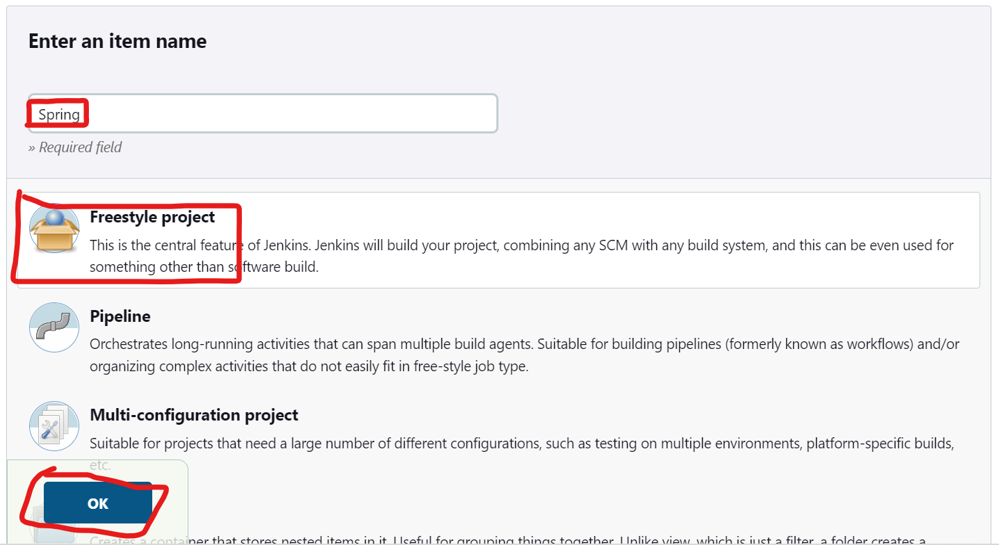
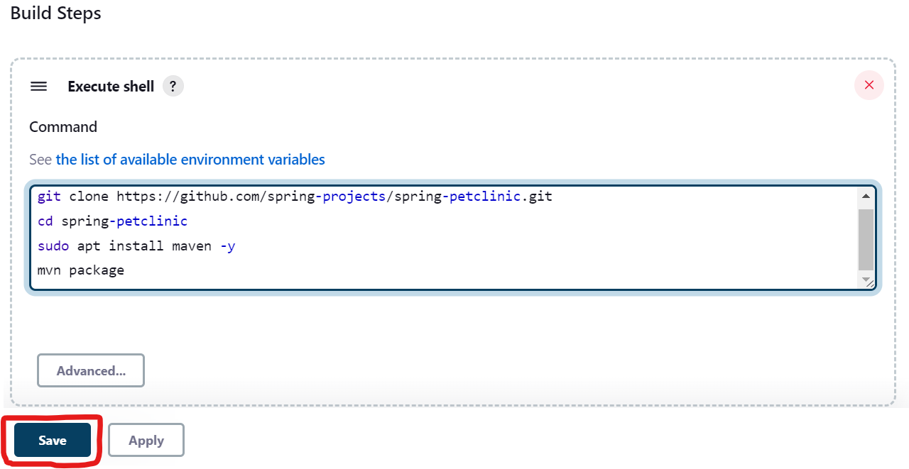
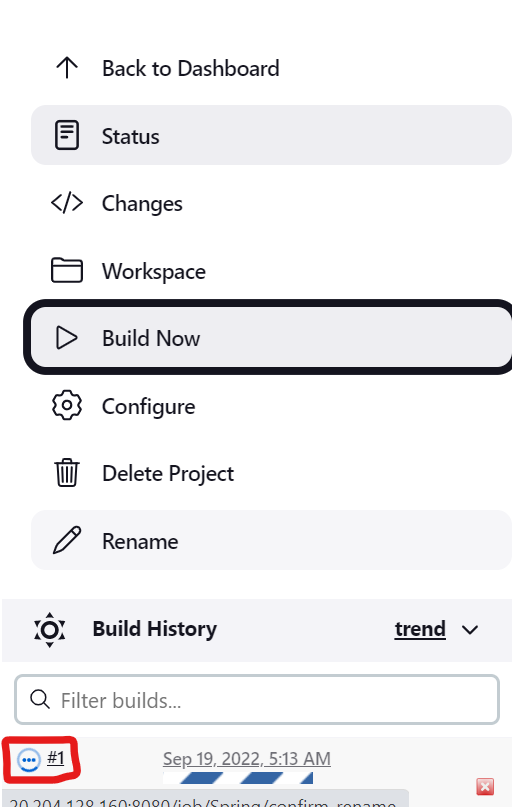
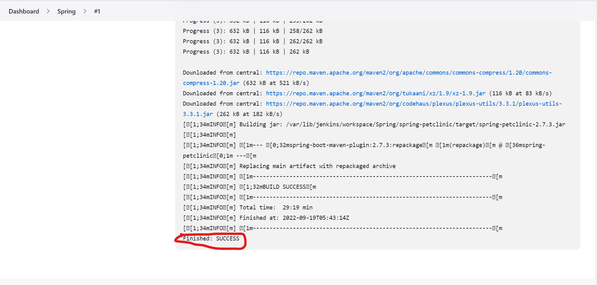

# Lets build a project<br  ><br  ><br  >
------------------------
* Lets go back to the dashboard.

* Lets add a new project just like we do this before for first project.

* Click on the build steps.
* Click on add build steps.
* Click on Execute shell.
* Enter the below command to build the project.
  * To build this project we need to install maven.
  * Replace maven installation command with any command to install required packages.
```
git clone https://github.com/spring-projects/spring-petclinic.git
cd spring-petclinic
sudo apt install maven -y
mvn package
```
> **_NOTE:_** Replace the git url with the url of your project.
* Now Lets save the configuration.

* Click on Build Now to start building the project.

* Click on blue icon to see the console output.
* The build has started and take time complete build.

* The build has success.