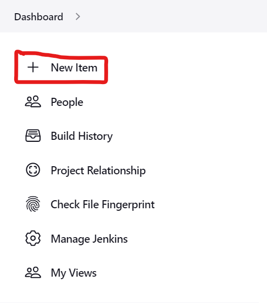
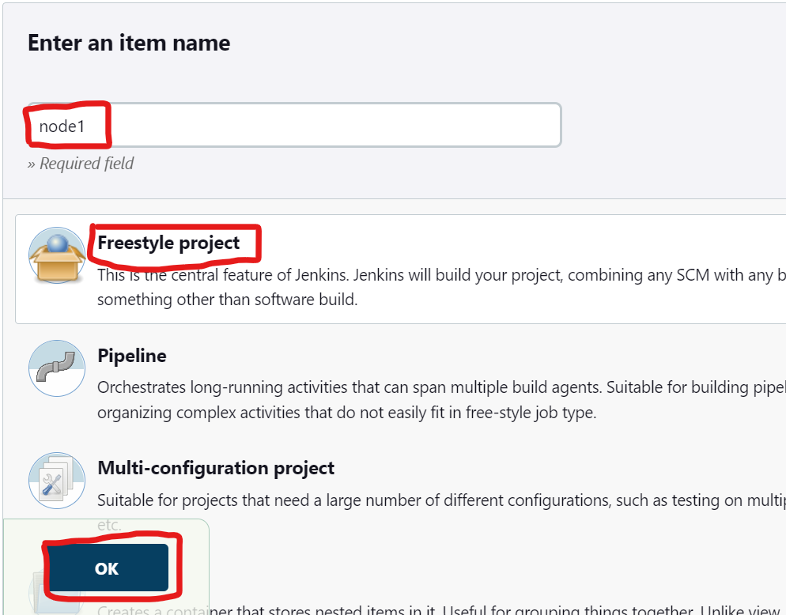
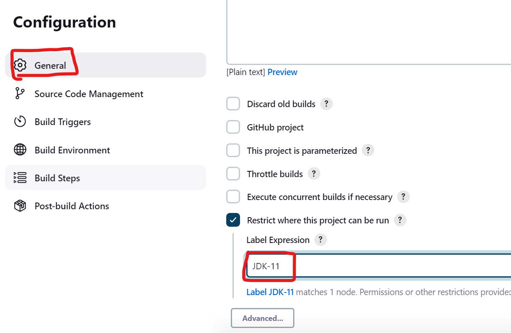
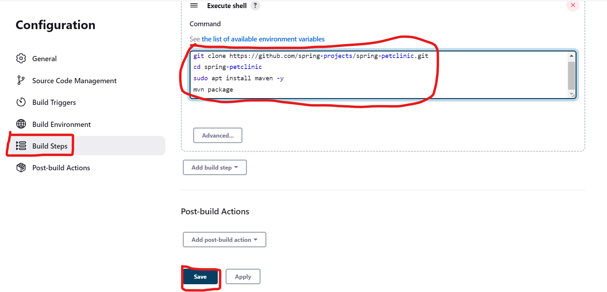
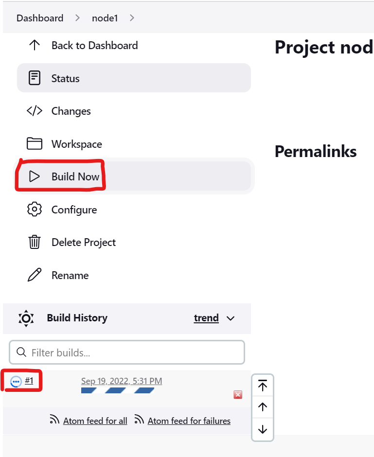
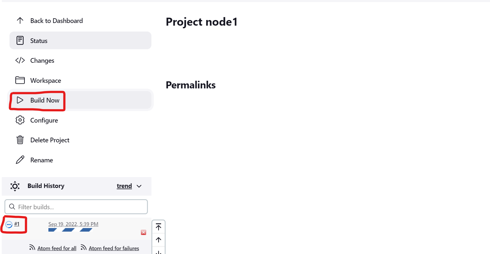
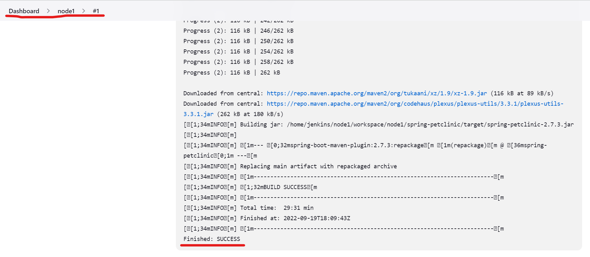

### Building the project
-------------------------
* Now lets create a new project and build the project in the jenkins node.



> **_NOTE:_** * Replace the Label Expression with the label given while creating new node.

* Enter the following commands in the build steps.
```
git clone https://github.com/spring-projects/spring-petclinic.git
cd spring-petclinic
sudo apt install maven -y
mvn package
```
* We have configure the build steps.
* Lets start building the project.


> **_NOTE:_** 
> * The buid history will be in the jenkins master.
> * The workspace will be in the jenkins node workspace.


* We can see that the build was successfull.