# Installing jenkins
---------------------
### Creating Resources
----------------------
> **_NOTE:_** Create all the resource including resource group in one location.
* Create a resource group `Jenkins`.
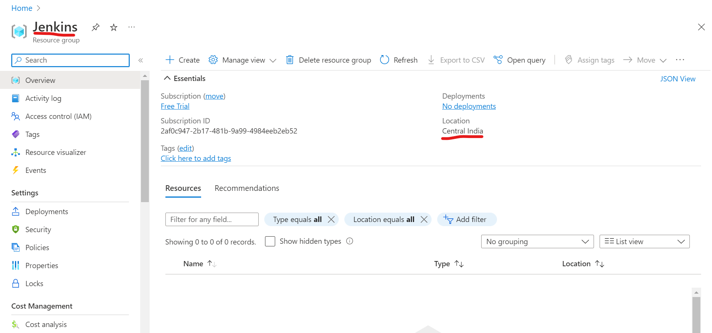
* Create a Virtual Network `jenkinsVnet` - 10.0.0.0/16 and add a subnet `JenkinsSubnet` - `10.0.0.0/24`.
> **_NOTE:_** This is the default Network configurations. So no need to change anything just give the name and click review+Create.
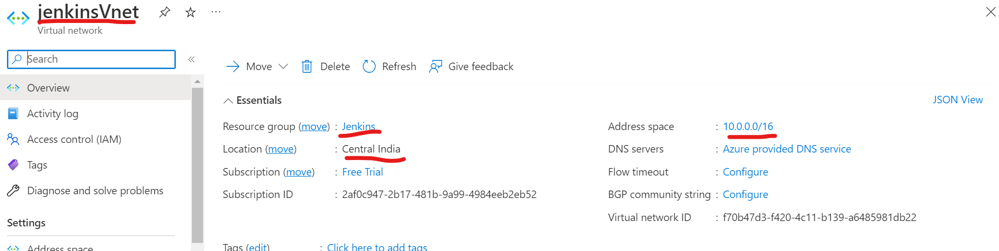
* Create a Network Security Group `JenkinsNSG` and add an inbound rule by opening 8080 port.
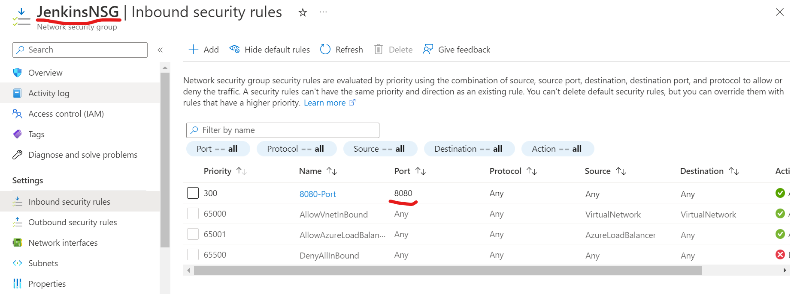
* Now Create a Ubuntu Virtual Machine `Jenkins`.
> **_NOTE:_** Select `jenkinsVnet` - `JenkinsSubnet` - `JenkinsNSG` while creating VM.
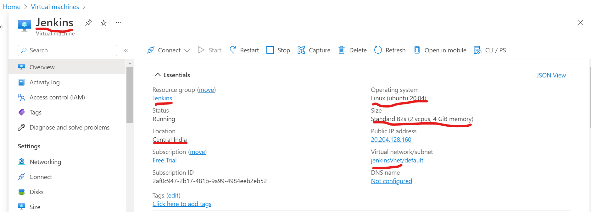
* Connect to the Virtual Machine `ssh username@ipaddress`.<br  ><br  ><br  ><br  >
# Install Jenkins in Master <br  ><br  ><br  >
------------------------------
* Get the system update.
```
sudo apt update
```
* Now lets install jenkins in the master.
* [Refer Here](https://www.jenkins.io/doc/book/installing/linux/#debianubuntu) for the official documentation to install jenkins in the ubuntu OS.
* Now lets look for the basic requirements to install jenkins.
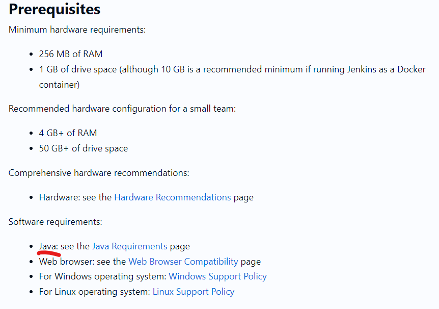
* For now we have all the requirements except java.
* So lets install java-11 for now in the first place.
```
sudo apt install openjdk-11-jdk -y
```
* Now lets move to the installation in ubuntu.
  * We have two types of releases
    * Weekly releases
    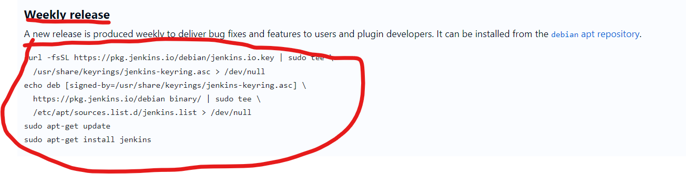
    * Long Term Support release
    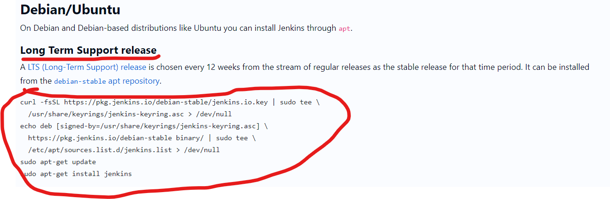
* For now lets go with long term release version.
* Copy the commands given in the documentation under the long term Support release.
> **_NOTE:_** The below commands may be outdate any day so go to the official documentation and copy the commands from there will be the best option.
```
curl -fsSL https://pkg.jenkins.io/debian-stable/jenkins.io.key | sudo tee \
  /usr/share/keyrings/jenkins-keyring.asc > /dev/null
```
```
echo deb [signed-by=/usr/share/keyrings/jenkins-keyring.asc] \
  https://pkg.jenkins.io/debian-stable binary/ | sudo tee \
  /etc/apt/sources.list.d/jenkins.list > /dev/null
```
```
sudo apt-get update
sudo apt-get install jenkins -y
```
* Now we have successfully installed jenkins.
* Lets Connect to the jenkins UI.
* Copy the ipaddress from the portal.
* Open the web browser and paste the copied ipaddress followed by `:8080`.
```
http://<ip-address-of-jenkins-master>:8080
```
* Now we can see the jenkins portal and asking for the password.
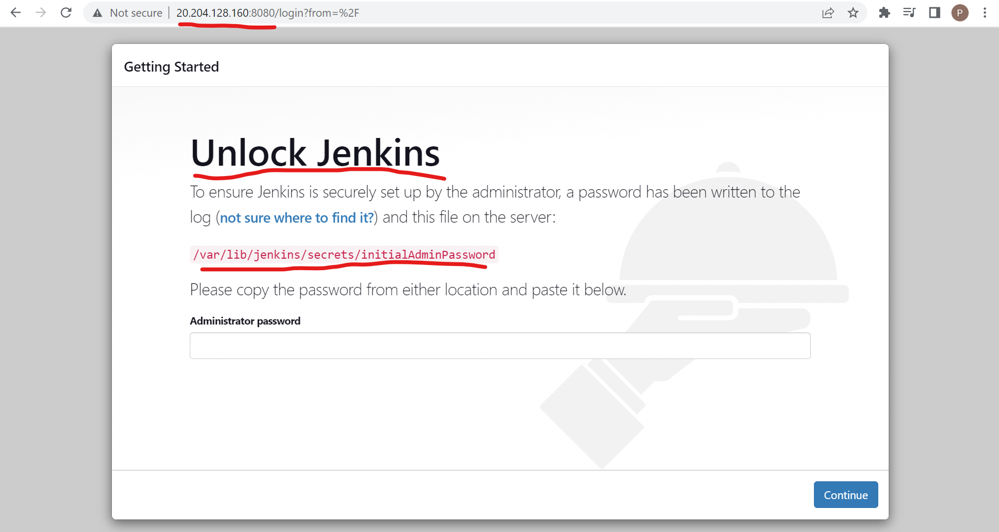
* We can see the path where we can find the default password for the jenkins admin.
* Now lets get the password from the given path and copy it.
```
sudo cat /var/lib/jenkins/secrets/initialAdminPassword
```
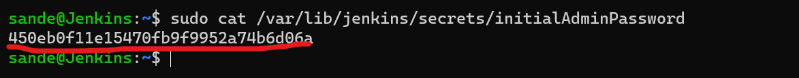
* Copy the password and use it to login as admin.
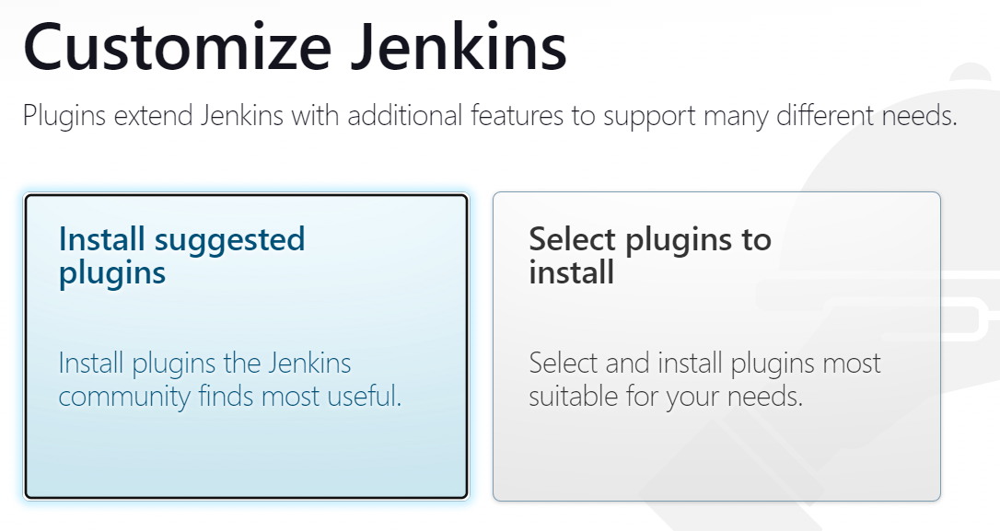
* We can install the suggested plugins or we can install the plugins which we want.
* For now lets install suggested plugins only.
* Now give the credentials and create admin account.
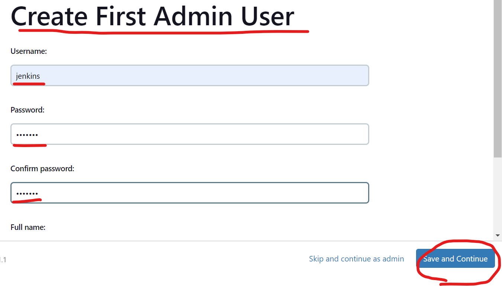
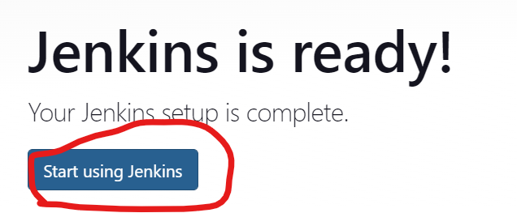
* This is how the UI of the Jenkins looks like.
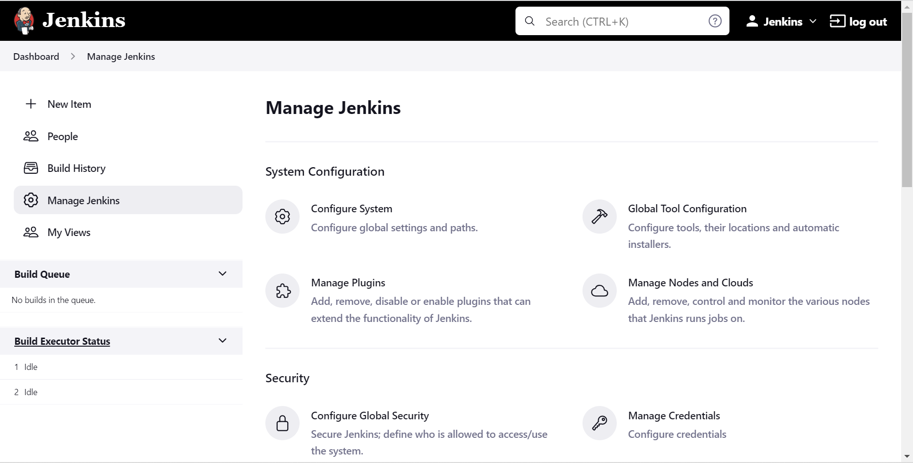
* To run a sample project [Refer Here](sample-project-in-master.md.md)
* To run spring pet clinic project [Refer Here](spring-pet-clinic-node.md)