Jfrog integration
-----------------
* Deploying the artifacts and storing the versions of the builds.
* Jfrog is the package repository where we can store the build versions in this repository.
* we can do this in two different ways.
  * We can do the configuration manually by adding all the files in the `.m2` folder and in `pom.xml` file.
  * Or we can simply download the artifacts plugin and configure them in the jenkins ui.

Configuring the jenkins in the ui using the plugin
--------------------------------------------------
* Login to the jenkins master  [Refer Here](jenkins-Install.md)
* Navigate to the `manage jenkins` > `manage plugin`.
* Switch to the available plugin and search for the `artifactory`.
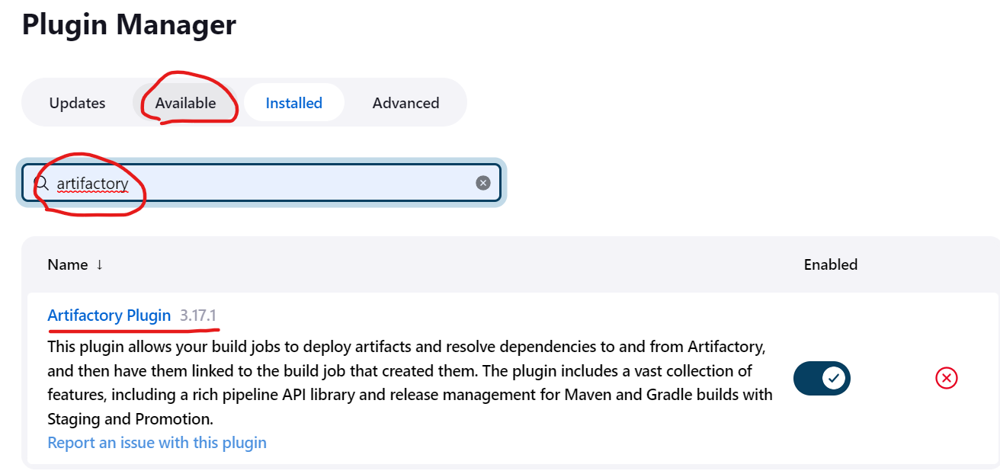
* Now we have artifactory plugin installed in our jenkins server.
* We also need jfrog account and the repository.
* Login to the jfrog account [Refer Here](https://jfrog.com/start-free/).
* Now we had login to the jfrog and lets set and get the credentials.
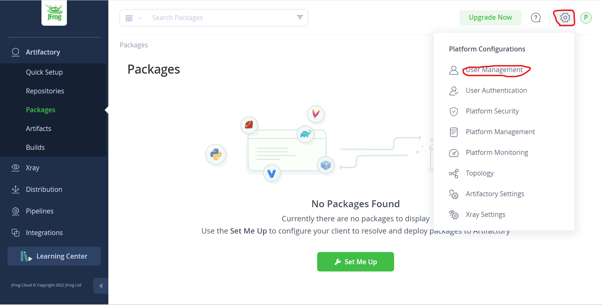
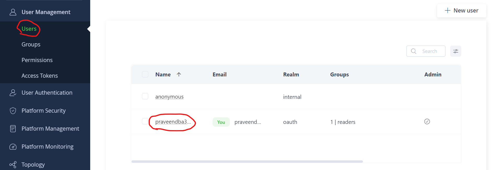
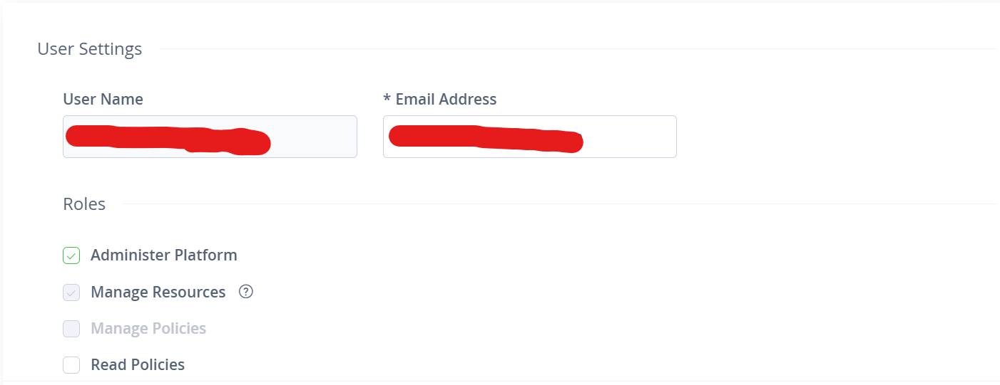
* Now we have the username and we need the password.
* Save the username for future reference.
* We can also use the access token but for now lets stick to the username and password.
* If you want you can configure using access token also.
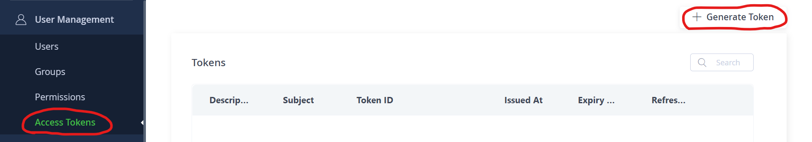
* Now lets set a password for the jfrog.
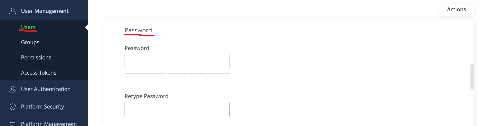
* Now we set the password.
* It might ask u to relogin using the credentials we have created just now.
* Now we need to create the repository for deploying the build package.
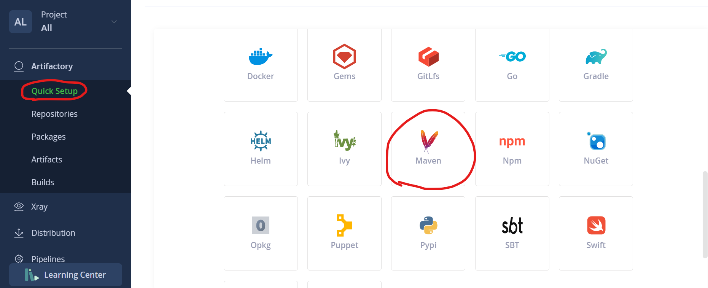
* Now we are building the maven project.
* So lets create repository for maven packages.
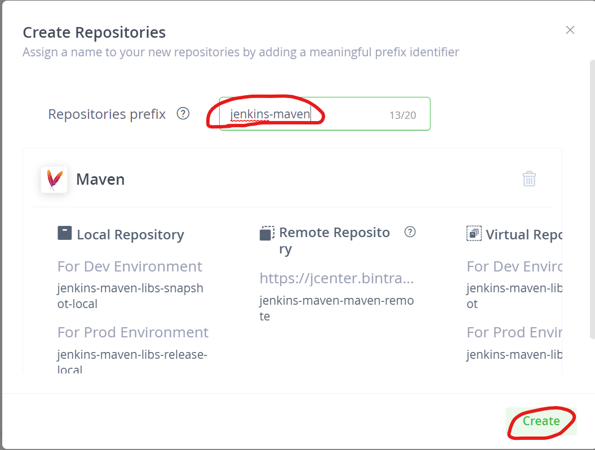
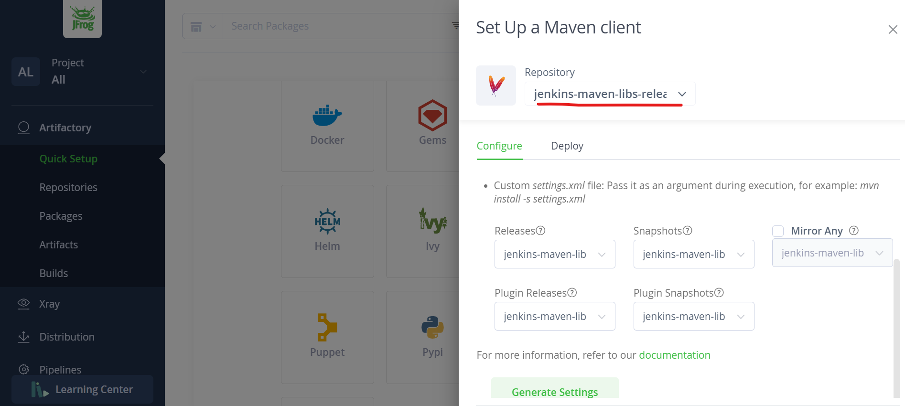
* Now we have username, password, maven repository also.
* Now lets configure these credentials in the jenkins server.
* Navigate to `manage jenkins` > `configure system` and search for the jfrog in the jenkins server.
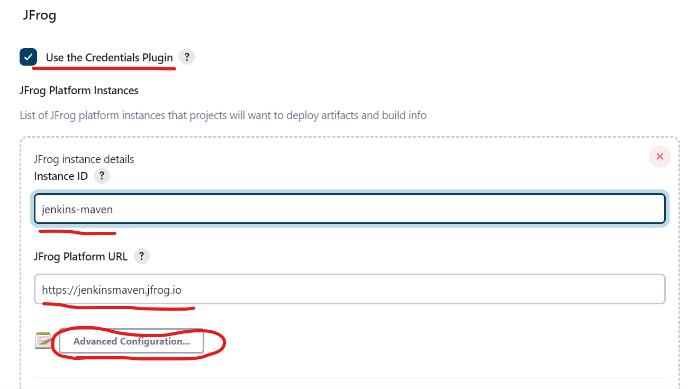
* The Instance Id is the repository name you have created in the jfrog.
* The Platform url is the url of your jfrog account.
* Now click on the advanced configuration
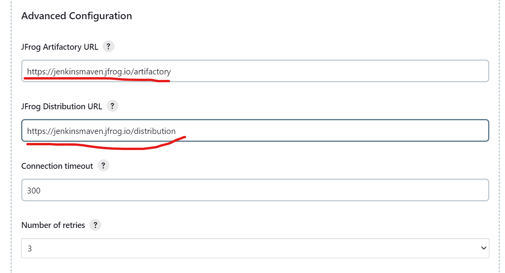
* The artifactory and distribution urls are `<Platform-url>/artifactory` and `<Platform-url>/distribution`.
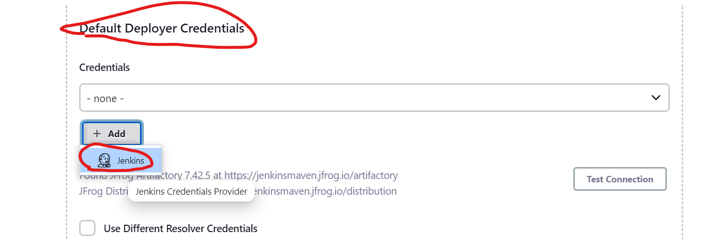
* Now we need to add the credentials.
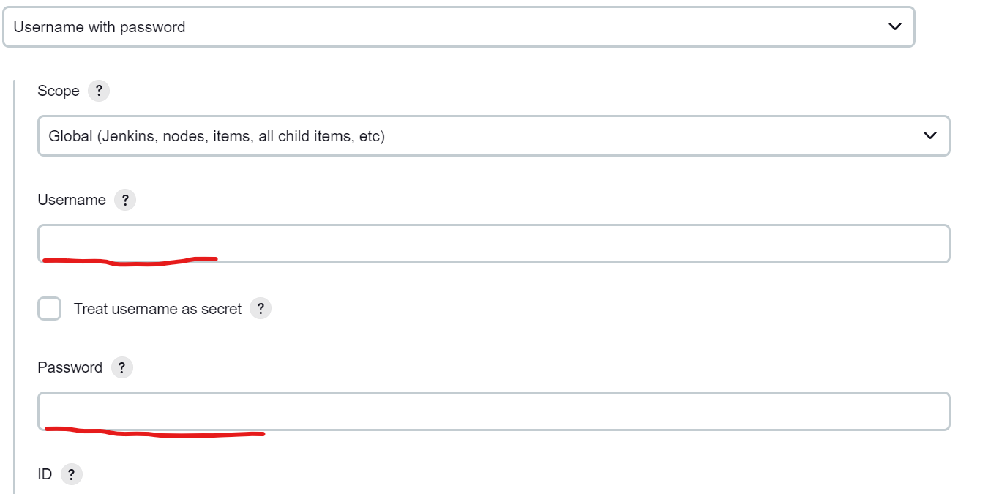
* Give the username and the password you have created in the jfrog account.
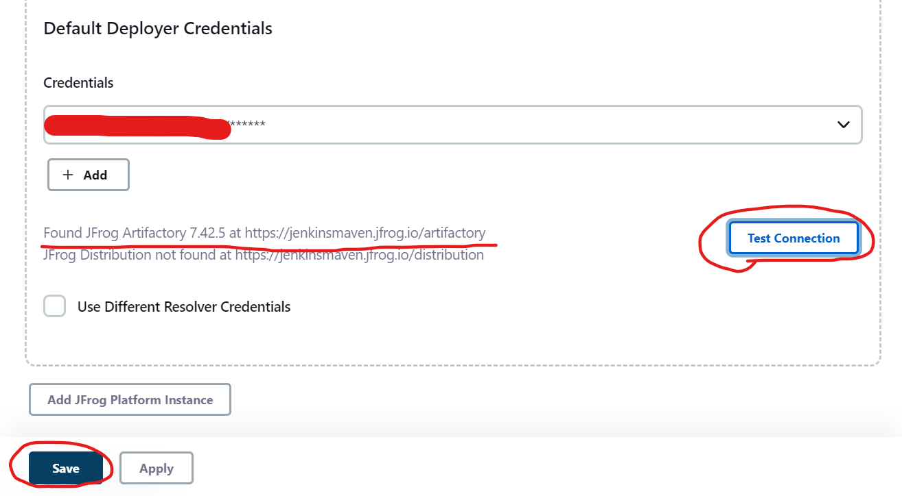
* Test the connection before click on save.
* Now the configuration of jfrog has completed.