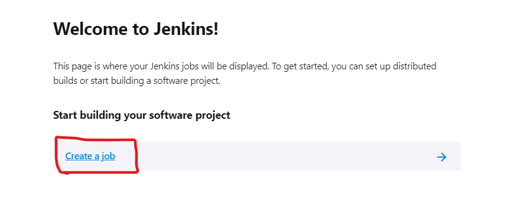
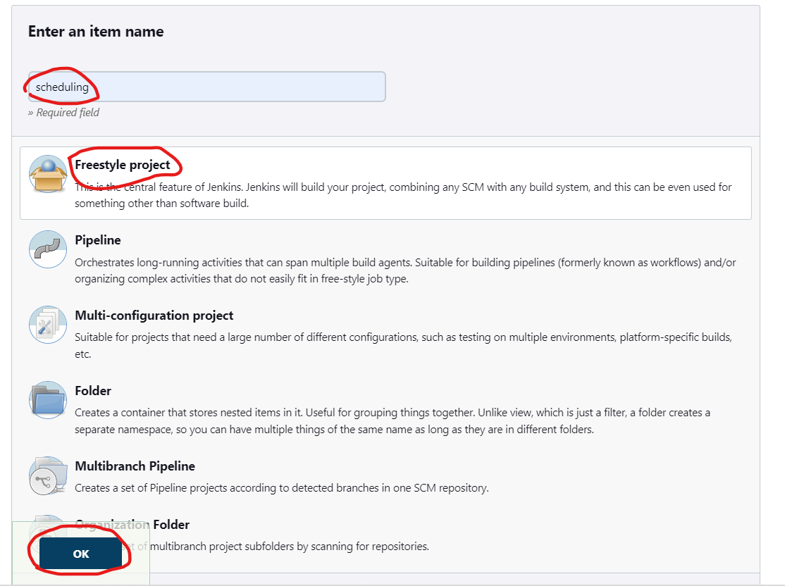
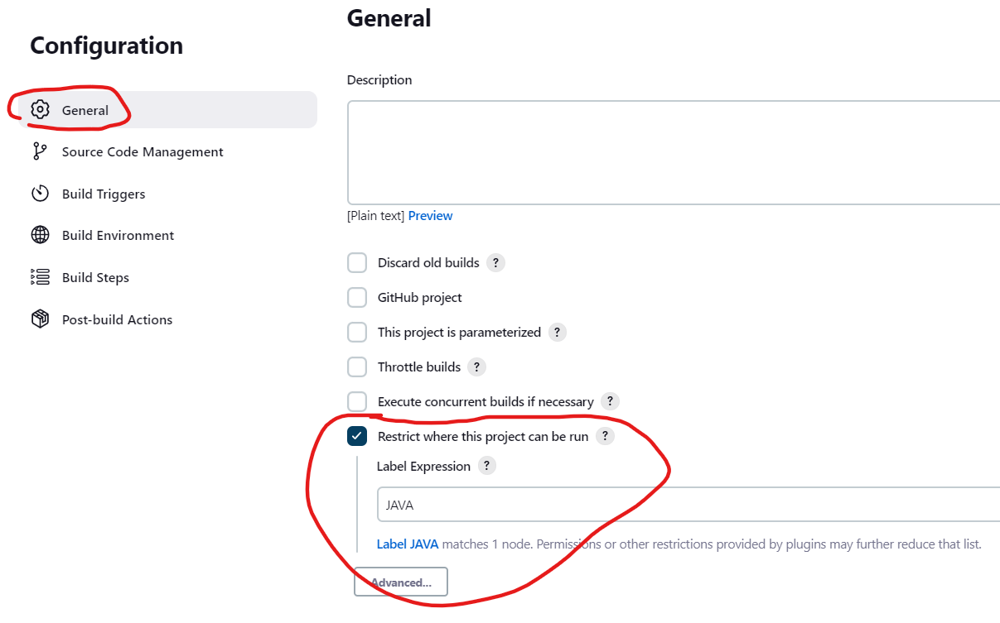
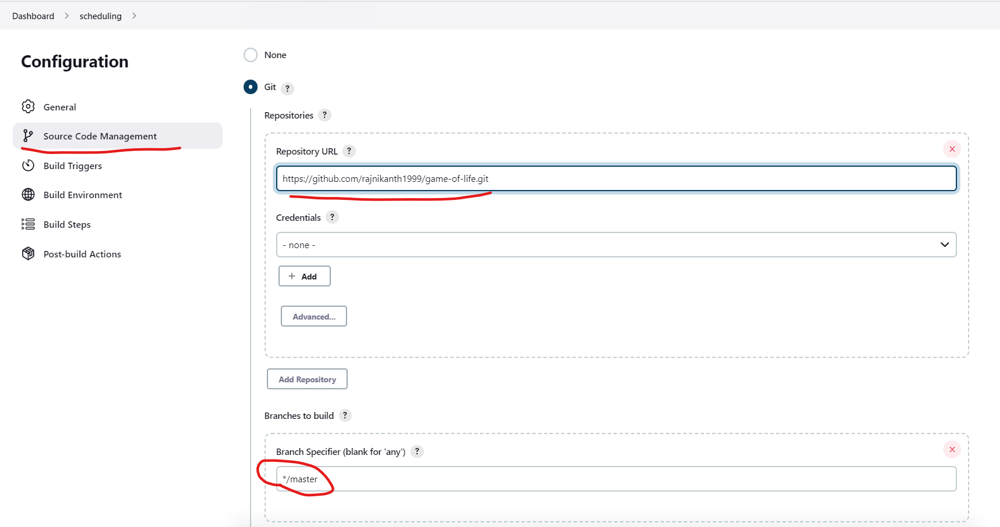
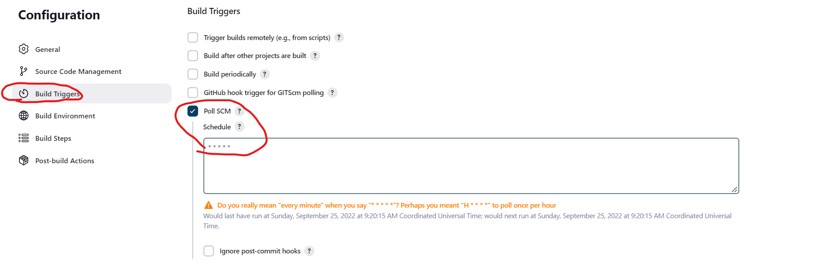
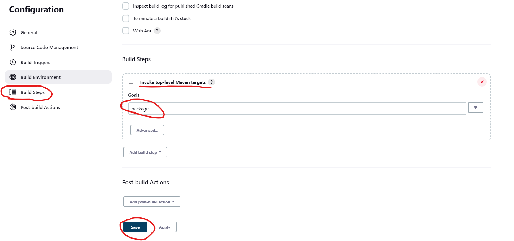
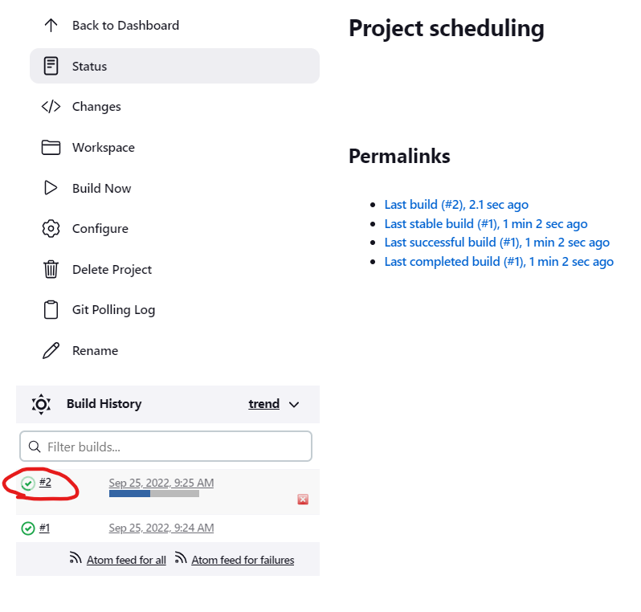
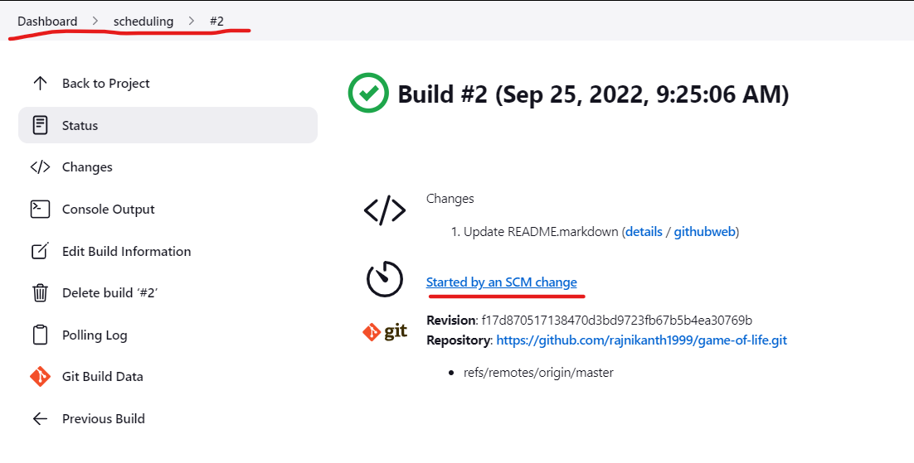

Scheduling build for VCS Repository
-----------------------------------
* To scheduling the Poll SCM we need a git Repository which we can commit new changes.
* Now lets create a project and schedule the poll scm.
* Navigate to dashborard.



> **_NOTE:_** 
> * Ignore the above step if you want to build the project in the master.
> * Replace the `JAVA` with your node's label.



```
* * * * *
```
> **_NOTE:_** 
> * Change the above timings to the required schedule build time.
* This project will check for the commits for every minute.
* The build will start immediately when we do some commit.

* Now we have created the project.
* The build #1 will trigger automatically.
* Now commit some changes to the Repository you have given.

* We can see that the build has started automatically.

* In the above picture we can see that the build has started by SCM change.