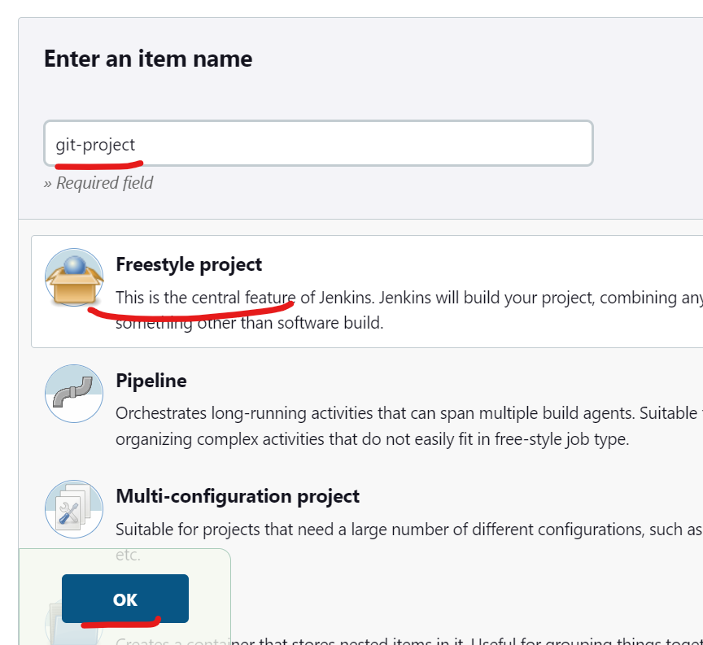

Build with git repository
-------------------------
* Lets create a project first.



```
https://github.com/spring-projects/spring-petclinic.git
```

* Now lets build the project.


* The build of spring pet clinic is success.
---------------------------------------------
<br><br><br>

Build same project in node
---------------------------

* At first configure the node [Refer Here](Jenkins-Node.md)
* Copy the label of the node to run the project in the node.
* Open the project or create the project.


> **_NOTE:_** Replace the `JAVA` with your node's label to configure.

* Now build the project.

* The build has started.
* Make sure you have installed all the required packages before started building.

* The build has successful.