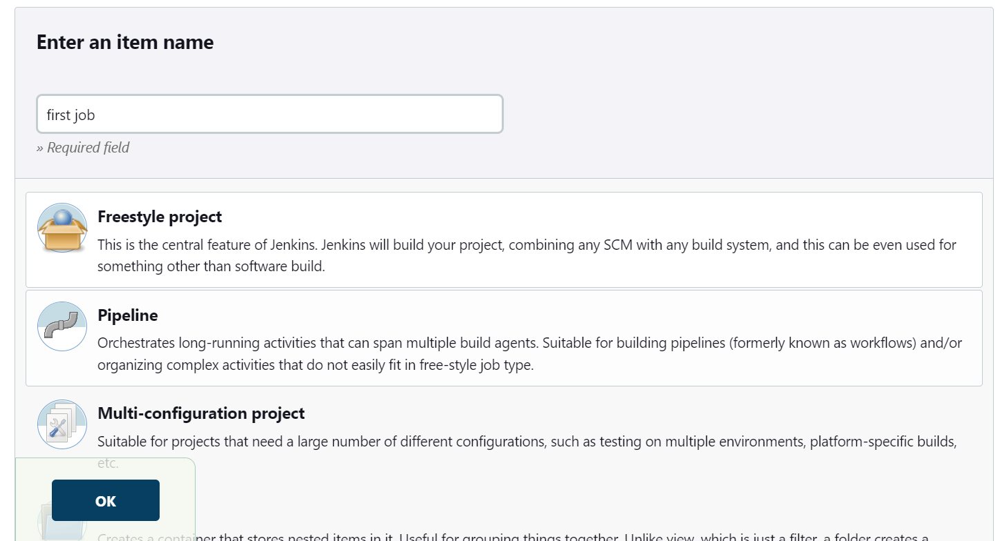
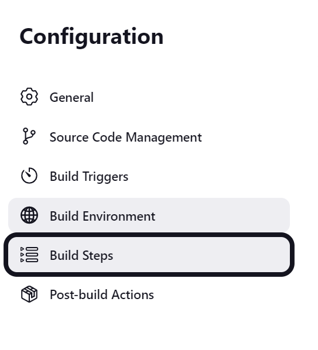
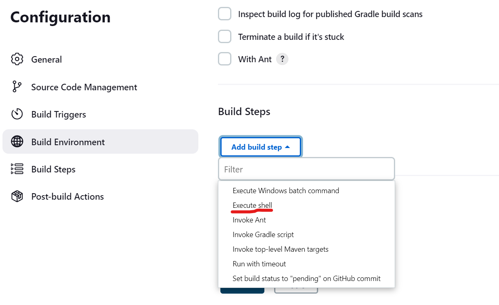
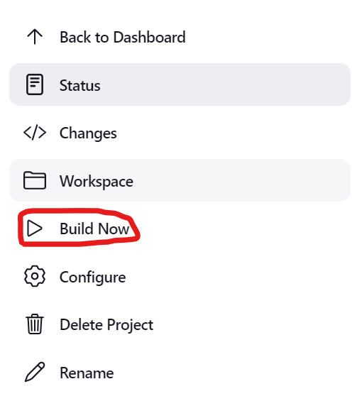
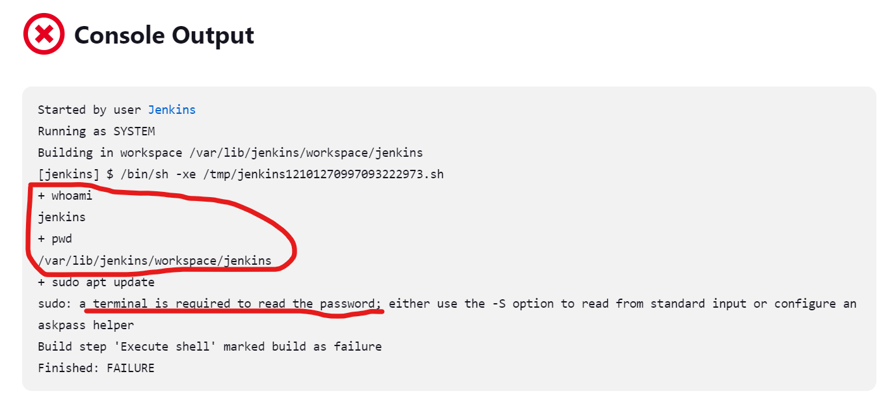
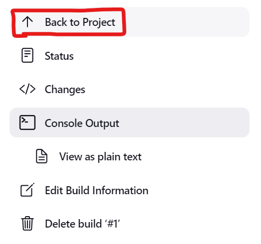
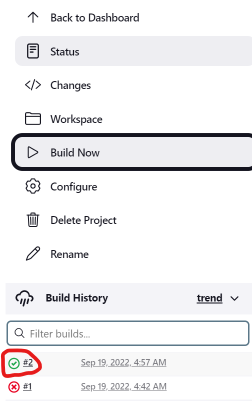

### Creating first sample project in Master
-----------------------------
* Lets create a new project in the jenkins `first job`.




* Now let's give some commands in the Build steps.
```
whoami
pwd
sudo apt update
```

* Now lets build the project.
* Click on the build now to start build the project.

* We can see that the build has failed.

* Click on the red icon to check the console output.

* The build has failed because the jenkins user does not have sudo permissions.
* Now we have to give sudo permissions to the jenkins user.
* Login to the system and ececute the following commands to open the sudoers file to give sudo permissions to the jenkins user.
```
sudo visudo
```
* Now sudoers file has opened in the vi editor.
```
jenkins ALL=(ALL:ALL) NOPASSWD:ALL
```
> **_NOTE:_** Replace the user name `jenkins` in the above command with the user name you have given while creating the jenkins account.
> 
> If you dont know the username it is in the above picture.
* Enter the above line in the file.

* press `ctrl+x`, enter `y`, click `enter`.
* Now the jenkins user has all the sudo permissions.
* Now lets build the project again.



* Now the build has success.