### Creating VM
-------------------------
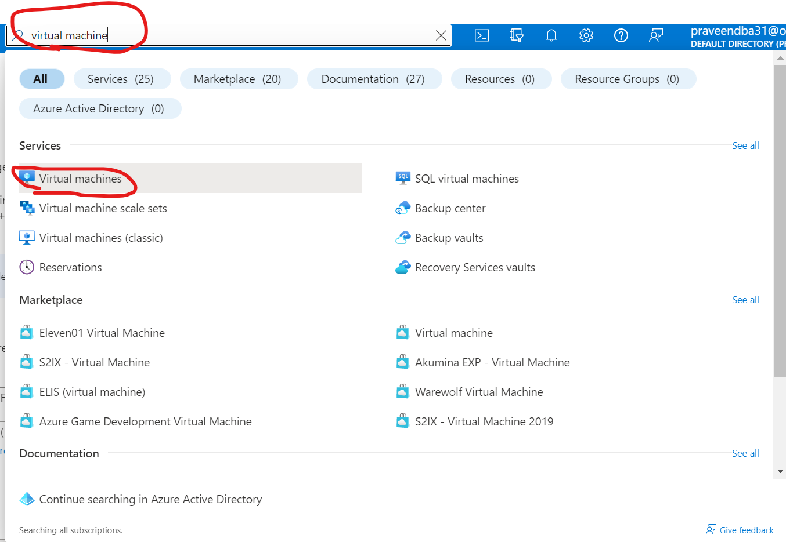
------------------------
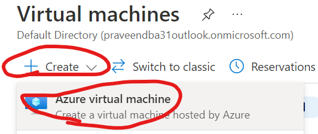
--------------------------
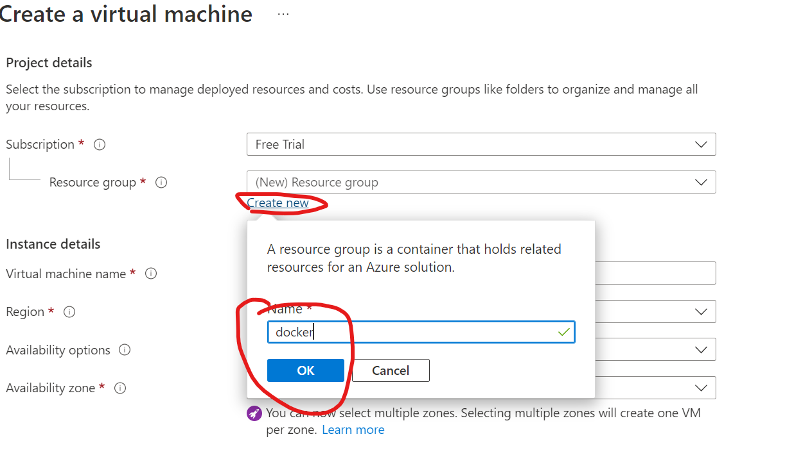
------------------------------
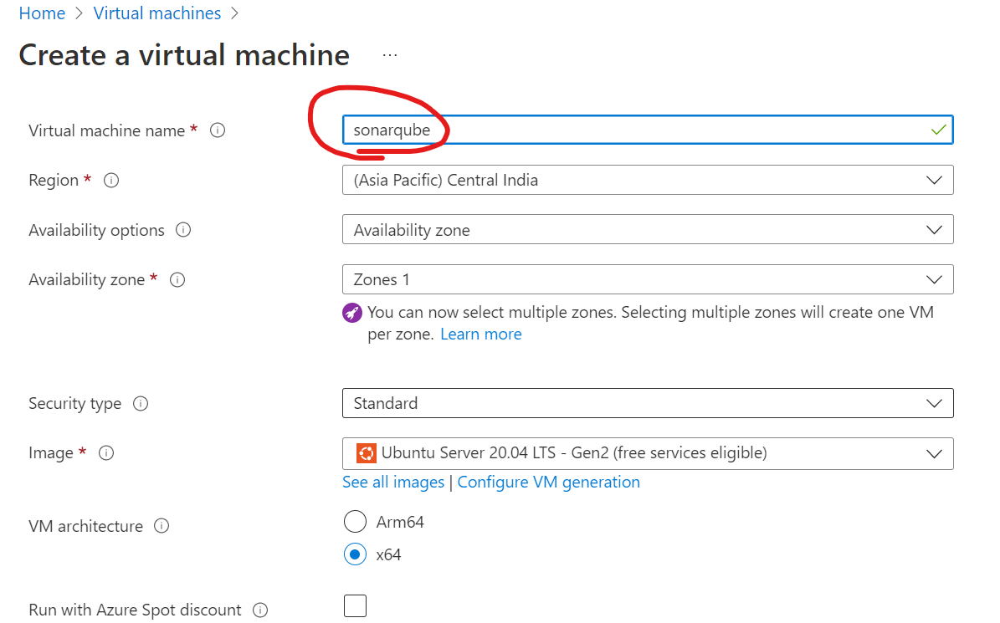
--------------------------------
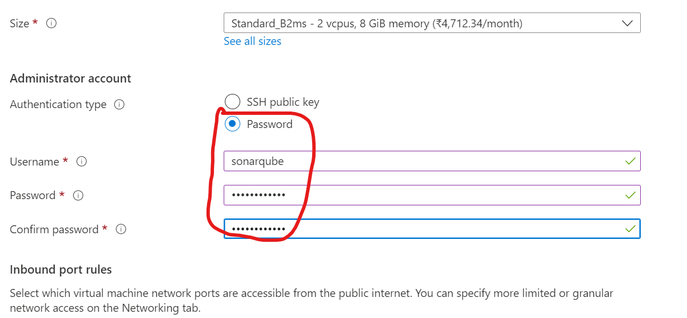
--------------------------------

-------------------------------
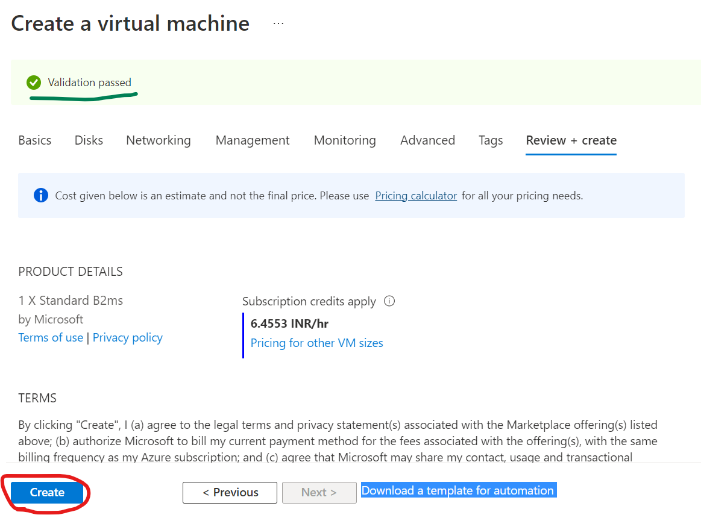
----------------------------------
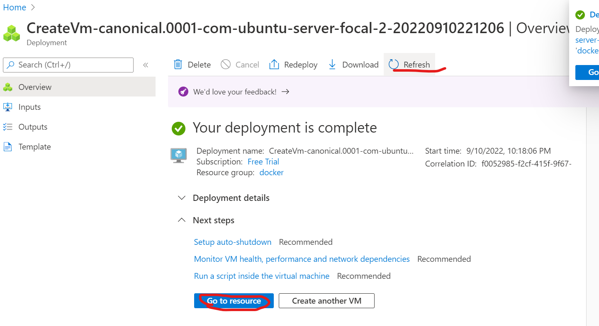
--------------------------------
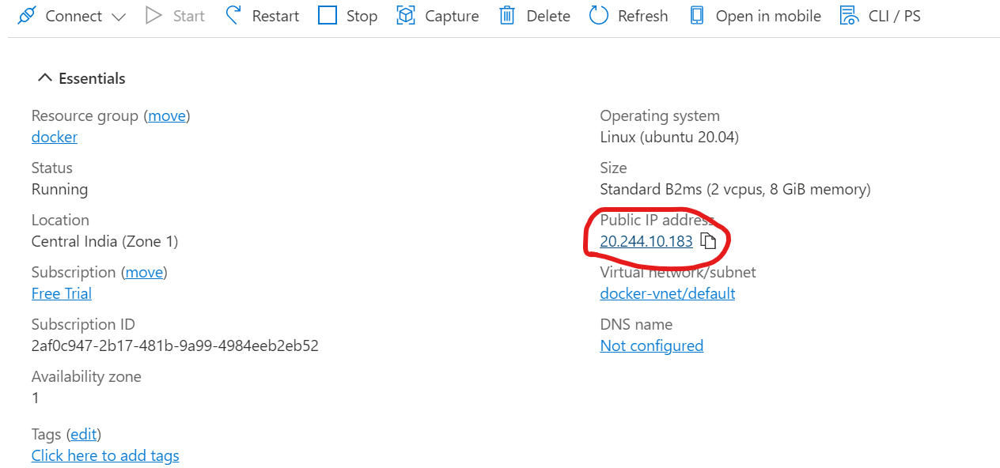
-----------------------
### To Stop or Restart or Start VM
---------------------------------
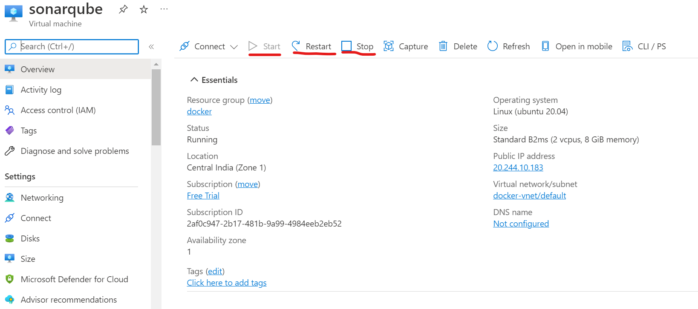
-----------------------
### To Add Inbount rule for networking
--------------------------------------
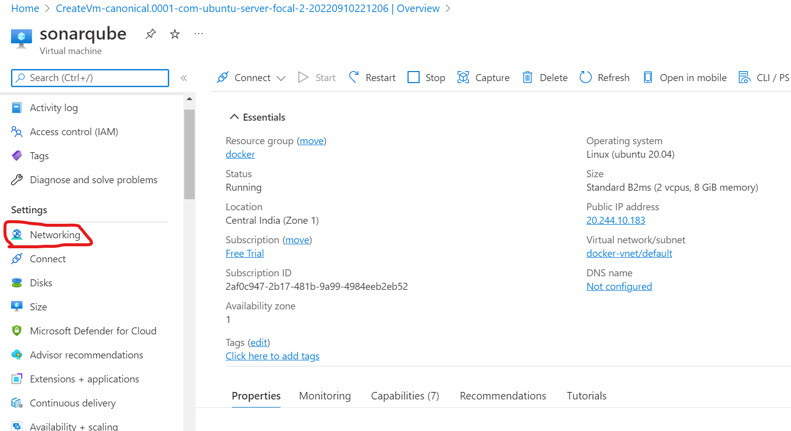
---------------------------------
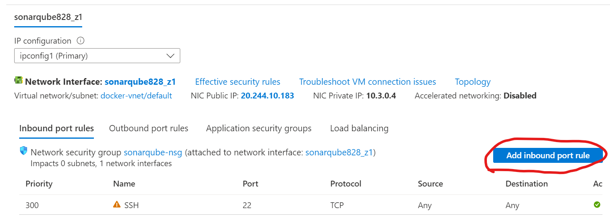
---------------------------------
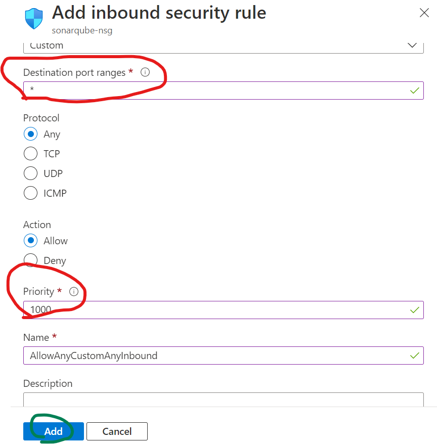
-------------------------------
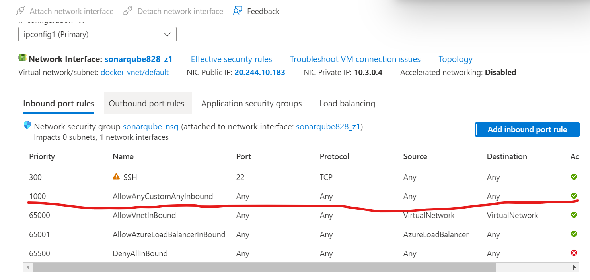